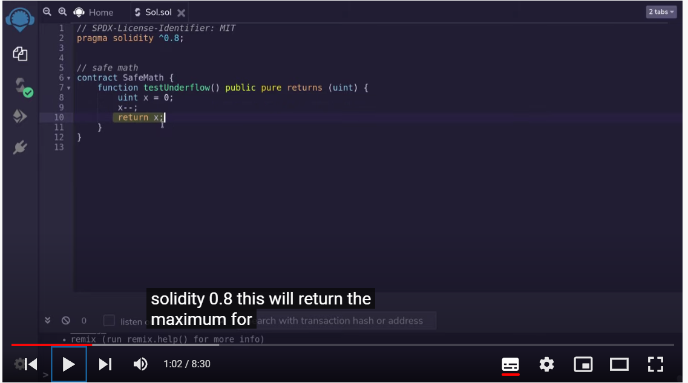
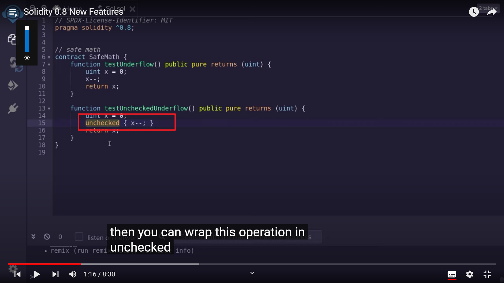
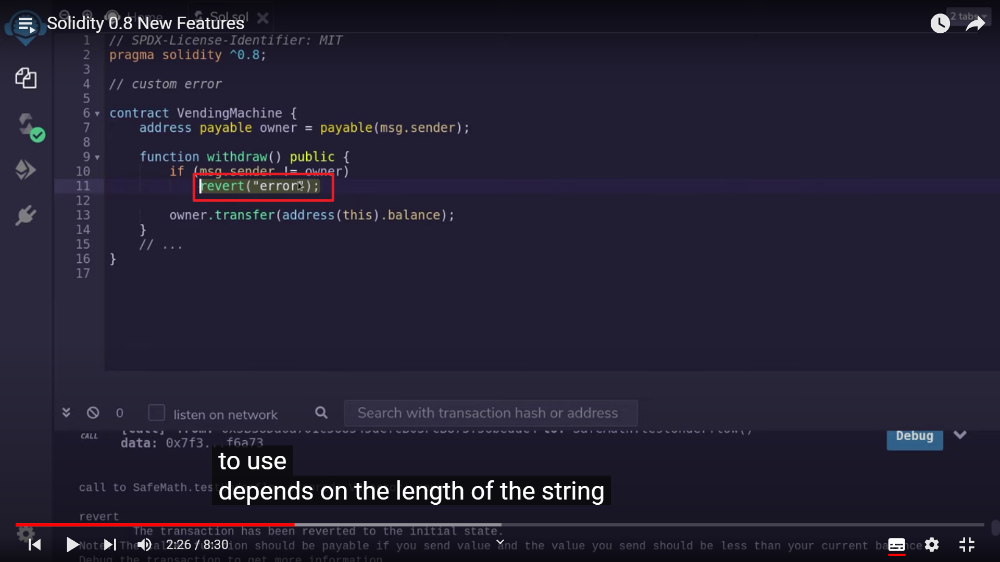
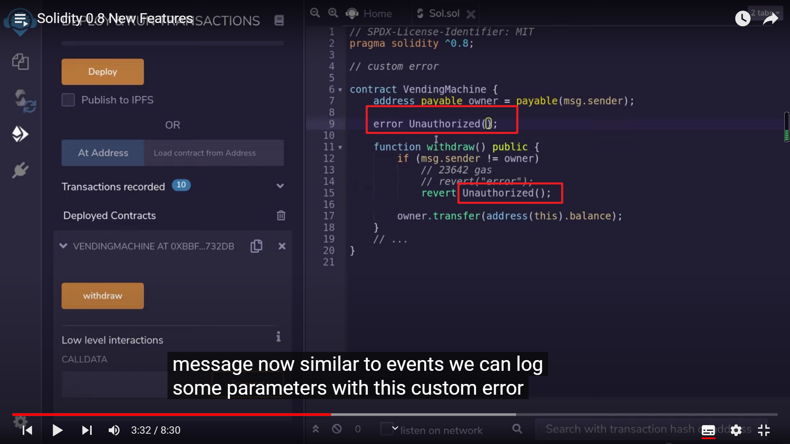
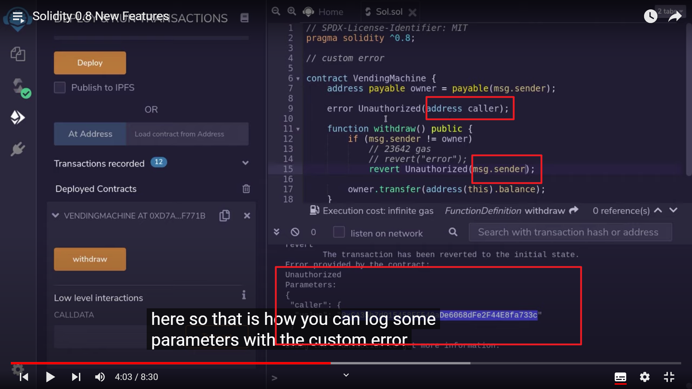
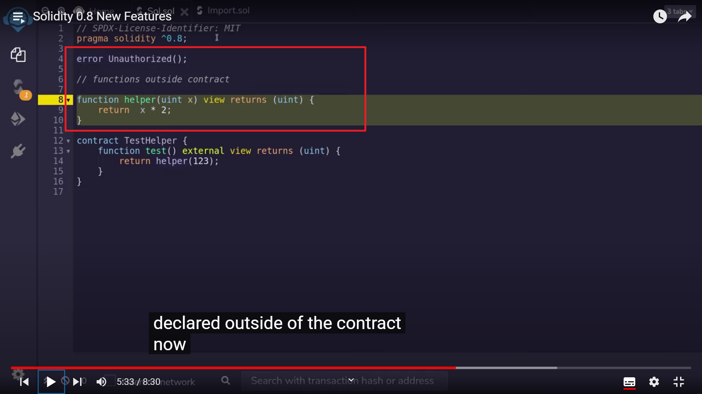
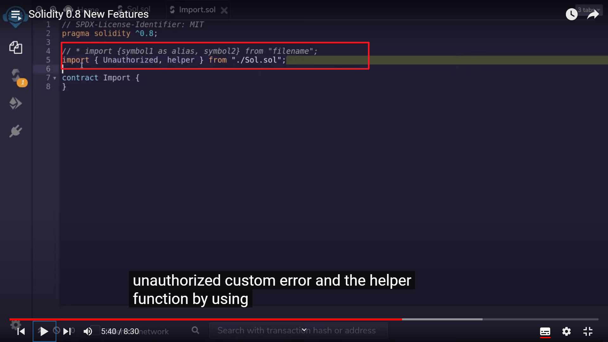
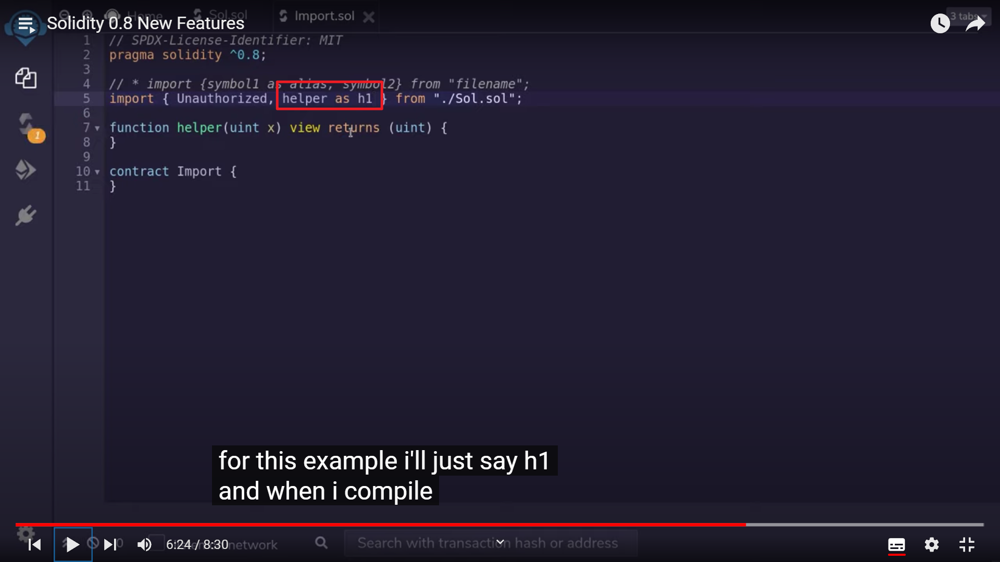
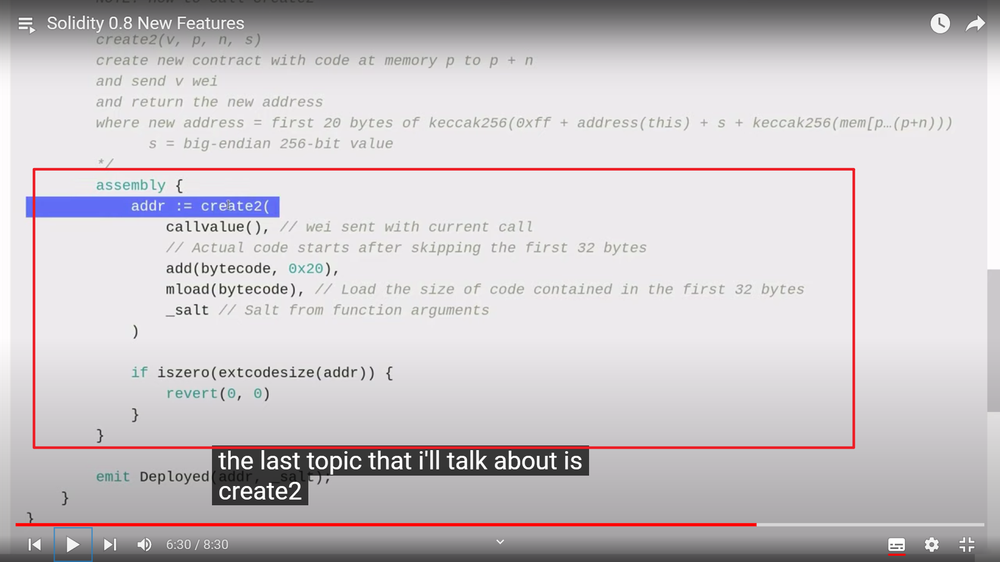

  
0.8 以前 overflow 不会报错，超过最小变为最大，反之亦然。0.8 以后则会 error。（safemath 功能）

  
如果想不报错，就放入 unchecked 里

  
custom error  
当使用 string 作为 error 时，gas 费跟 string 长正相关。

  
把 string 换成这个 custom error 后，gas 费减少。

  
custom error 还能返回一些信息。

  
  
在合约外面定义 function 和 custom error，就可以在其它合约里引用它们

  
可以重命名引入的 function（就不会跟合约里本来就有的重名）

  
create2，0.8 以前唯一的方法是使用 assembly。  
（看不太懂，需要时再学习）
