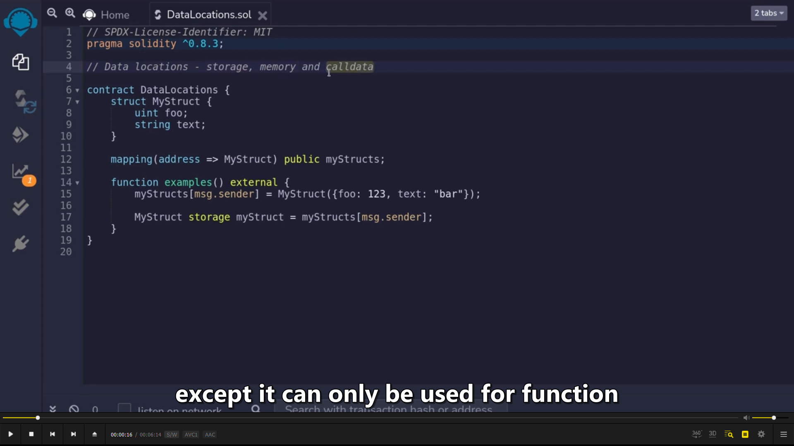
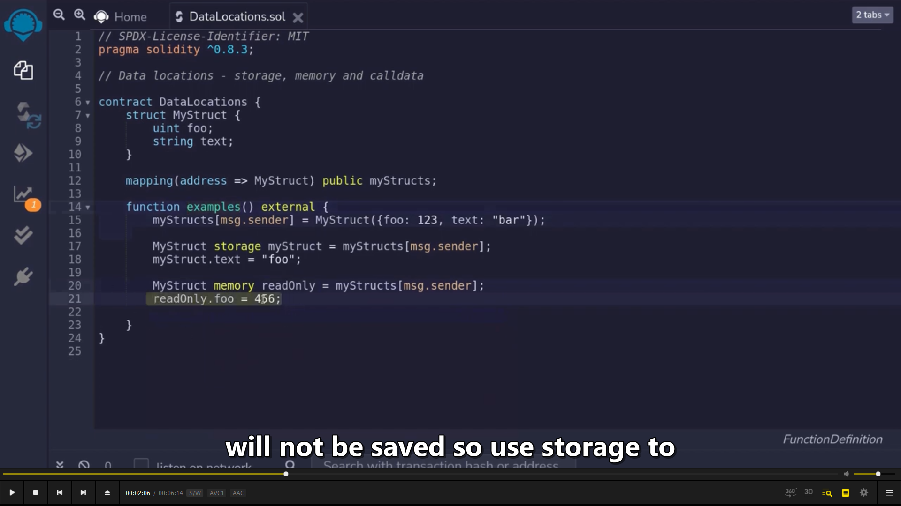
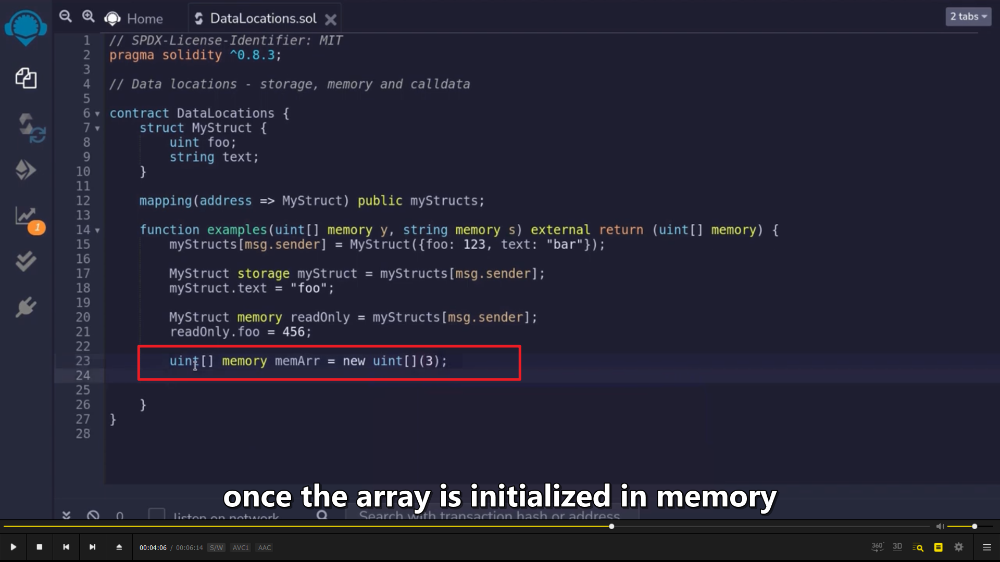
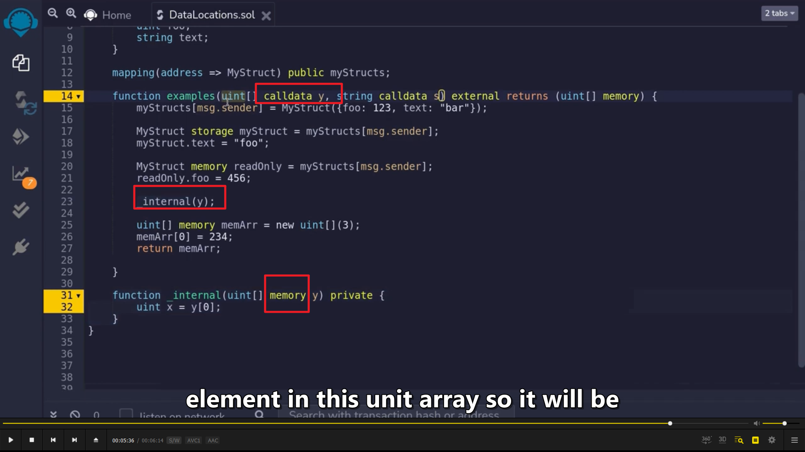

使用动态数据类型作为一个变量时需要声明它的变量位置，storage，memory 或 calldata。calldata 类似 memory，但是只能作为 function input 使用。

  
一般 storage 用于要修改变量时，memory 用于读取数据。虽然 memory 也可以修改变量，但 function 结束后 memory 修改的值不会被改变。

  
在 memory 里初始化的数组，只能初始化为定长数组。  
parenthesis，圆括号

  
用 calldata 可以节省 gas，如图，如果最后一个 memory 换成 calldata，就省去了一个复制的步骤，节省了 gas。（需要它被 passing 到其它 function 时才起作用，因为避免了复制的步骤。）  
add(有时只能用 memory，用 calldata 会报错。)  
reviewed 2022/05/05
