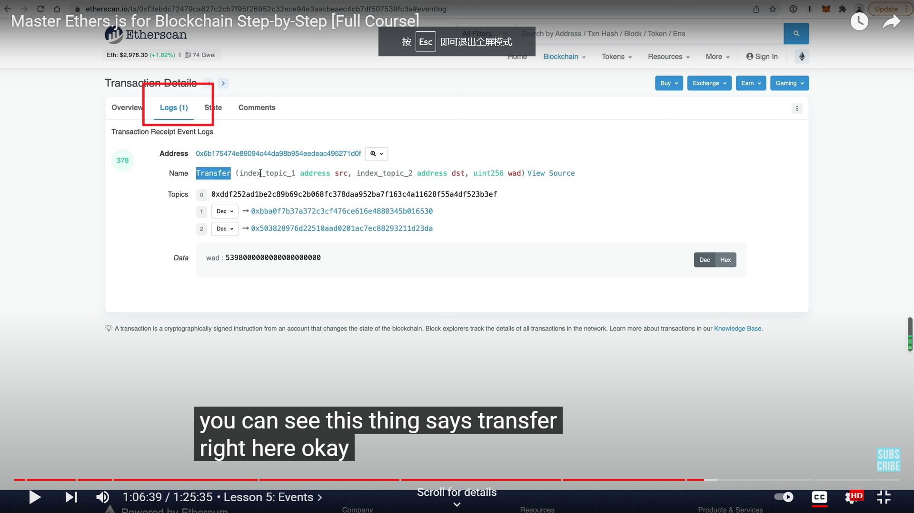
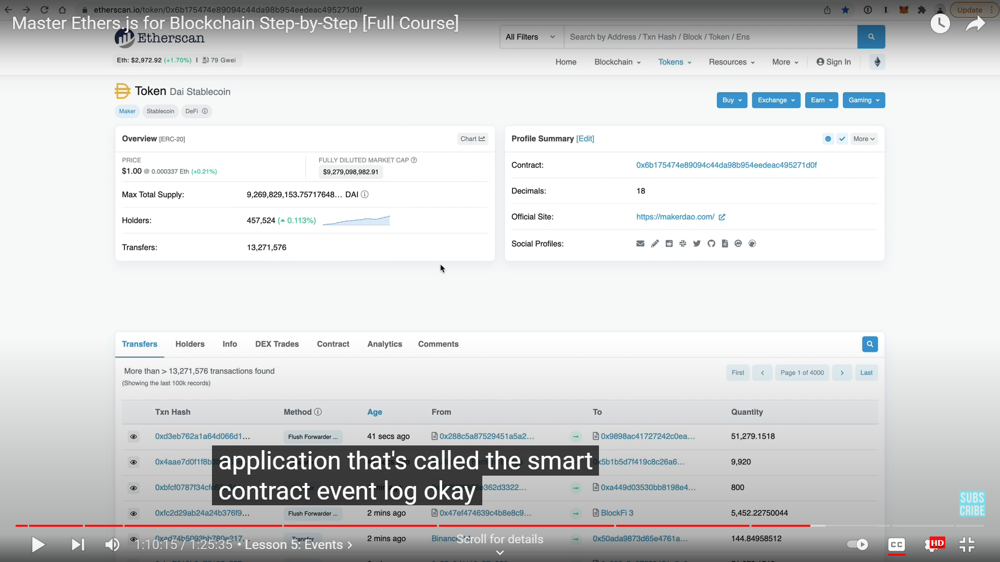
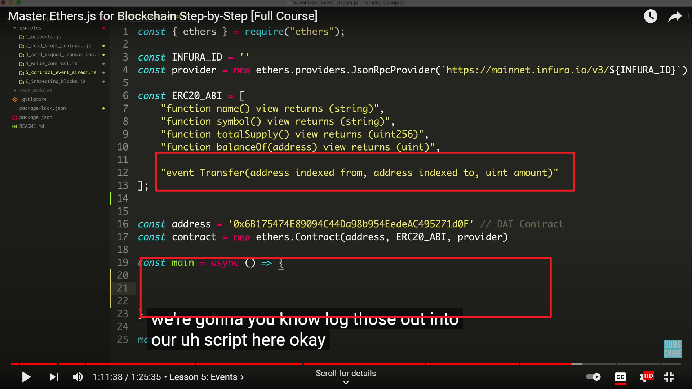
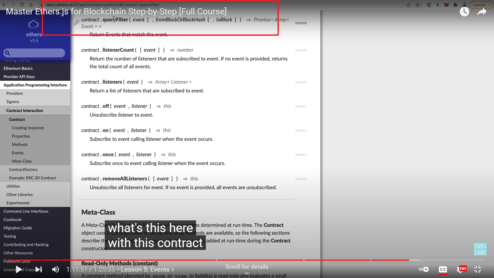
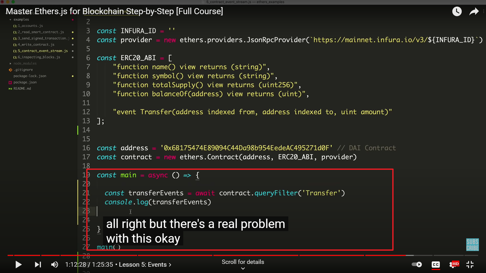
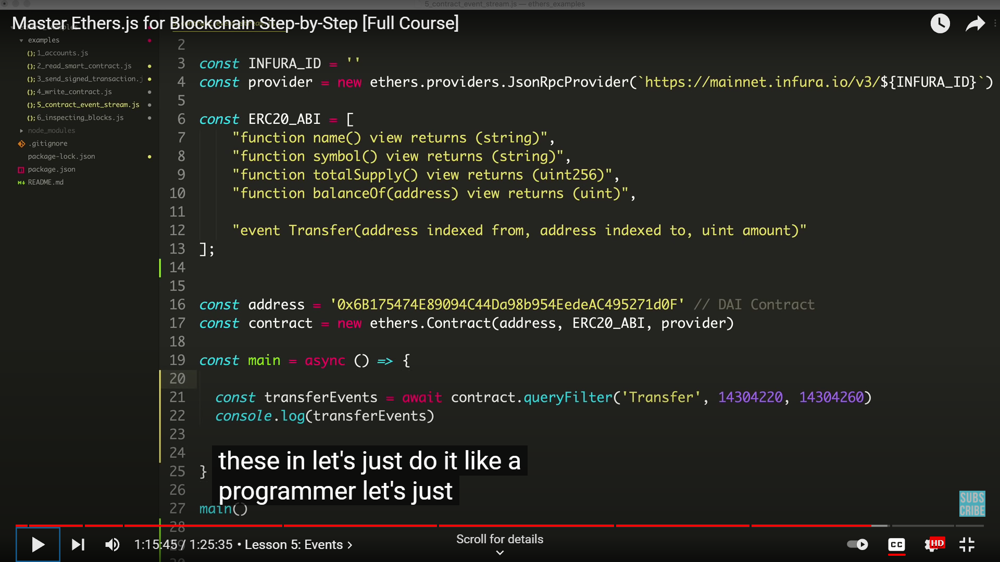
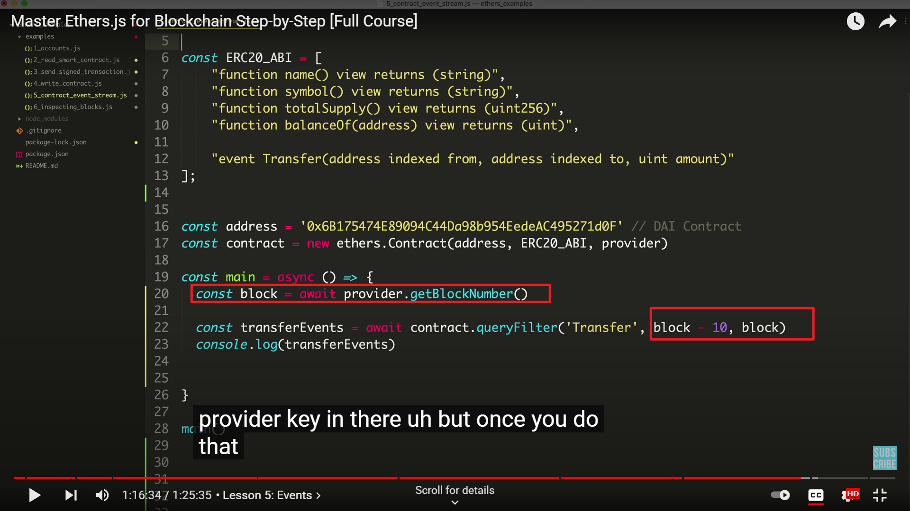
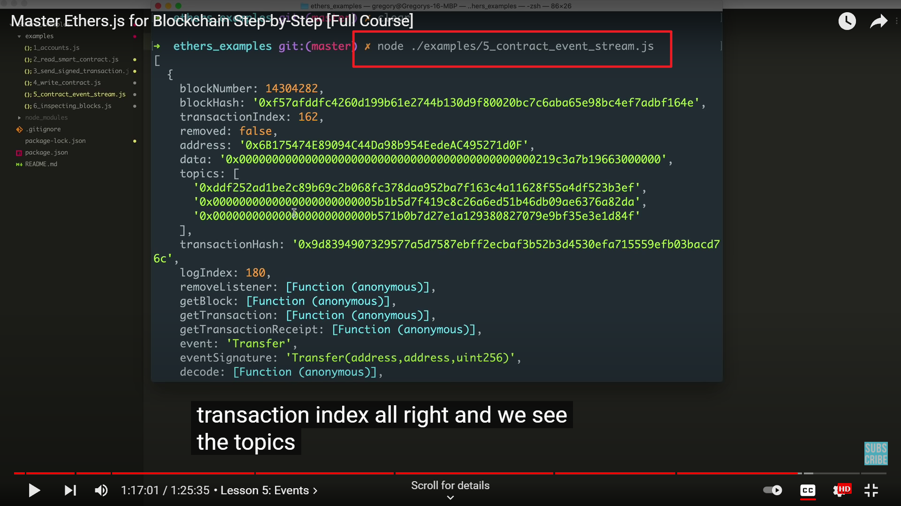

## 目前只做 event 相关部分笔记

https://www.youtube.com/watch?v=yk7nVp5HTCk

  
浏览器能看到这些信息就是来自 event。每次 call 合约时，都可以生成 event。

  
通过 event，可以方便的查看某个合约 function 的调用。如此图 dai transfer 的调用。

  
此例子目的，listen the transfer event 并 log。

  
  
参照官方文档写出如图，但此方法会 log 此合约所有 events。

  
      
      
添加了过滤条件的方法。
