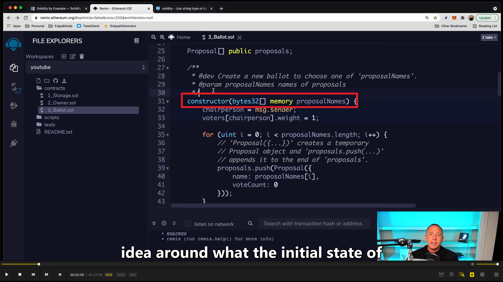
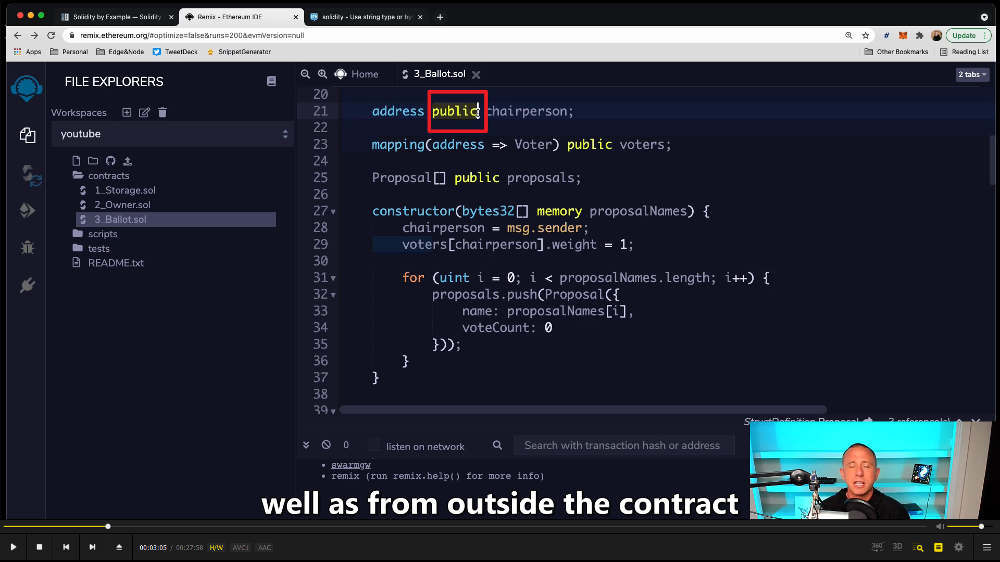
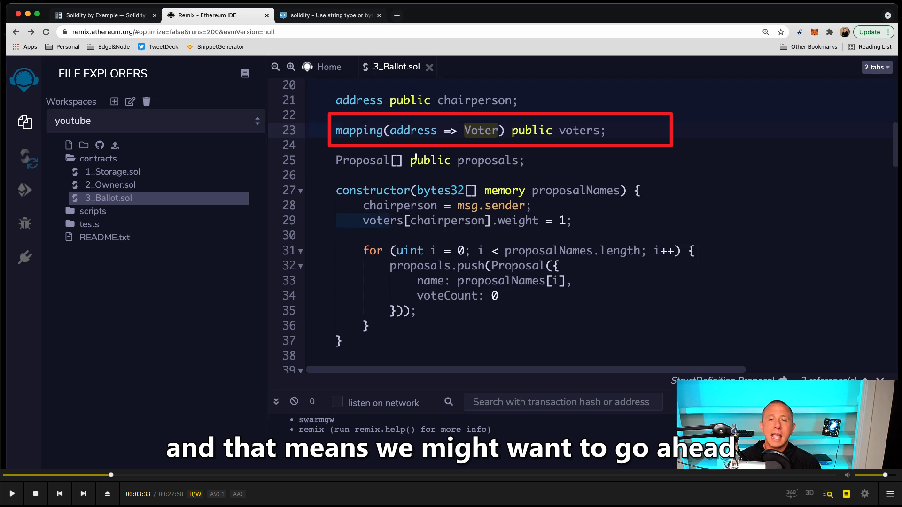
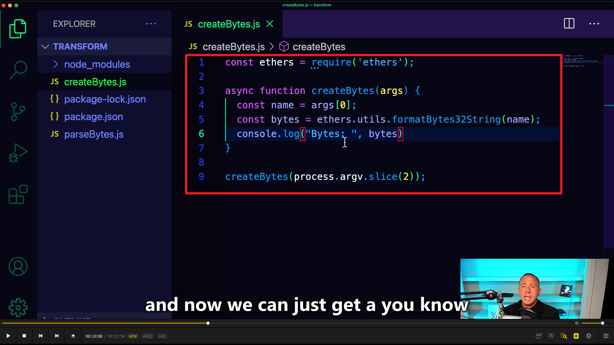
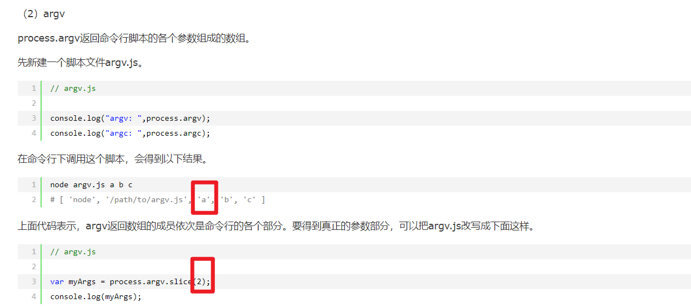
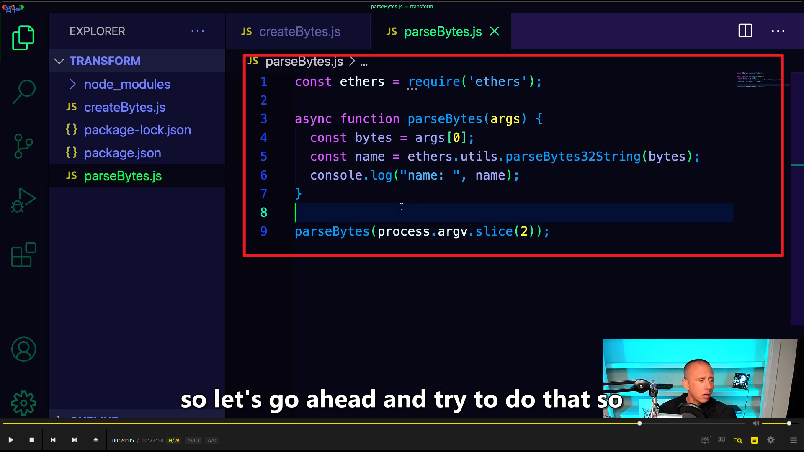
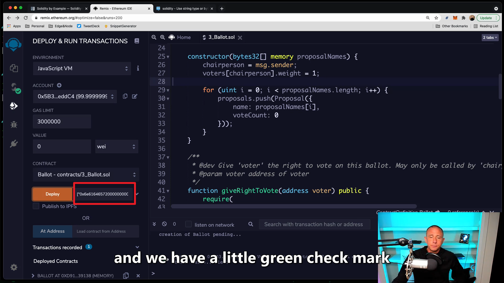

https://www.youtube.com/watch?v=GB3hiiNNDjk  
remix 里的 ballot 讲解

  
首先看 constructor，可以了解合约的初始状态，大概了解合约内容

  
public 这里意味着我们可以在合约里和合约外都访问这个变量，比如应用之类的。

  
voters 这个映射的 key 是 address，value 是 Voter（上面的 struct Voter）。

由于需要 byte32，直接输入 string 不行，所以需要个 string 转 bytes32 的函数，所以单独创建个 transform 文件夹，并引入 ether 依赖  
npm init --y  
npm install ethers

  
string 转 Bytes32 代码 （用 bytes32 是为了节约 gas 费用）

process.argv.slice(2)的解释

  
相反的，Bytes32 转 string 代码

  
传入两个生成的 bytes32，则部署成功
