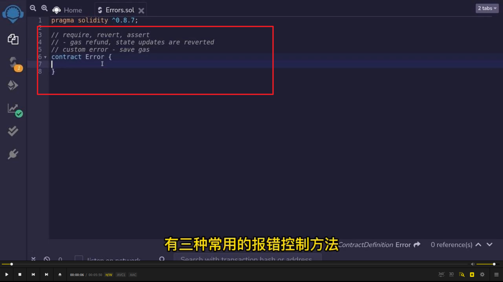
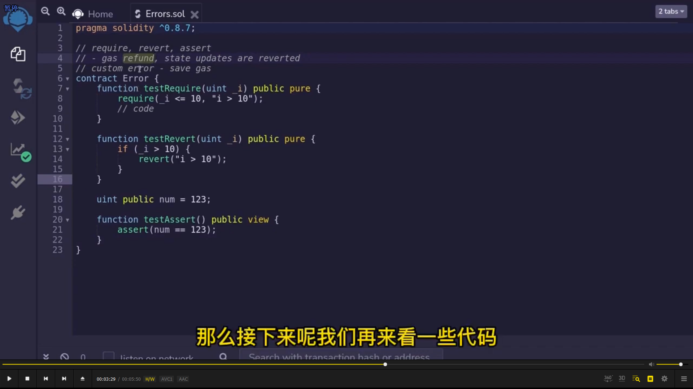
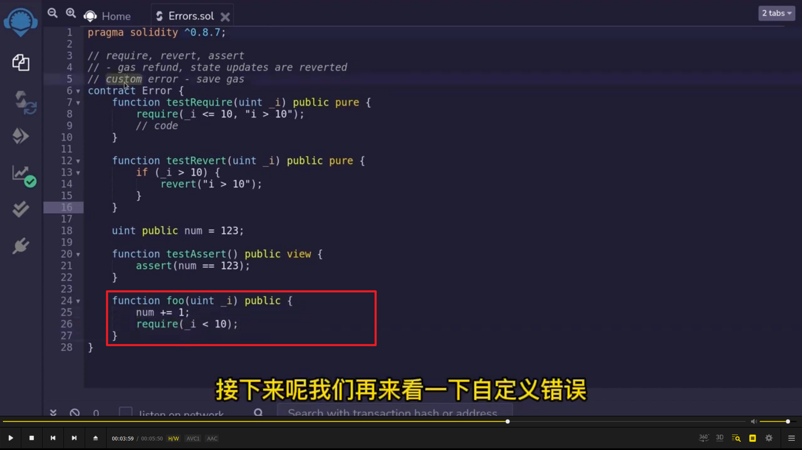
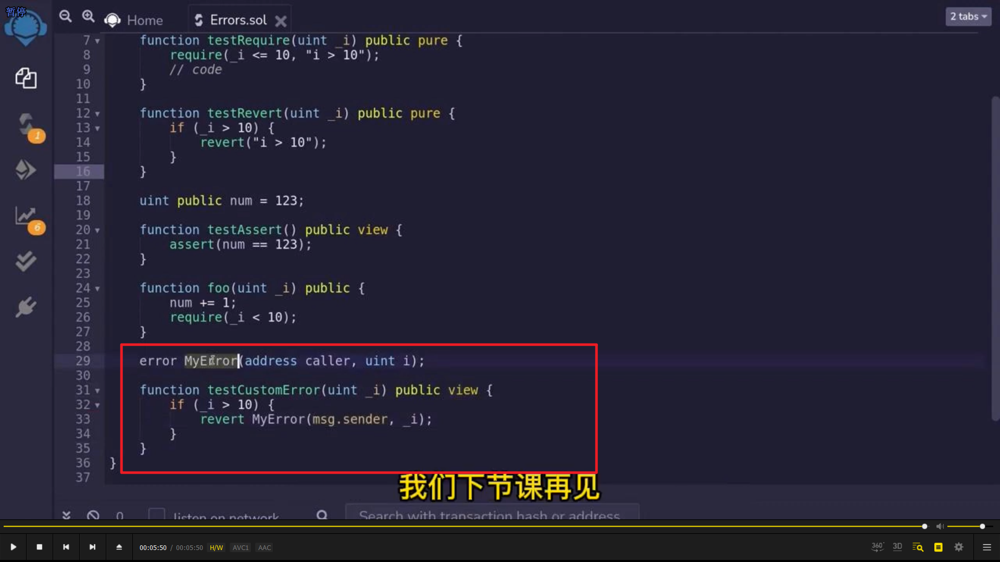

</img>    
三种常用报错 require，revert，assert    
0.8 新增自定义报错 custom，可以省 gas。  
  
</img>      
三种写法，assert 断言，没有报错信息。revert 用 if。  
  
</img>      
如果 I>=10 了，则变量不会被更改，gas 费也会退还。  
  
</img>      
自定义报错，省 gas 费，但其实也是要用到 revert。  
