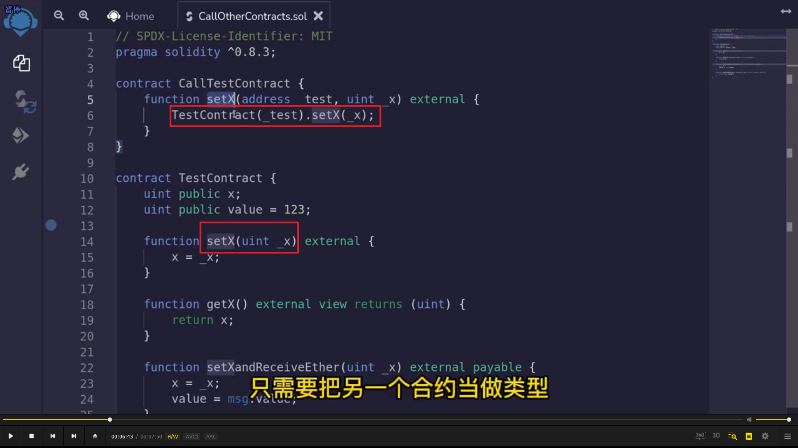

</img>      
</img>      
这节课讲通过合约调用其它合约的几种方法。    
方法一，如图一把另一个合约当作类型并传入其地址就能直接调用函数。    
方法二，如图二。  
  
</img>      
</img>      
注意图二的写法仍然能返回值。  
  
</img>      
</img>      
</img>      
更复杂的情况的调用。图三为图二的简易写法。        
  
  
