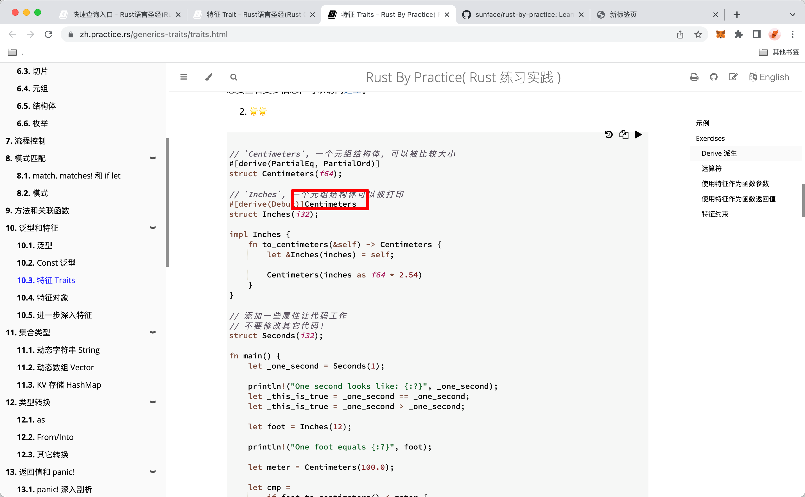
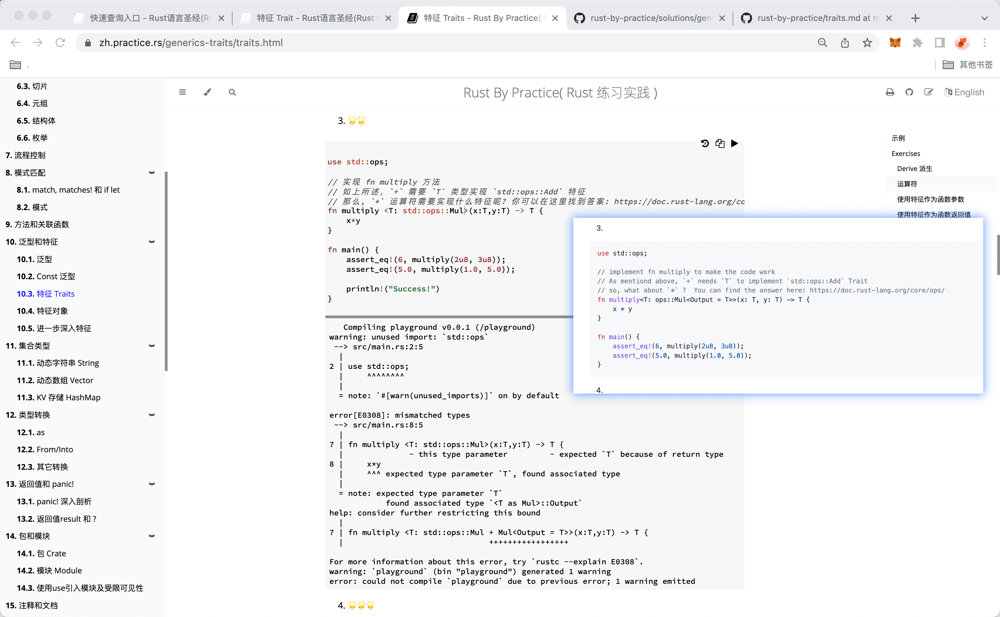
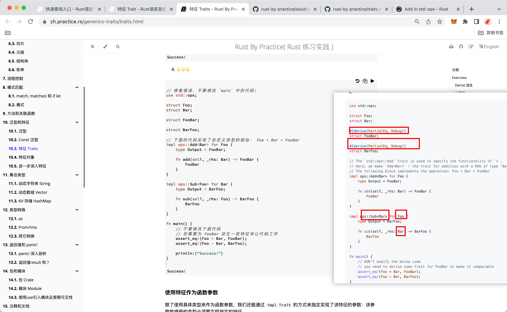
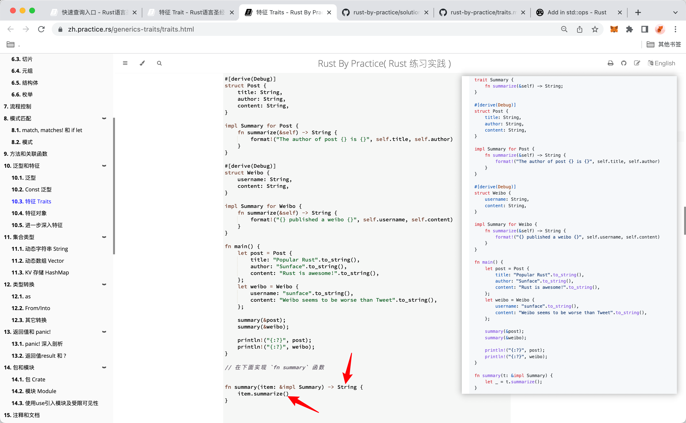
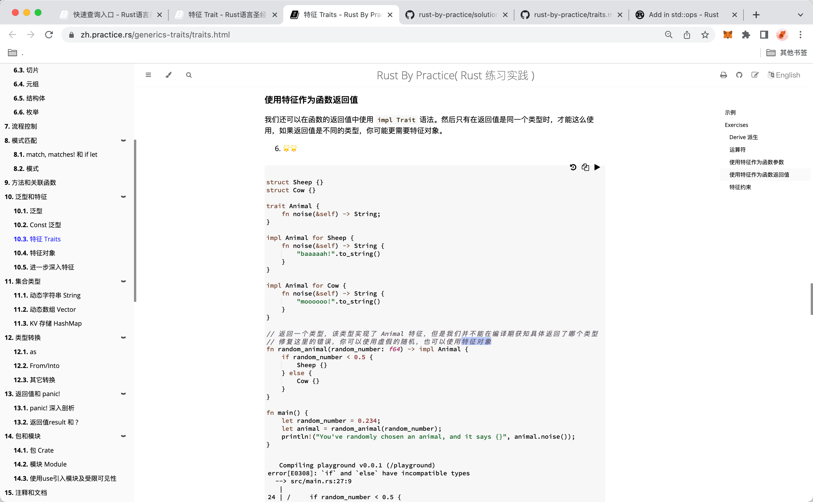
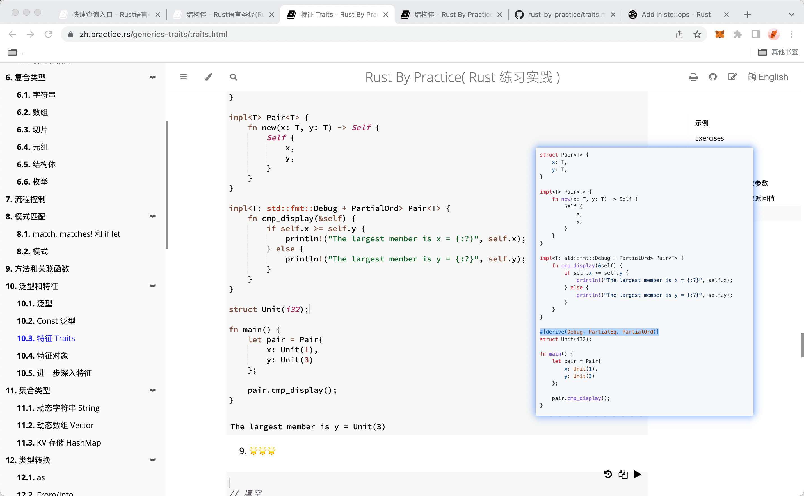
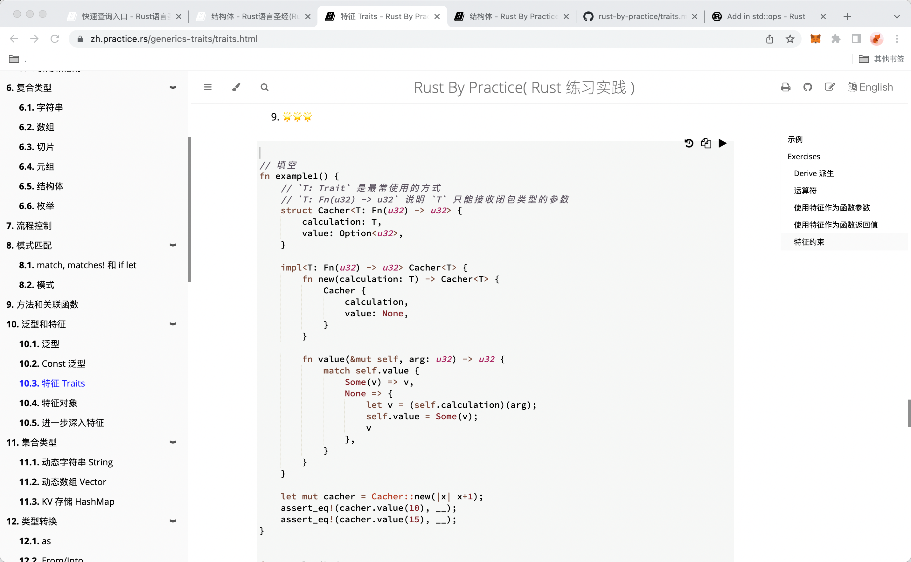

### 220814

  
较复杂，为什么会写字属性右边？意思是什么？lllf



```
原理较复杂，以后再研究，lllf
但可以直接就用 T，根据报错添加内容，
但注意
<T: std::ops::Mul + Mul<Output = T>>
不是添加Mul<Output = T>部分，而是讲Mul替换为Mul<Output = T>
```

add220824,看 trait mut 定义：https://doc.rust-lang.org/std/ops/trait.Mul.html，Output为此trait的关联类型，这里将它指定为T，如不指定，则返回值类型为关联类型（报错里说的associated type），与要求的 T 类型不服。

  
注意 impl 时是为运算符前的结构体 impl，而运算符后的结构体则是作为 运算 trait 的指定类型那样处理。mmmi

```

add220824,如图 main 里的 foo-bar 在 impl 时是ops::Sub<bar> for Foo,而不是ops::sub<foo> for Bar
```

  
1，虽然 impl 时圆括号里要写&self，但实际调用时不要写。

add，应该是函数体实际使用到 self 时才加。  
`self` value is a keyword only available in methods with a `self` parameter。

2，如不写返回类型，函数体里就要加引号，写了类型，就不要加了。

  
需要用到下节才学的特征对象，llln

  
ooop

  
涉及到以后的知识，lllf
