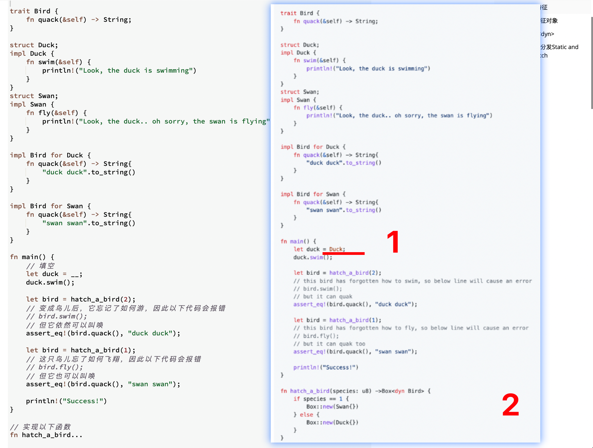
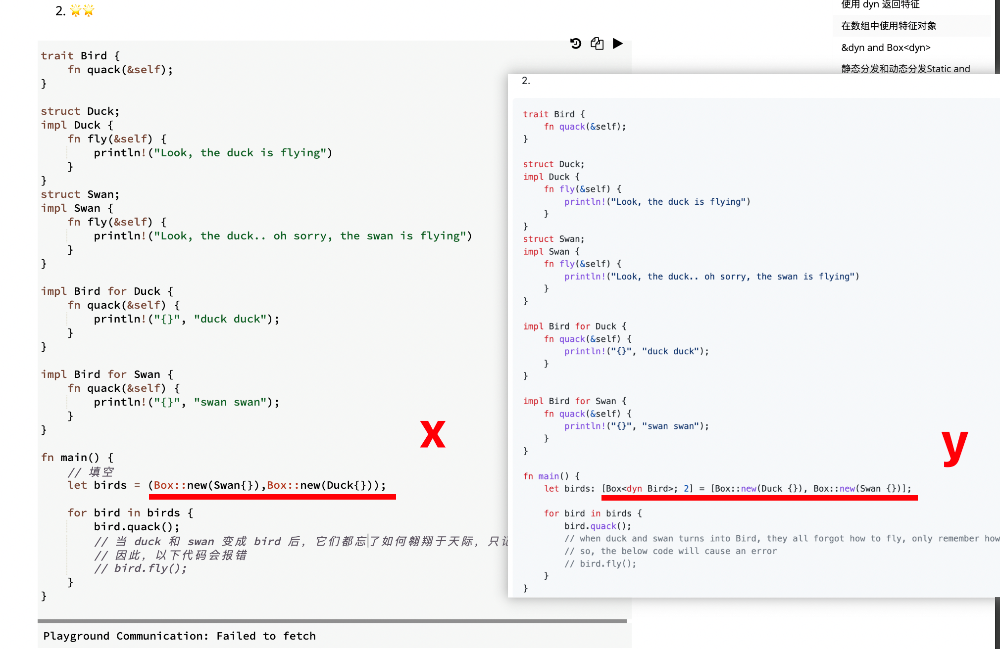
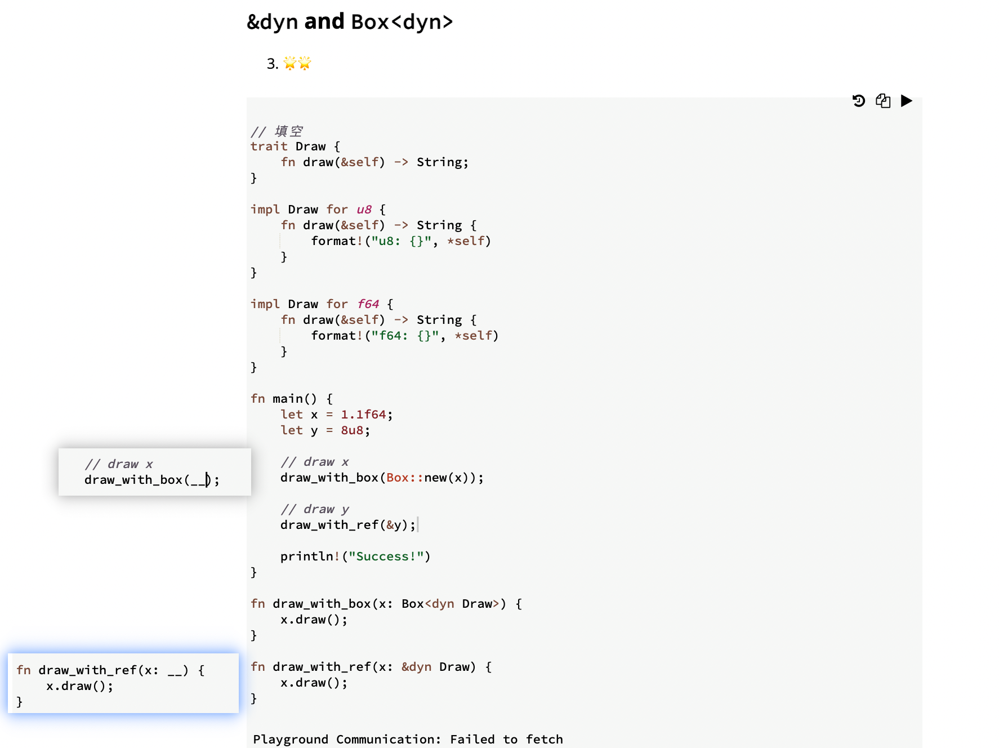
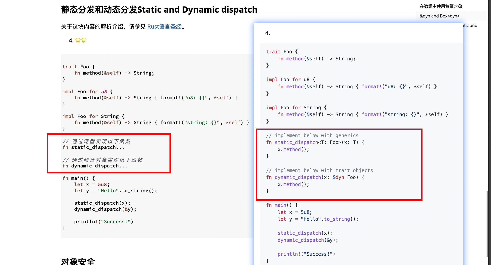
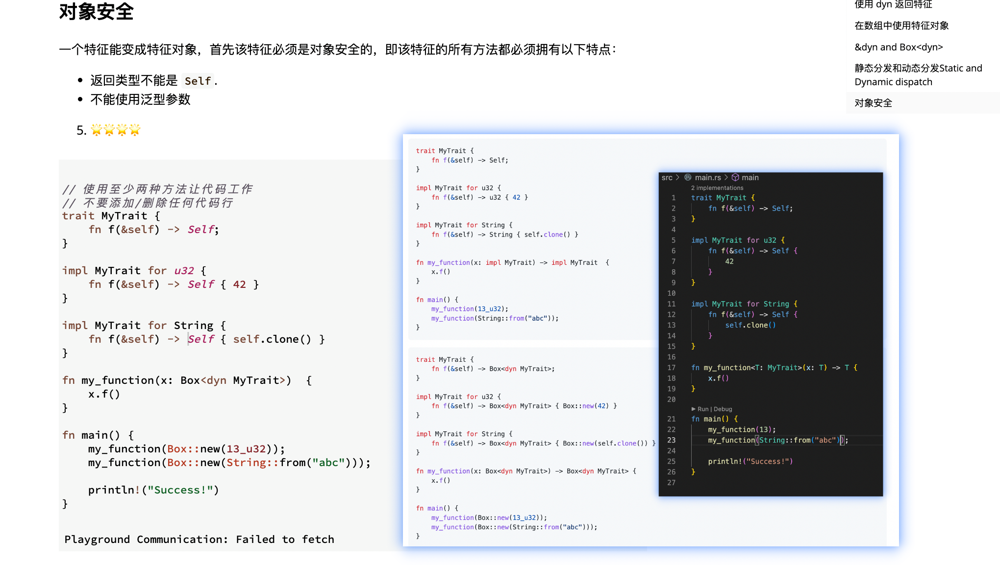

## 220825

### 总结，可以把特征对象当作一个类型，写法也和类型一样，写在参数的:后面，或作为返回值指定的类型。

  
1，注意实例化一个 struct。不用 new，直接 let duck = Duck 就行。  
add,这里 let duck = Duck 没问题是因为 Duck 这个结构体没有具体内容，如有的话，则需要接上大括号和其中的内容。  
2，特征对象作为返回值例子。

  
自己的写法错了，  
1，元组元素可以是不同类型，数组元素是同一类型。  
2，数组元素用中括号  
3，记得变量名后需标注类型



```
3，&dyn and Box<dyn>
```

回答正确，照抄教程里定义和实现的写法就行了



没做好，记住写法，记住返回一个类型时用范型写法，返回多个类型时用特征对象写法。

  
依次为，原题，官方答案，自己写的  
1，官方答案 1 和自己写的类似。只是范型标注不一样。  
2，官方答案 2，lllf
