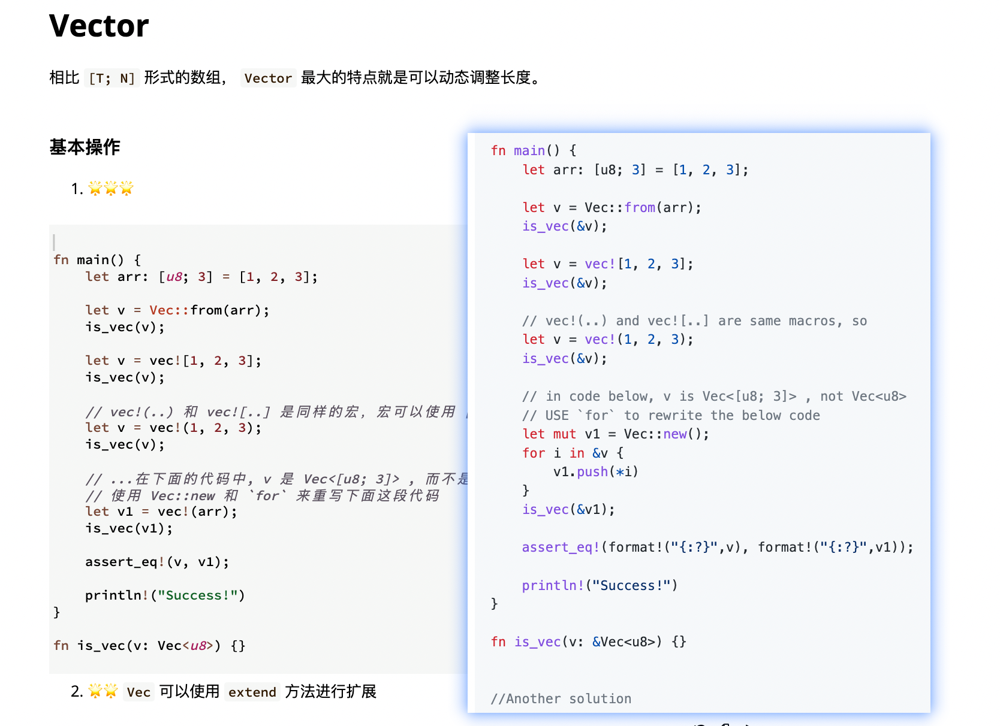
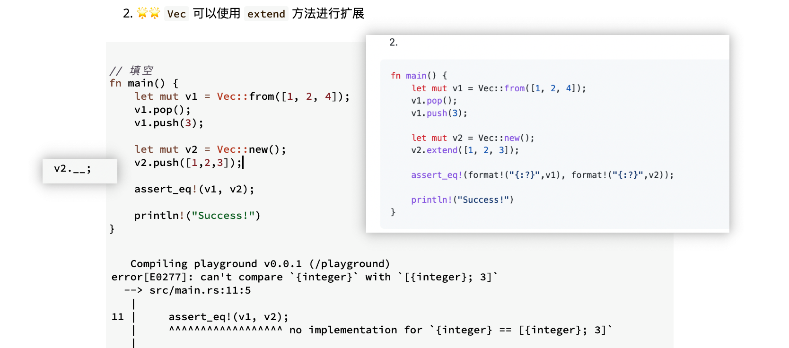
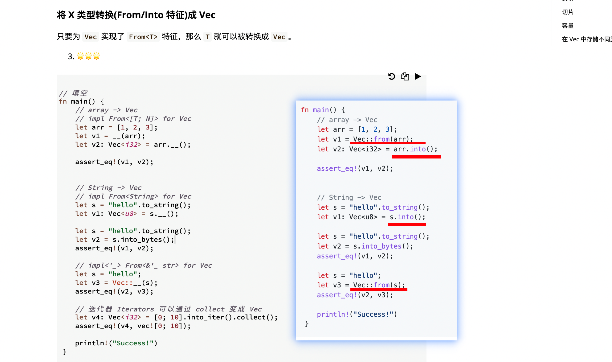
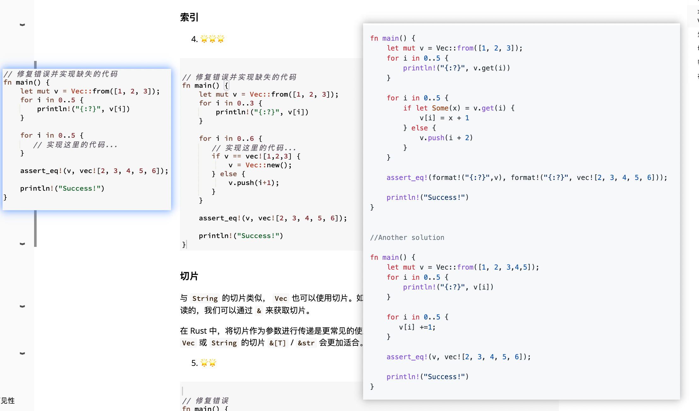

## 220826

  
lllf  
这题很奇怪，略过

  
dddn  
pop 为去掉最后一个元素  
push[1,2,3]为增加一个数组元素，extend[1,2,3]为增加 3 个不同的 int 元素。  
不做答案所写的 format 修改也没问题。

  
dddn  
vec 的 from into 用法，course 里没有介绍

索引  
自己的写法和标准答案不一致  
1, 循环时 0..5 实际使用的是 0，1，2，3，4  
2，get 可以不考虑溢出  
3，if let 类似于只有一个情形的 match
