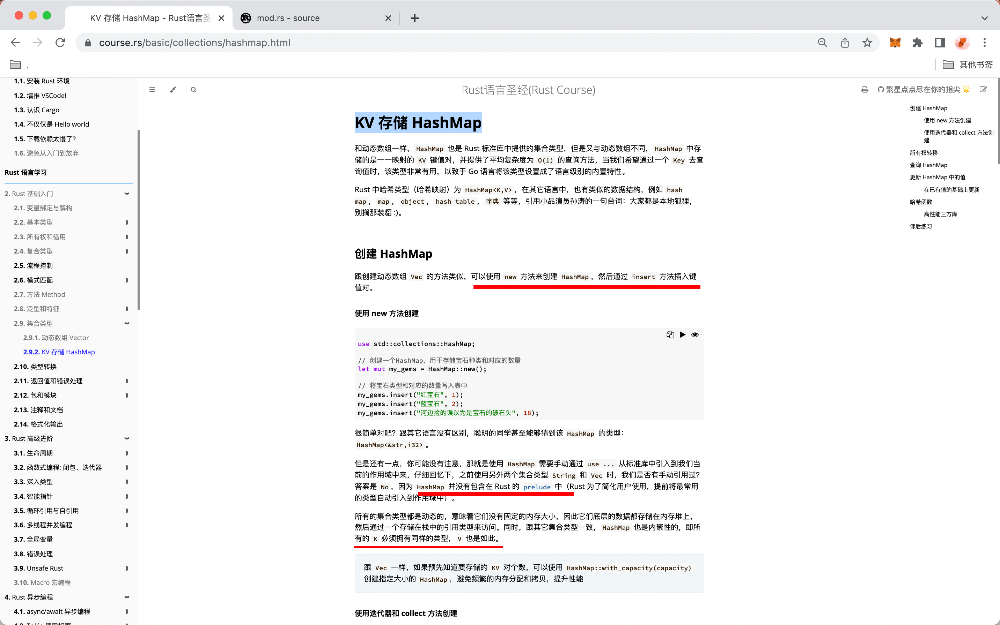
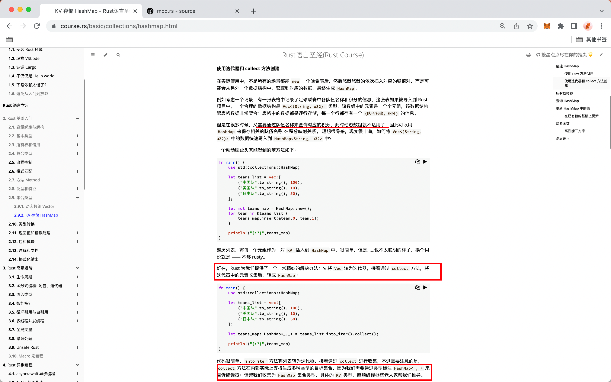
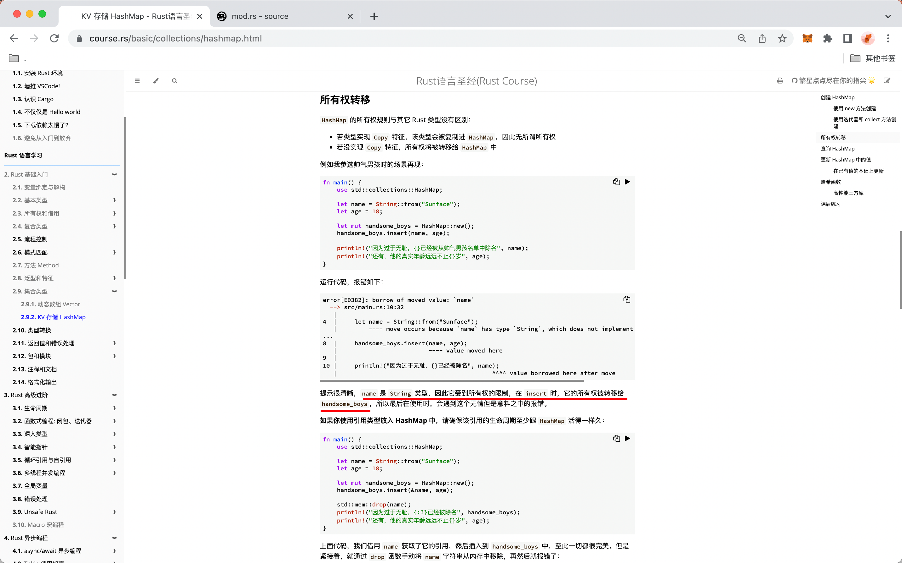
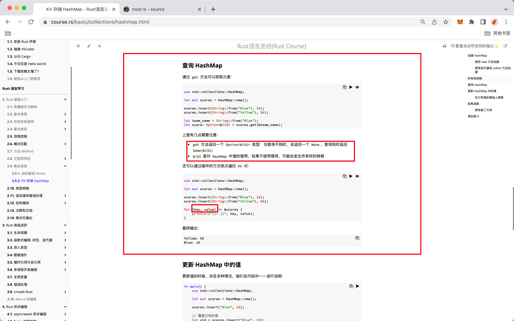
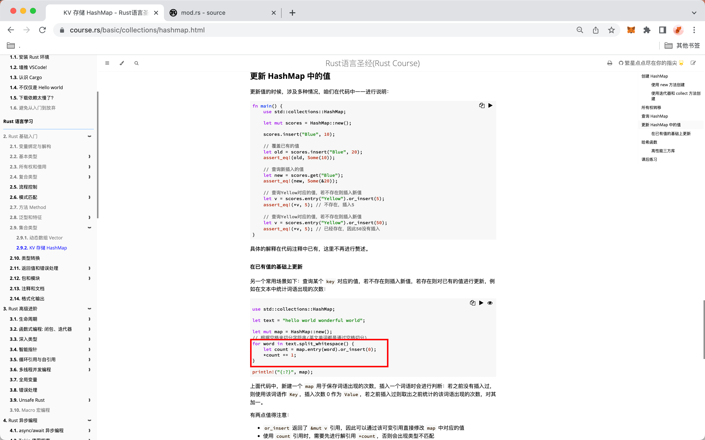
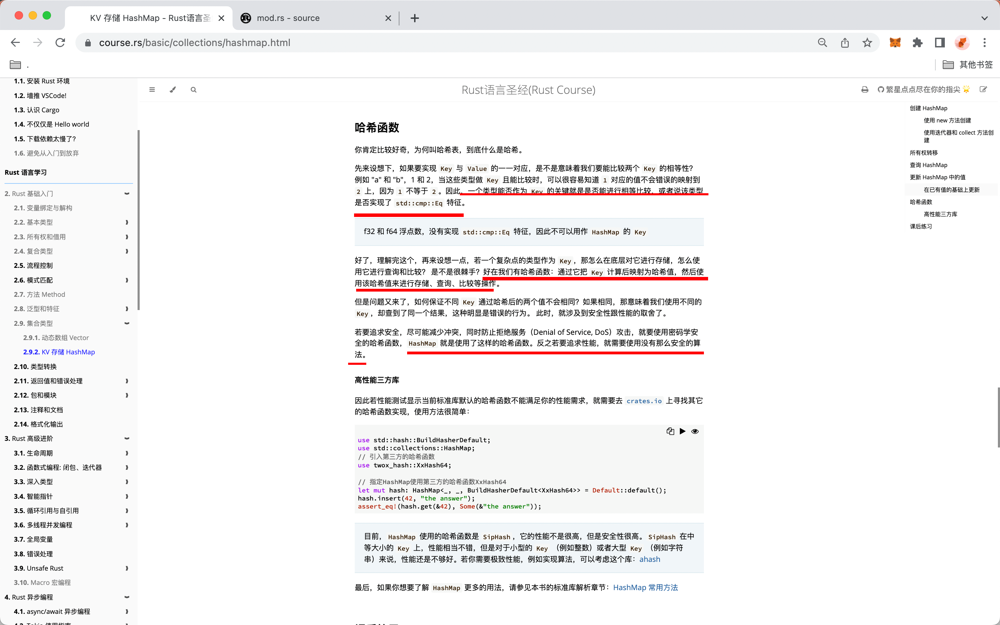

## 20816

  
ooop


ooop  
iiic

```
//如不写为HashMap<_,_>，会有以下报错
error[E0282]: type annotations needed // 需要类型标注
  --> src/main.rs:10:9
   |
10 |     let teams_map = teams_list.into_iter().collect();
   |         ^^^^^^^^^ consider giving `teams_map` a type // 给予 `teams_map` 一个具体的类型

```

  
ooop  
iiic

  
查询 hashmap  
ooop

  
更新 hashmap 中的值  
圈中的部分应该是某方法的固定写法，记住就行了

  
hashmap 原理
