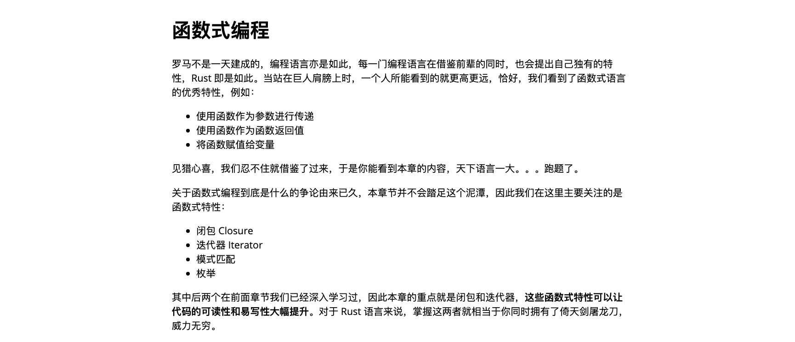
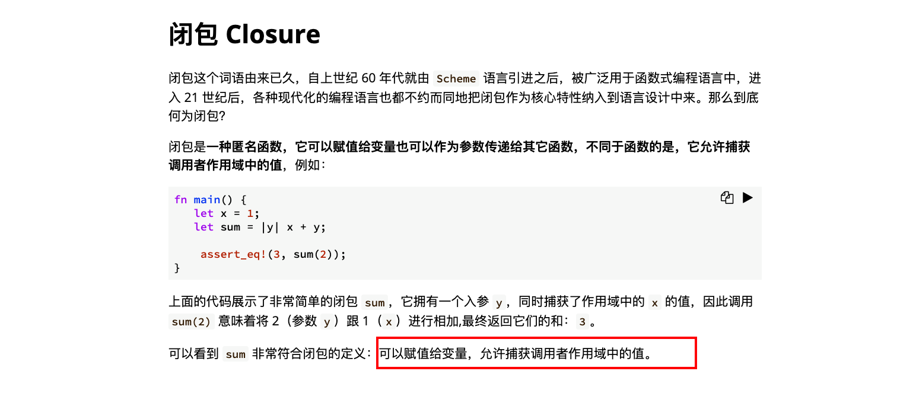
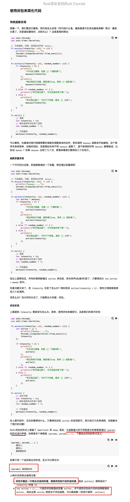
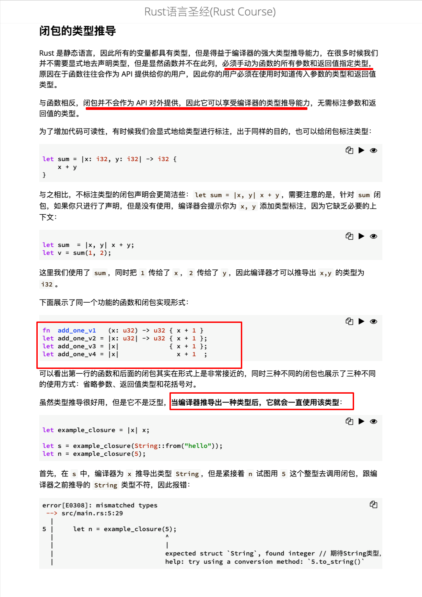
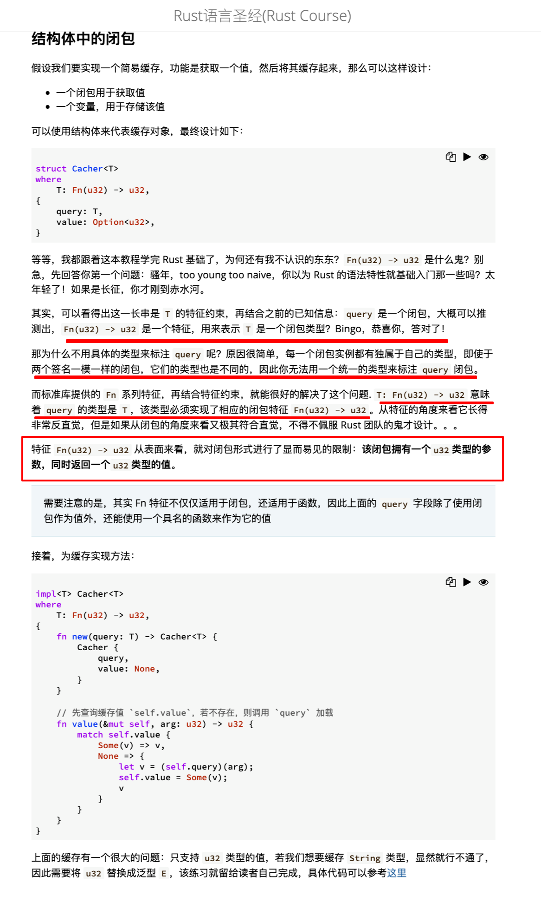
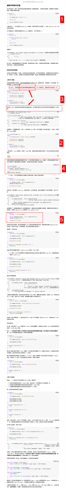
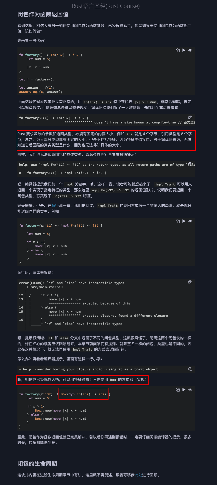

  
3.2 函数式编程

闭包 Closure  
add220902,这里 sum 整体是闭包（而不是单独的参数|y|），类似函数，只是参数不用括号而是竖线包裹，且可以从此函数外拿到其它变量的值，如这里的 x。

  
使用闭包来简化代码  
add220902,复习红框部分
  
闭包的类型推导  
add220902,复习红框部分

  
结构体中的闭包  
add220902，复习红框部分，图中这种结构体只有名字，叫做单元结构体。但按图中所写，其仍可以有范型参数。

捕获作用域中的值  
1，注意这里是判断，而不是赋值  
2，fn_once 是函数，func 是闭包且是此函数的参数，也就是函数体里的 z。func(3)意味着 3==x.len()==3，所以结果是 func(3) = true。  
3，这里应该是两个不同的意思，1 是闭包会拿走被捕获变量的所有权，2 是此闭包被函数调用后自身也会失去所有权？？？？  
4, oooh  
5, 注意 let mut update_string 只是在定义闭包，下面一行才是在使用闭包，str 可能造成误解，其实只是个普通参数可以把它换成其它单词。

add220902，  
3 这里的主体 fn fn_once 并不是闭包，而是它的参数 func 是个闭包，因为 func 的范型 F 的 trait bound 形式就证明了它是闭包（此节之前的笔记有说这种形式）。  
4 看不懂 thread::spawn，mmmf。

较复杂，5 之后的内容以后再看，lllf

  
闭包作为函数返回值
