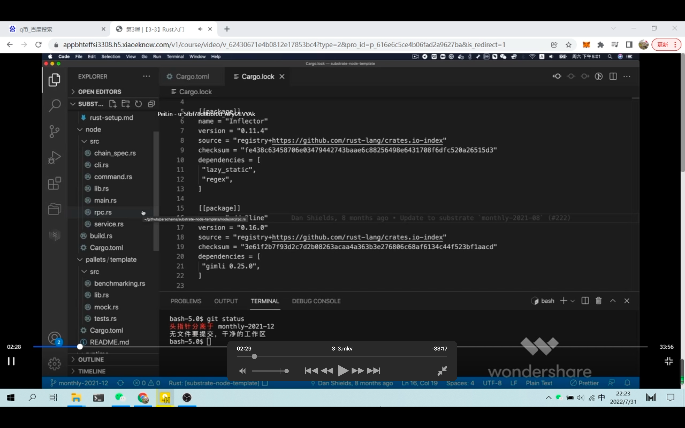  
node 部分介绍，node 主要是 binary 部分，如节点启动，网络连接，数据库等底层代码

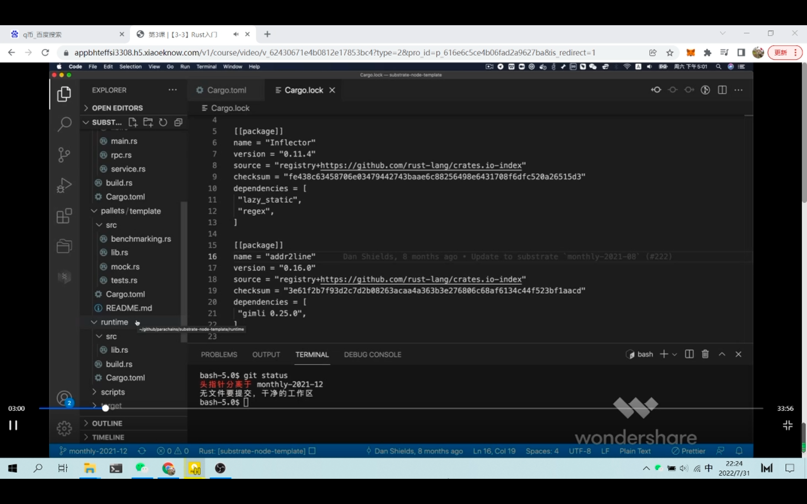  
runtime 执行链上逻辑，runtime 会编译成 wasm 代码，wasm 代码会存放在链上，当代码包含的 function dispatch 时，它会到 node 里去执行

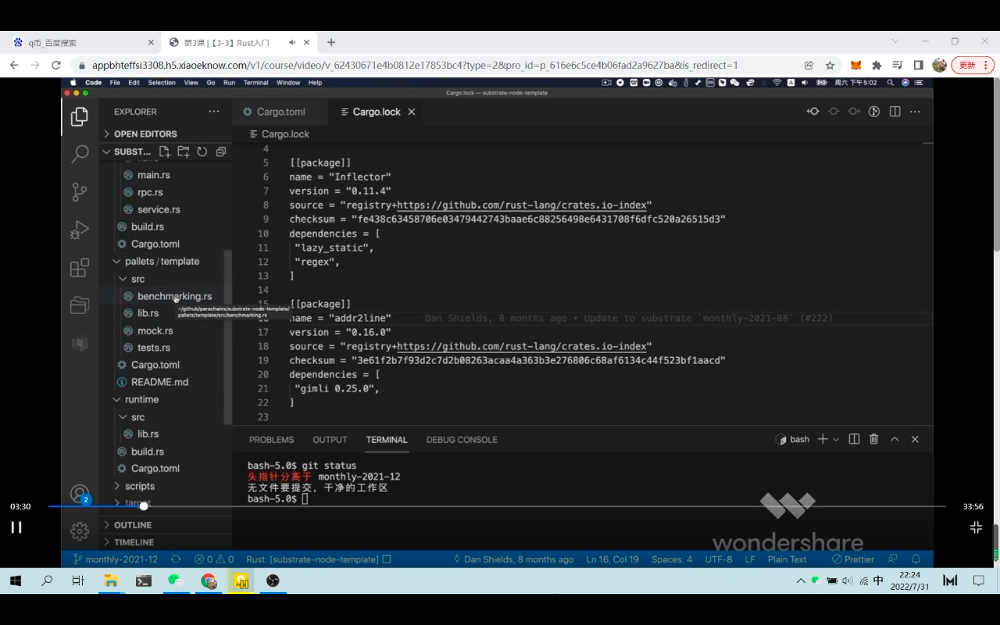  
pallets，每个 runtime 有不同的功能，放到不同的 pallets 里，所有的 pallets 组合起来就是整个 runtime 的执行逻辑。

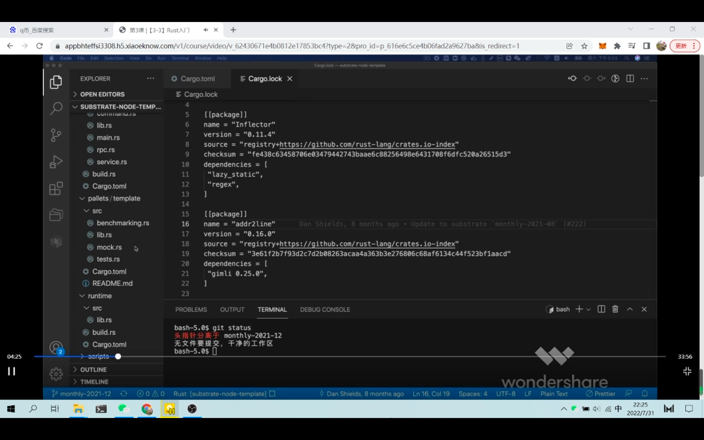  
substrate 链还可以在这两层之上（binary 层和 wasm 层？）有用户层的链上逻辑，通过智能合约实现。但 node-template 未包含智能合约代码

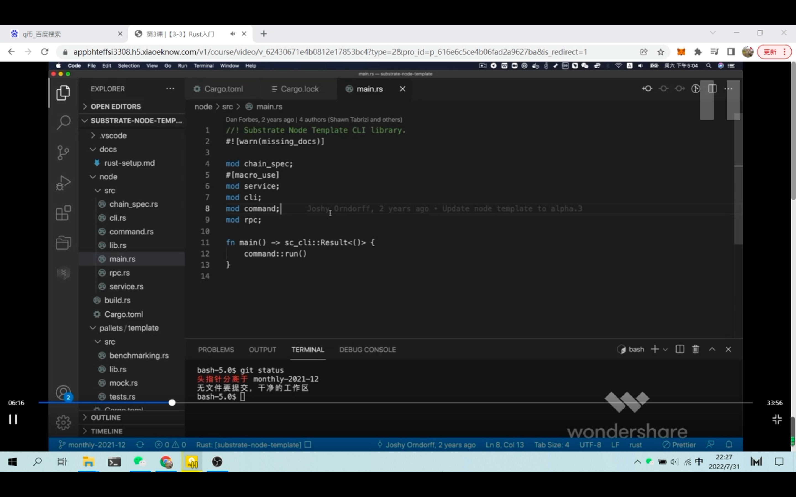  
node 部分是要把所有的区块链组建启动起来。数据库，网络连接，线程管理，交易池等初始化，

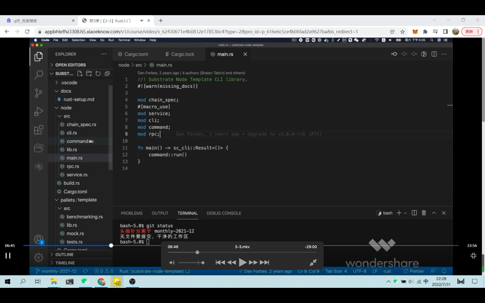  
main.rs 对外 run command?

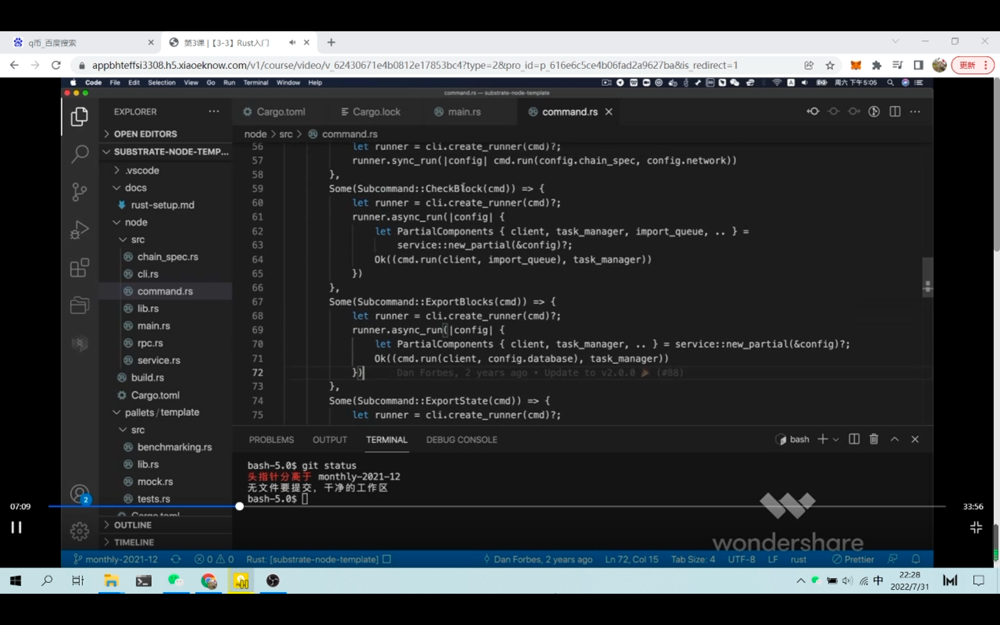
command.rs,运行链以外比较有用的 subcommand,如 purgechain 等

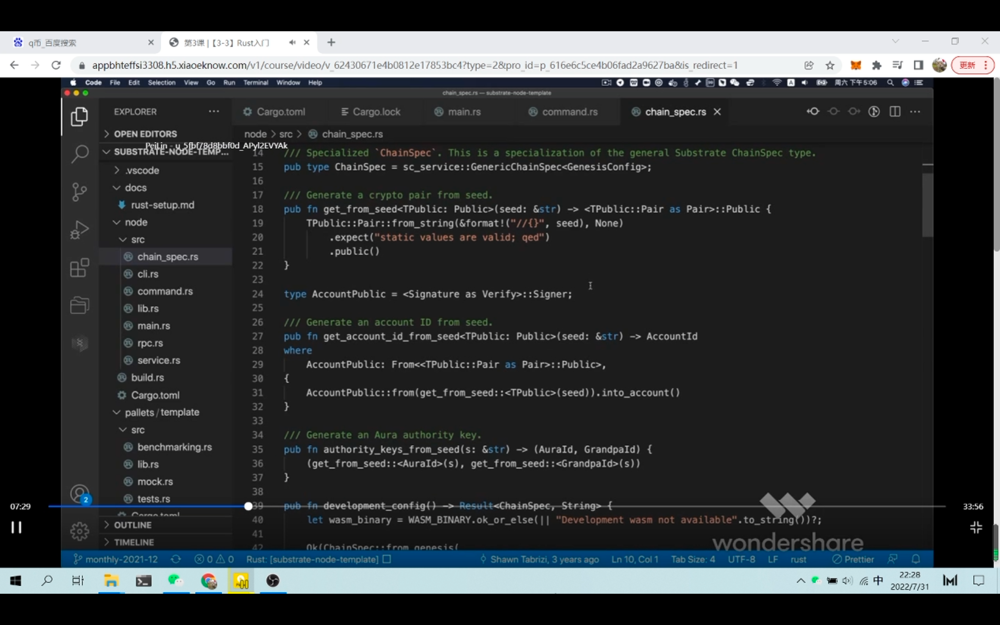  
chainSpec.rs 定义链启动的一些参数.

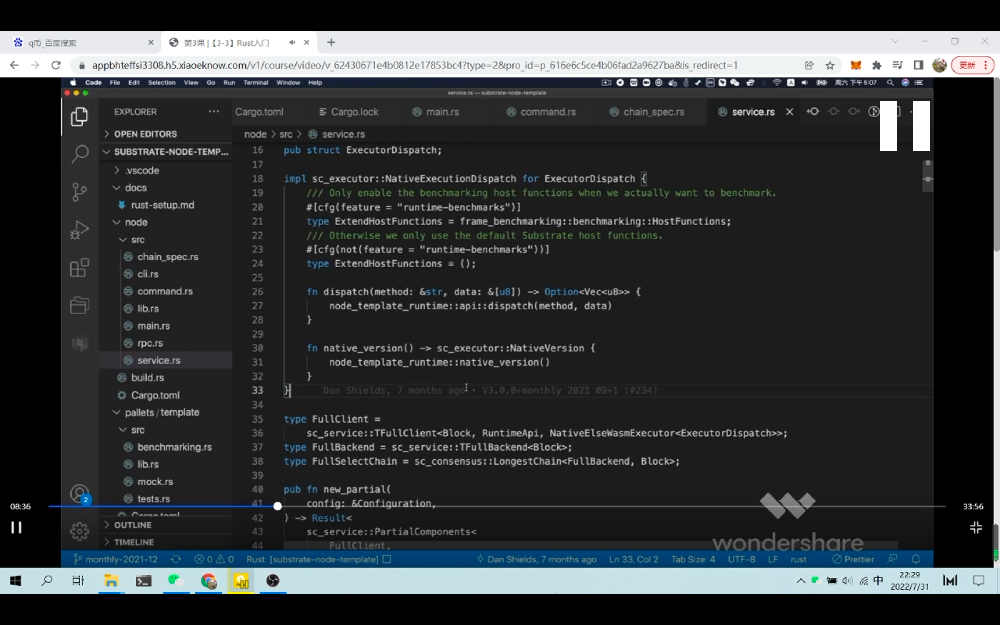  
service.rs 定义如何组装 node 节点的执行代码,较复杂,需要时再学

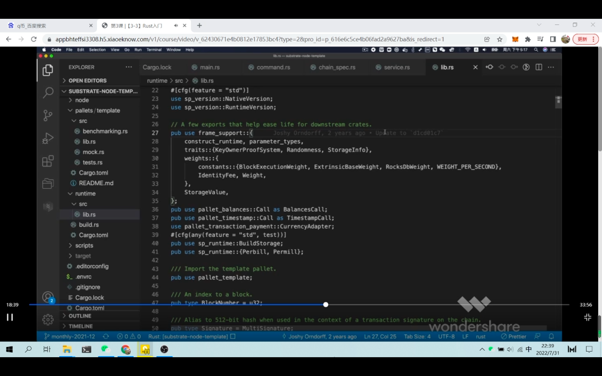  
基于 node,运行 runtime,所以 runtime 相当于第二层.可以对 wasm 进行 dispatch 和 excute 的环境.runtime 最主要是进行参数设定,常数,trait 绑定,把 pallets 组合起来等.

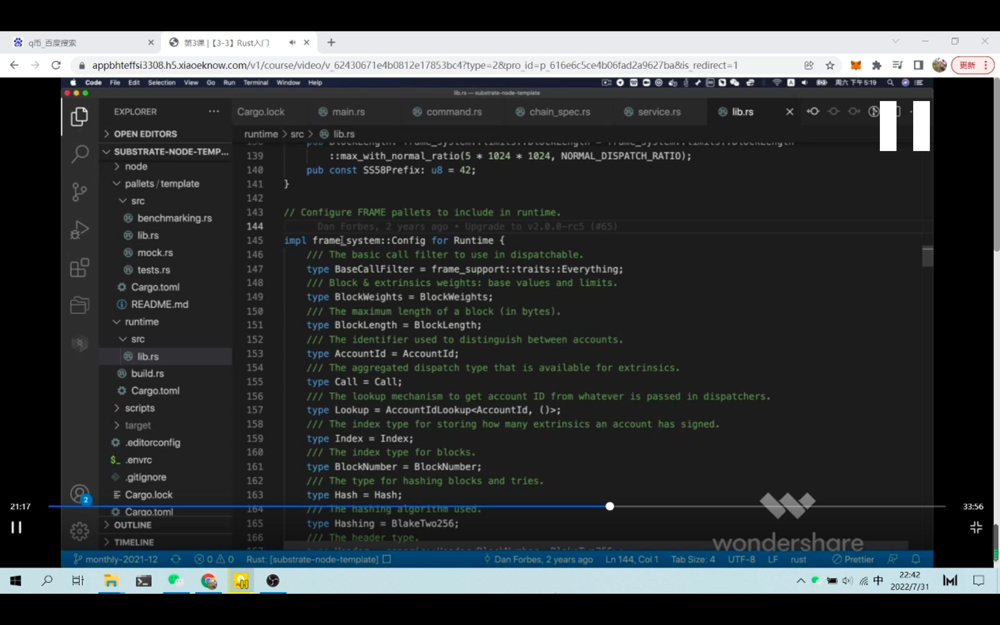  
以 frame 开头的 pallet 是系统级 pallet,包含了重要参数的设定.

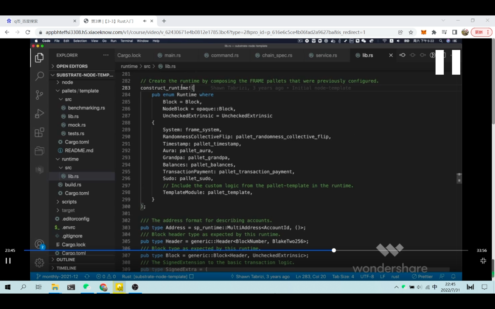  
construct runtime 宏是把之前提到了最重要的 pallet 放进来        

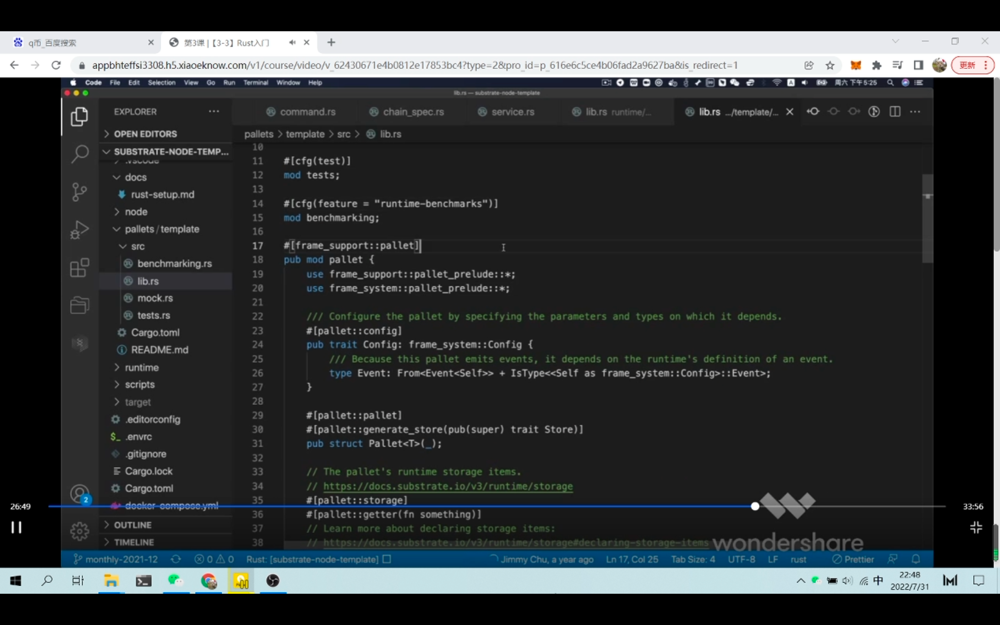      
介绍所有的pallet是怎么定义的.
