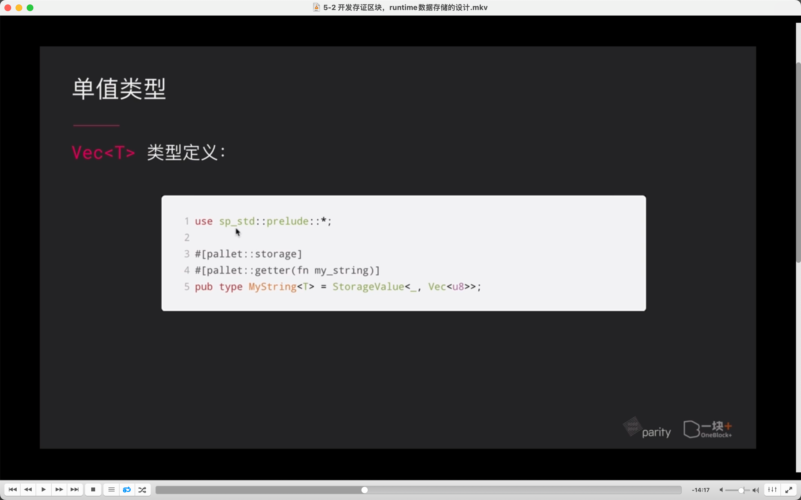

## 220823

  
内容

  
区块链存储不同点

  
约束  
1，存 hash
2，区块链浏览器  
3，浮点数运行结果跟编译器 cpu 架构都有关系，所以不能用

  
存储单元类型  
单值 stroage value  
简单映射 storage map  
双键映射 storage double map

  
ooot  
type 是类型别名的意思。

  
ooot  
定点小数，取代浮点数  
timestamp 模块定义 moment，表示当前区块时间戳，系统模块提供的 accountid，通常是用户私钥对应的公钥信息。

  
数值类型举例
第三个范型参数 valuequery，表示使用 valuequery 这种形式去读取链上存储单元。如果不指定则是 optionquery，默认没值会返回一个 option none 值。这里用 valuequery 没有值就返回一个所存储类型的默认值。如 i8 默认值为 0。

  
单值类型 api。

  
安全操作

  
ooot

  
ooot

  
ooot

  
--=

ooot

  
moment 时间类型定义  
1，是在 pallet_timestamp 模块里定义的  
2，当想使用 pallet_timestamp 模块里定义的 moment 类型时，让配置接口（最前面的 Config）继承自 pallet_timestamp::Config(pallet_timestamp 模块里的配置接口)。这样当前模块就能拥有 moment 这个类型定义。mmmi  
3，这里定义了存储单元 mytime，类型为单值类型，存储的数据是 T::moment，即 pallet_timestamp 模块里定义的 moment 类型

  
accountid

  
struct

enum

  
简单映射类型，storagemap  
Blake2\*是一个哈希算法，用来对 key 哈希，用结果作为 key-value 数据库真正存储时用到的 key

  
ooot

  
-=  

双键映射类型 storagedoublemap

  
-=  

存储的初始化

  
  
最佳实践 N 其它 tips
