## 220911

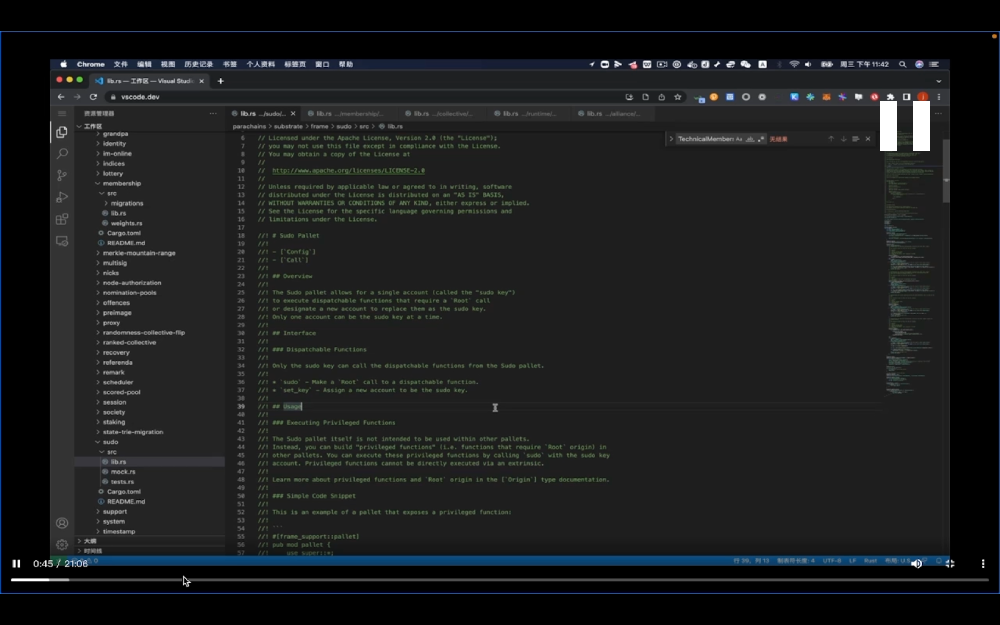</img>  
sudo 可以在没有权限时调用任何方法

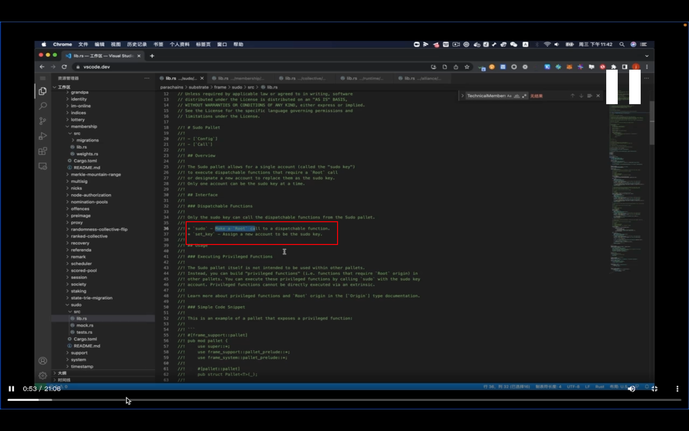</img>  
sudo pallet 主要是有个 sudo 方法，用来 build 一个以 root 为 origin 的 call。

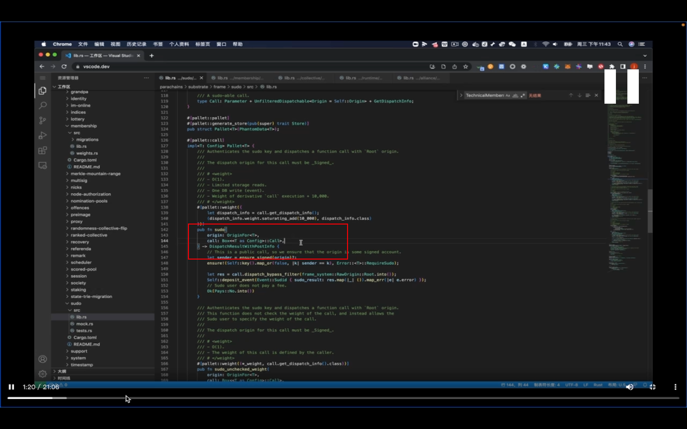</img>  
orgin 没有详细说 ddda  
call\* 是最 general 的类型，代表了所有 pallet 里面的所有方法。ddda。  
当用前端调用 sudo 时，会展开，让选择用哪个 pallet，哪个 extrinsic。之后就会在 js 里包装出对应的方法发送到链上。这个方法就会组成这样一个对象。

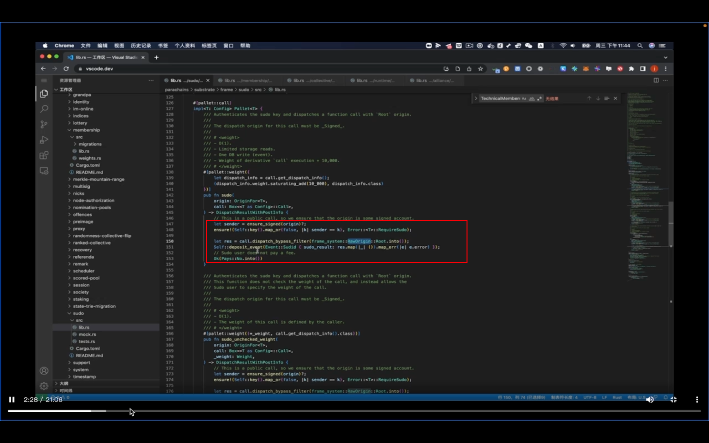</img>  
let sender\* 看签名  
ensure!\*,拿出存储到 sudo 账号和签名账号做比较，如果是就继续，不是就会抛出错误。执行过程其实就是直接跳转到另一个 call 里去（dispatch_bypass_filter\*）。

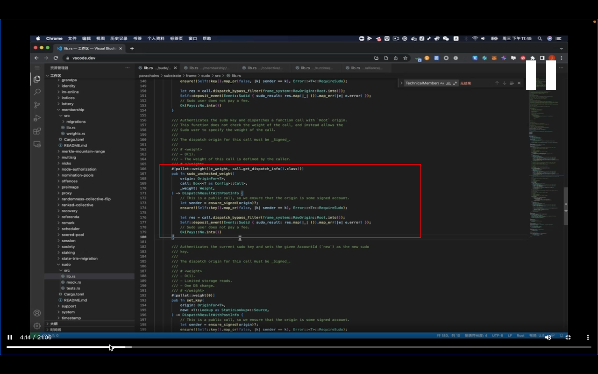</img>  
unchecked_weight，有时执行方法可能 weight 非常大。可能超过用户有的 token 数量，或超过 block？？？？即设定的最大值。所以用这个，跳过 weight 的检查，直接调用方法。

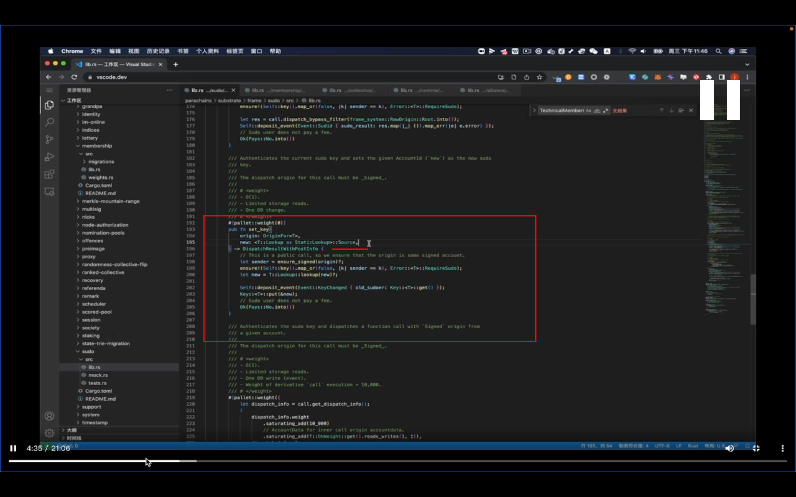</img>  
set_key 改变 sudo 账号。  
这里没有用 accountid，而是用 source 类型。类似于短的账号的形式。它这个账号需要用下面的 Lookup::lookup 方法去获取长的 accountid。  
这样做的好处是参数 new:\* 会比较短。因为它是按账户生成顺序来的，所以会比 accountid 要短很多。 dddf

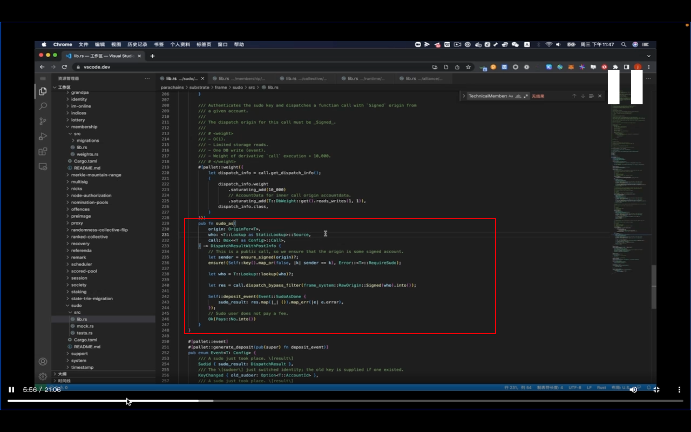</img>  
sudo_as 以另一个账号的身份去 trigger 这个 call。

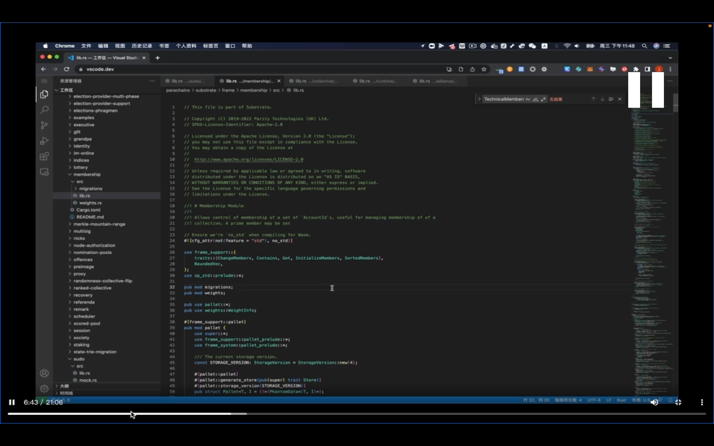</img>  
membership 是在一个系统中去管理某些成员。把成员分为两个类别，一个是 member，一个是 prime，prime 只有一个。

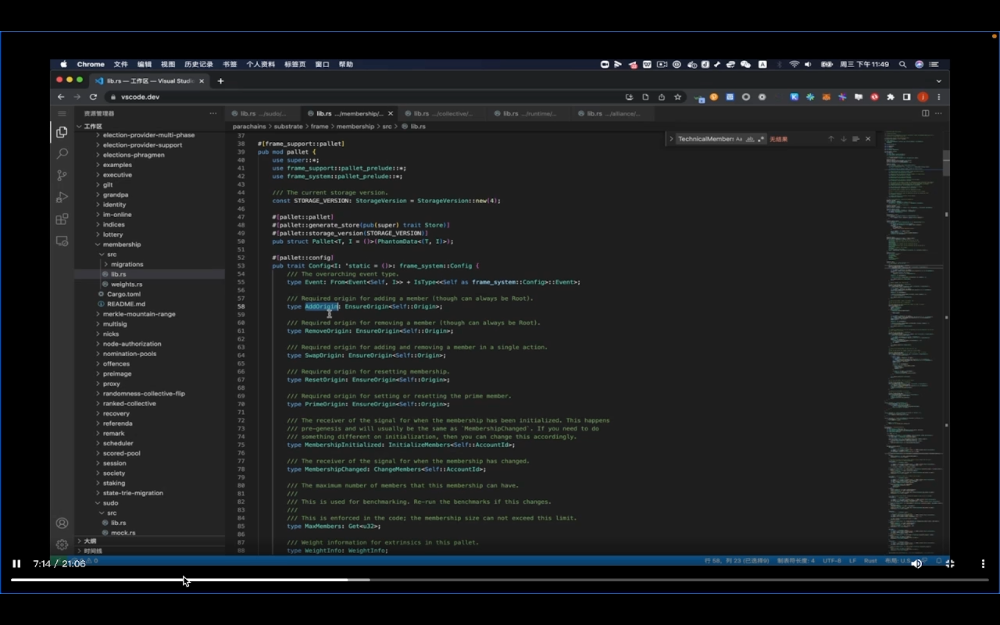</img>  
addorigin 增加一个成员，这个成员可以是一个账号，一个 pallet，或一种多签的组合等。很灵活，需要在 runtime 里动态绑定。  
可能这里等 ensureorigin 是限定只有指定的用户才有操作权限。

addmemebr，增加成员。对应的 origin 是使用 T::addorigin 来做一个 check，看哪些账号有增加 memebr 的权限。  
因为是一个 vector，所以在整个操作中进行了排序 ddda。所以查找时就能用这个二分查找 binary_search 来获取 member。  
然后用 put 把更新后的 member 放到存储里去。刚才的查找主要是不重复添加 member。  
做出改变后，通过 change_members_sorted，这种类似回调的方式通知使用 membership 的人。  
1055 左右，dddf。

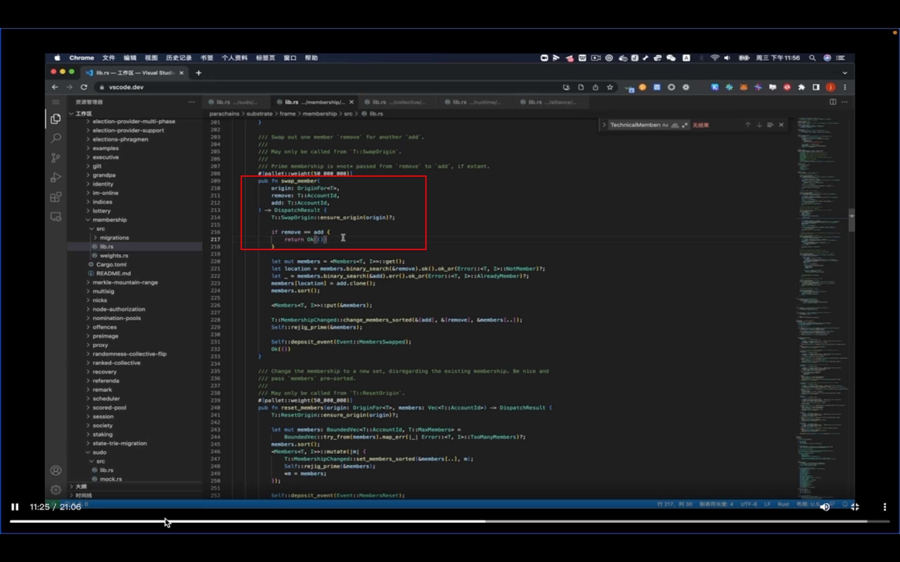</img>  
swap 用于增加一个的同时减少一个。

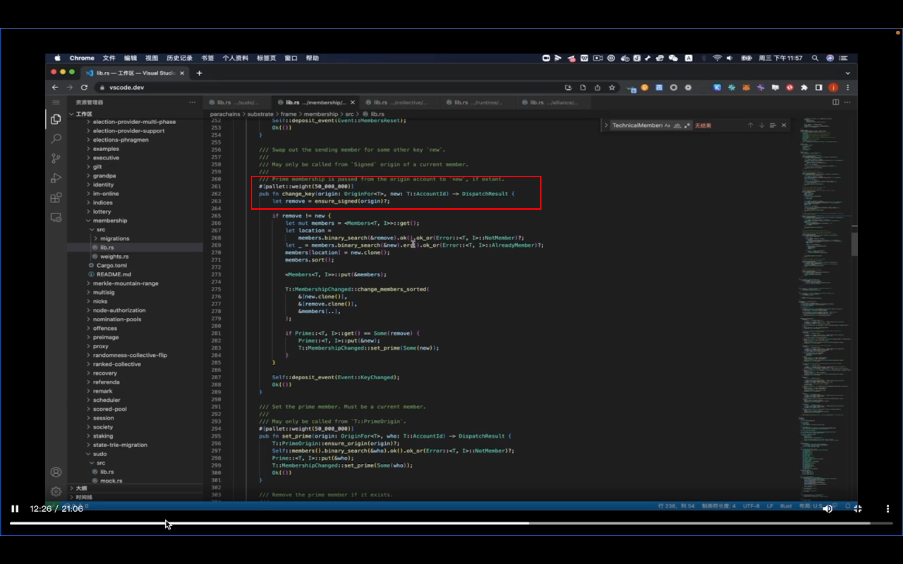</img>  
changekey 起到一个改变 prime 账号的作用。

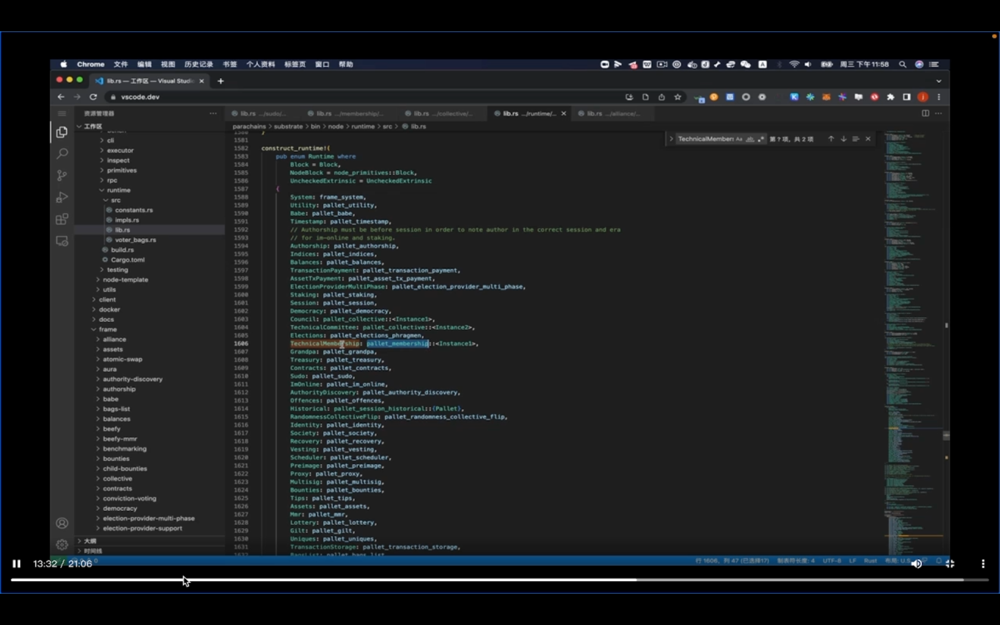</img>  
这里用 pallet_membership 实例了一个叫 technicalMembership 的对象。

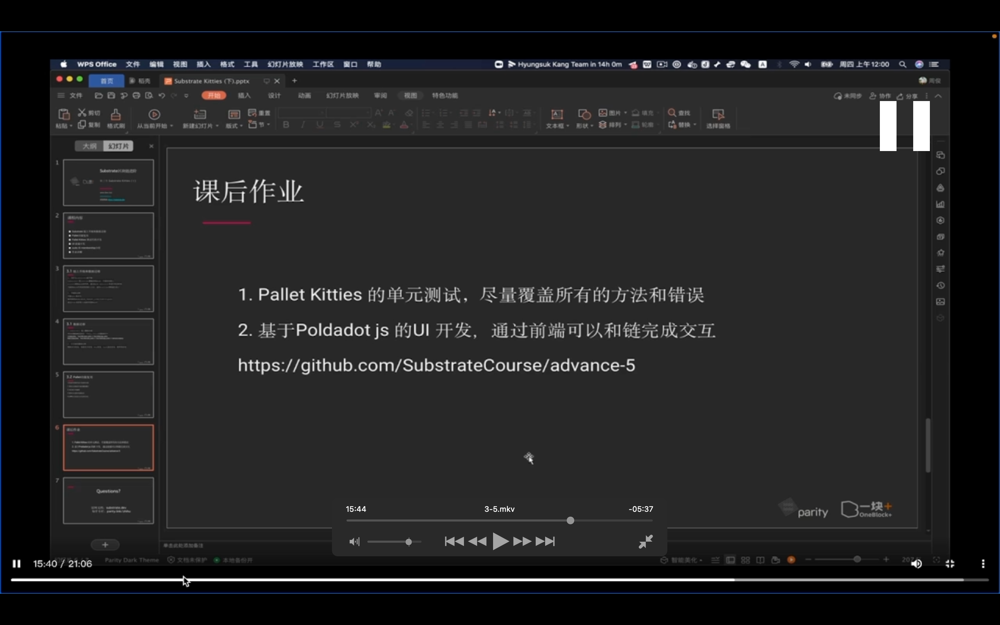</img>  
课后作业
