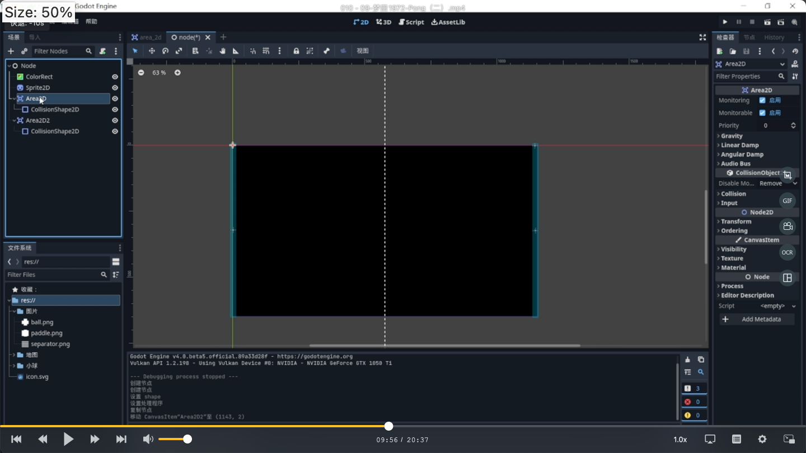

## 230916

## 做一个很简单的 2d 乒乓球游戏

</img>  
创建 area2d 节点，它可以判断区域内是否有框出的这 4 个节点。

</img>  
0530e，小球重复从左到右运动  
之后取消掉 if 段，并复位小球位置，保存好，则小球场景做好。

## 0900，创建背景及分隔线

</img>  
两边添加墙壁

</img>  
左边墙添加代码  
对 area2d 进行高频率范围检测，范围内出现小球则命令小球返回原地点
因为是高频率检测，所以要写在\_process 或\_physics_process 中。  
\_process 画面每刷新一次就执行一次，\_physics_process 物理引擎每刷新一次就执行一次。  
区域检测是物理引擎上的操作，所以要写在\_physics_process。但这里先示范下错误写法

## 1247，左右两边墙壁代码写完成了。

