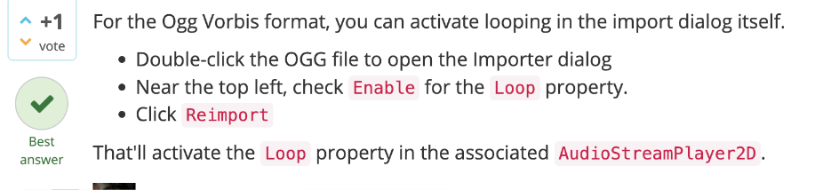
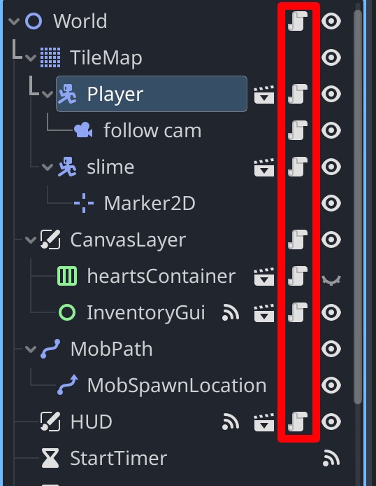

godot mac 中 创建副本的快捷键和 mac 系统快捷键有冲突，所以改为 cmd+opt

默认注释为 cmd k，修改为习惯的 cmd /

## godot 中 charactorbody2d 和 rigidbody2d 的区别

在 Godot 游戏引擎中，Character2D 和 RigidBody2D 是两种不同类型的节点，用于处理 2D 角色的移动和物理模拟。它们之间的主要区别在于角色控制和碰撞响应方面：

Character2D:

Character2D 是专门设计用于控制 2D 角色的节点。
它包含了许多内置的角色控制功能，如跳跃、移动、地面检测等。
Character2D 通常用于依赖于精确控制的角色，例如平台游戏中的角色。
它提供了一种方便的方式来处理角色的移动，同时可以轻松处理各种情况下的碰撞检测。
RigidBody2D:

RigidBody2D 是 2D 物理引擎的一部分，用于模拟 2D 物体的物理行为，如重力、惯性、碰撞响应等。
它更适用于需要真实的物理模拟的情况，例如角色具有质量、受力、重力等物理属性的情况。
使用 RigidBody2D 时，角色的移动通常受到物理引擎的模拟，因此需要在物理世界中受到力的作用。
RigidBody2D 通常用于需要角色与其他物体进行真实物理交互的情况，如物理谜题游戏或模拟游戏。
总的来说，如果您需要精确控制和便捷的角色控制，可以选择使用 Character2D。如果您需要更真实的物理模拟和与其他物体的物理交互，可以选择使用 RigidBody2D。选择哪种节点取决于您的游戏需求和设计目标。

## ogg 音乐点选不了 loop 循环

</img>

https://ask.godotengine.org/152149/i-cant-enable-loop-using-audiostreamplayer2d

## AnimatedSprite2D 和 AnimationPlayer 的区别

AnimatedSprite2D 更简单，但可处理细节更少。AnimationPlayer 相反

## 似乎根节点下的所有子节点的脚本的-ready -physics 等函数都会在程序运行时自动运行。但如 player 下被隐藏的子节点的函数则不会自动运行。应该是因为这些子节点都已经是 player 的一部分。而如图的 follow can 则是后续添加进的。

</img>
