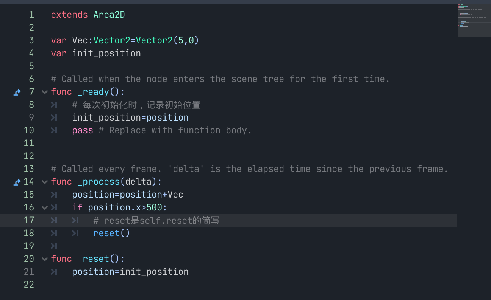
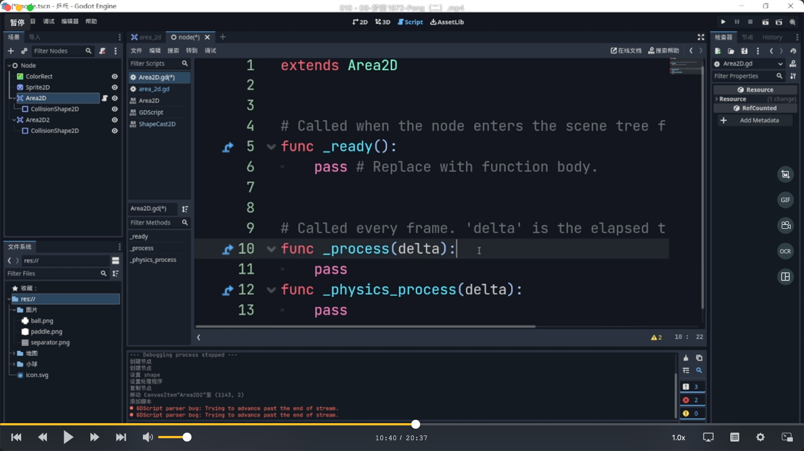
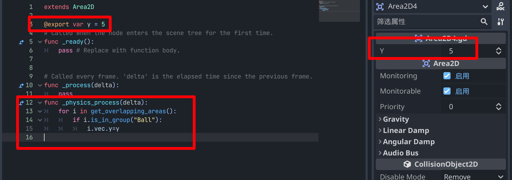
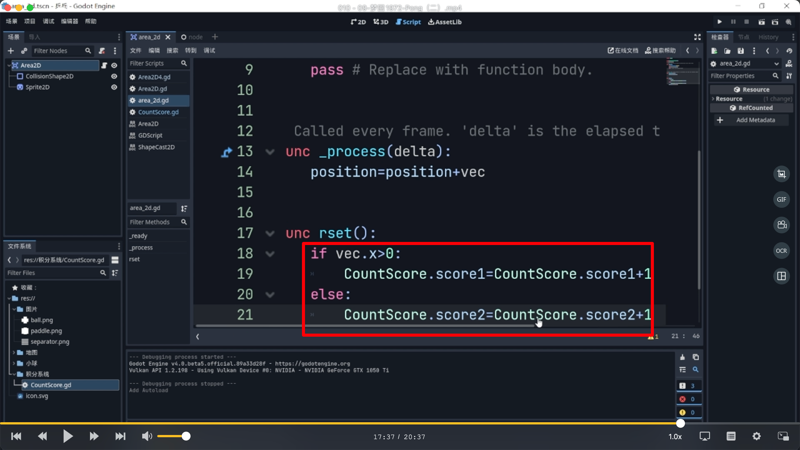
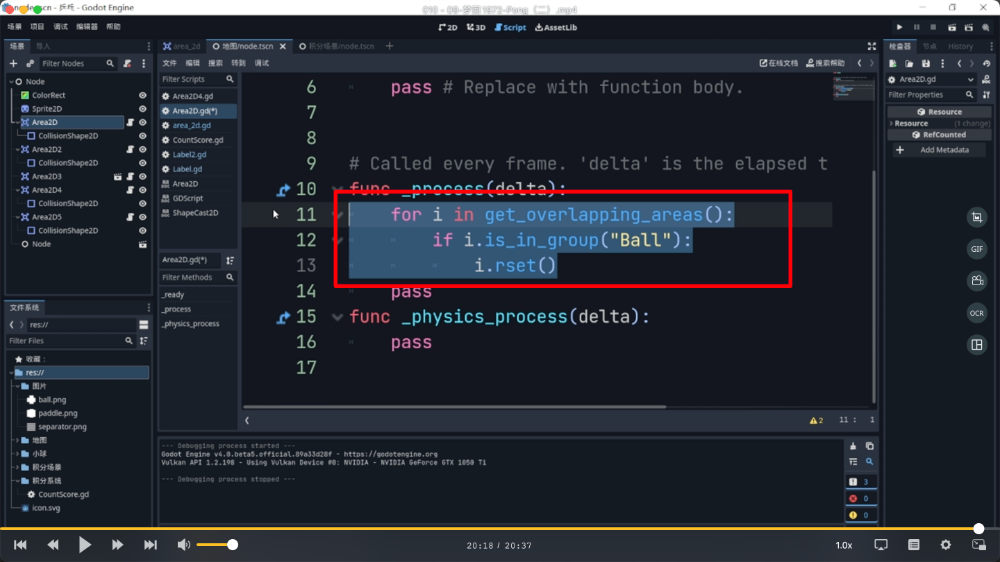

## 230916

## 做一个很简单的 2d 乒乓球游戏

</img>  
创建 area2d 节点，它可以判断区域内是否有框出的这 4 个节点。

</img>  
0530e，小球重复从左到右运动  
之后取消掉 if 段，并复位小球位置，保存好，则小球场景做好。

## 0900，创建背景及分隔线

</img>  
两边添加墙壁

</img>  
左边墙添加代码  
对 area2d 进行高频率范围检测，范围内出现小球则命令小球返回原地点
因为是高频率检测，所以要写在\_process 或\_physics_process 中。  
\_process 画面每刷新一次就执行一次，\_physics_process 物理引擎每刷新一次就执行一次。  
区域检测是物理引擎上的操作，所以要写在\_physics_process。但这里先示范下错误写法

## 1247，左右两边墙壁代码写完成了。

## 1320，实例化子场景小球到背景

</img>  
1530，创建上下两个墙，并如图编写上个墙的代码，注意这里用@export 大概是实现又边能直接调整的功能

## 1555，之后下面墙加载上面墙的脚本。只是速度改为-5（右侧面板改，而不是直接脚本里改）。

## 1616，修改小球速度为（5，5），可看到小球碰到上下墙折返，左右墙重启的效果。

</img>  
新建积分系统文件夹，新建脚本，再创建单例。  
1737 然后如图修改小球脚本，每次复位时计分。

</img>  
新建一个显示玩家 1，2 得分的场景。并将它们添加到地图场景中（在地图场景中实例化子场景）。  
最终每次突破边界是加 2 分而不是 1 分。  
因为范围检测是物理引擎的工作，物理引擎刷新一次，检测信息也刷新一次。物理引擎不刷新，检测信息也不刷新。  
但一般情况画面刷新高于物理引擎，这就导致 process 多次触发情况下，读取的是同一批 get_overlapping_areas()。导致 rset 被重复触发。  
2015 所以如图代码要复制到下面去。
