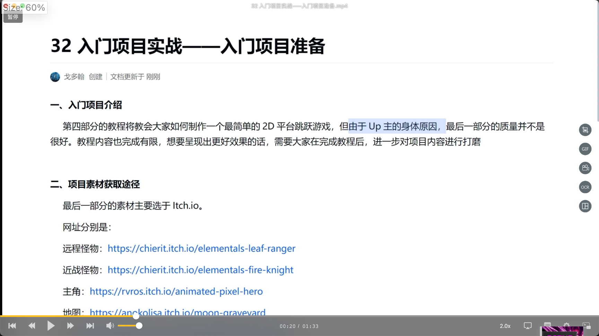

</img>  
要做的项目介绍及资源地址

```
二、项目素材获取途径
最后一部分的素材主要选于Itch.io。
网址分别是：
远程怪物：https://chierit.itch.io/elementals-leaf-ranger
近战怪物：https://chierit.itch.io/elementals-fire-knight
主角：https://rvros.itch.io/animated-pixel-hero
地图：https://anokolisa.itch.io/moon-graveyard
UI：https://adwitr.itch.io/pixel-health-bar-asset-pack-2
```

