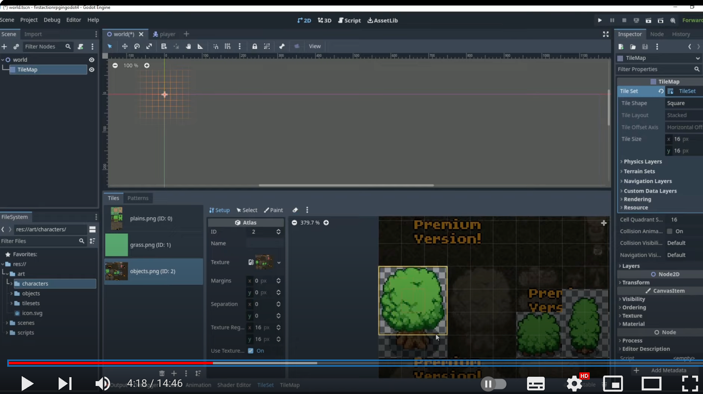

## 230920

## 这节主要讲做 tilesets，也就是地形图，如草地，树木，石头等。

## 评论区有人说可以用 terrain 技术更方便点做图。https://www.youtube.com/watch?v=N6aVQ2ylMrU

</img>  
注意 0418 讲了让多个小区块合并为一个大区块的方法，大概就是先用橡皮擦擦掉所有区块，然后选择 setup，按住 shift 在圈选需要合并的区块即可
