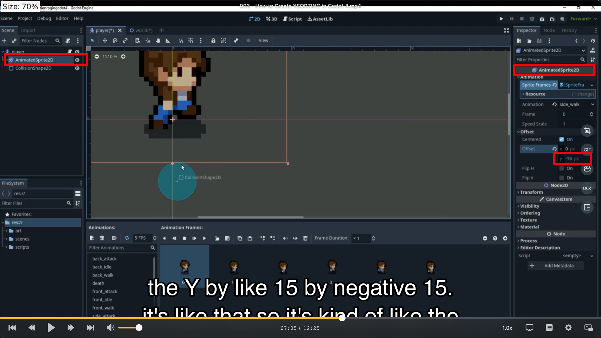

## 230920

## 0410 给 tiles 增加碰撞模块

## 0535 给 player 增加碰撞模块，此时碰撞功能实现

## 0611 对上一步做了些修改，但没看懂这些修改有什么意义。

## 0643 player，world， tilemap 的 ysort 层都开启 ysort on

</img>  
0705，设置 player 的 ani2d，暂未看懂

## 0734 设置 player 的 cli2d，还是未看懂，感觉跟 0643 时没什么本质变化，只是位置变动了点。

## 1022 设置 ysort 层的 ysort，但试了仍然无效

## 1042 增加了一个地方的 ysort，开始生效了。
