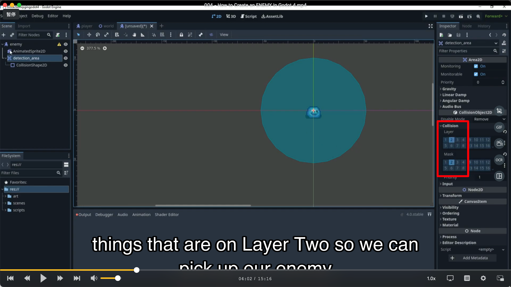
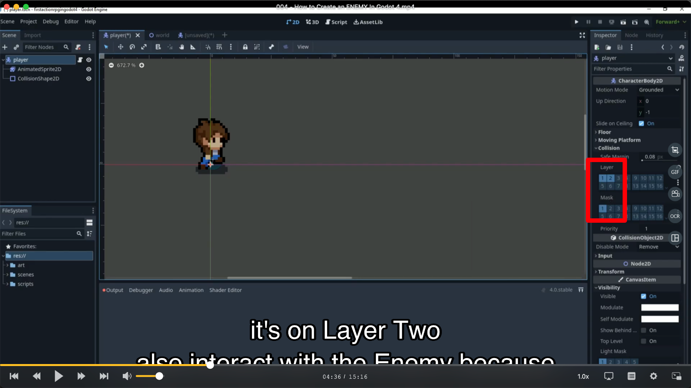
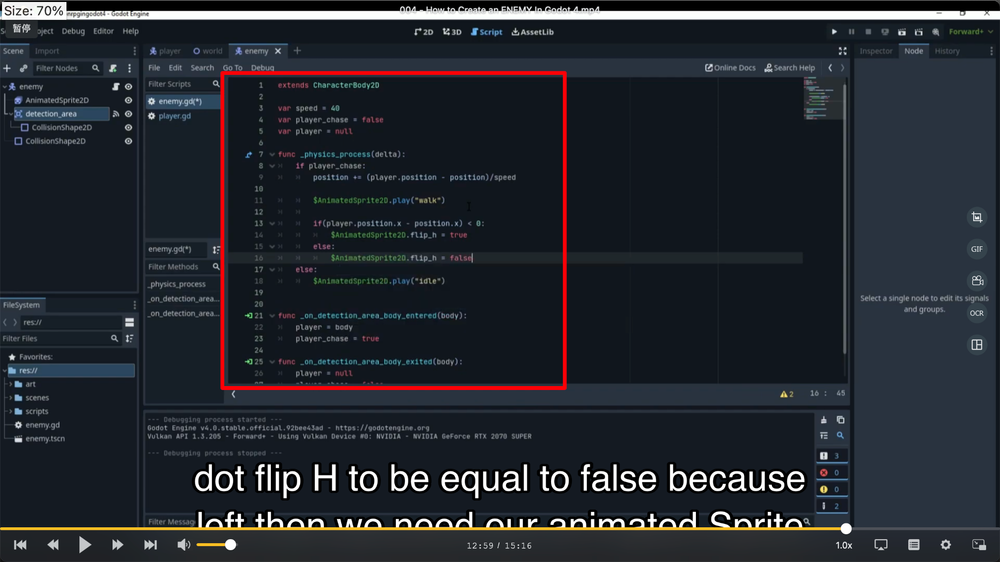
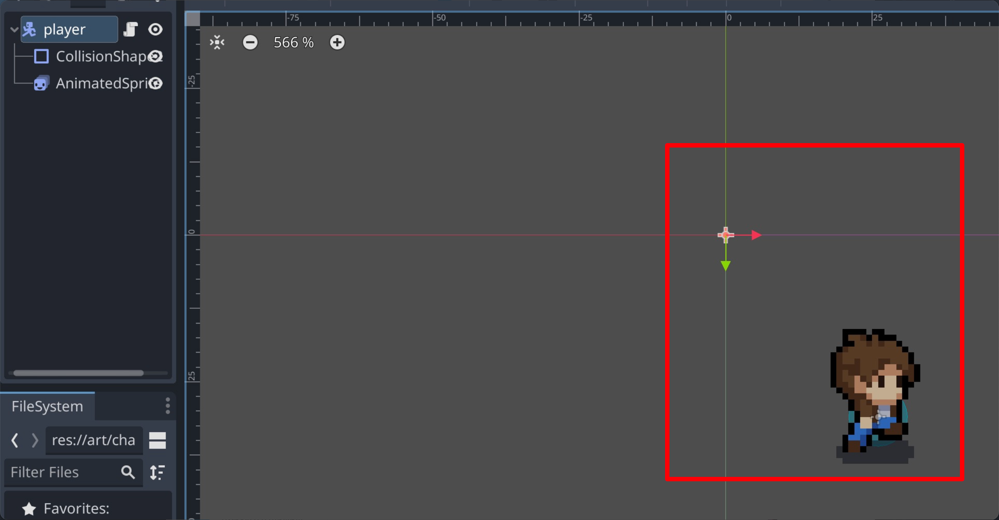

## 0920

## 0210 创建 slime 以及其 ani2d 的动图

## 0255 创建 slime 的侦测区域

## 0402 设置 slime 的 layer 和 mask 层都为 2，这样大概就不会与为 1 的层互动。layer 代表自己所在的位置，mask 代表自己可见的位置

</img>

## 0436 设置 player 为 layer 1，2。mask 1。

</img>

## 0505 此时 slime 不能和 tilemap 互动，因为 tilemap 所属的 layer 1 对 slime 不可见（之前的 collision 是用作探索的目的） 。所以这里给 slime 再添加一个 collision，作为它真正的碰撞模型。

## 0521 slime 的 ani2d 的 offset y 轴更改为-6px，再把碰撞模型也跟上去。这样做的目的大概是做上节课的 ysort 设置。0555 解释 0521

## 1302 slime 的代码完成，注意需要 0620 从侦测位置倒入函数。

</img>  
最后一行未显示完全的代码为 player_chase = false

## add，如图所示会导致怪物离玩家太近反而怪物逃脱的 bug。解决方法不是在 player 节点调整，而是将它的两个子节点拖到 player 节点。

</img>
