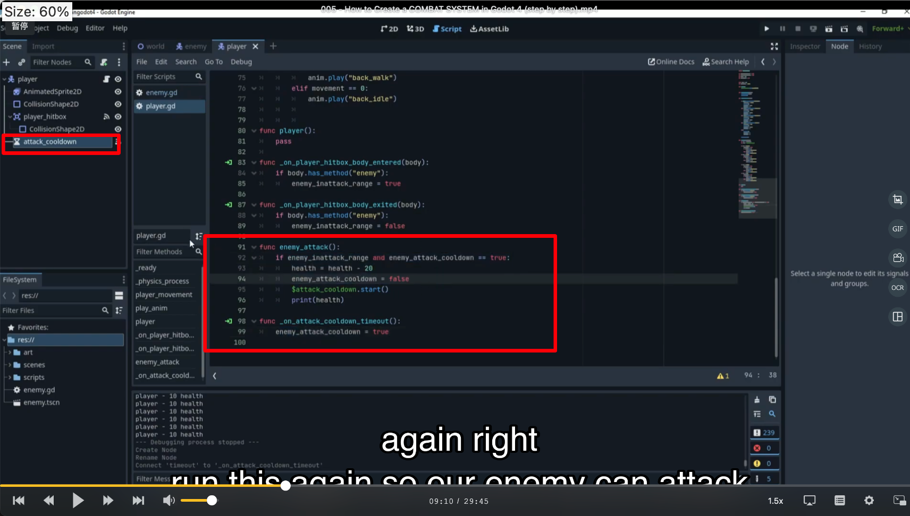

## 230921

## 0115 intro

## 0210 添加玩家和怪物的 hitbox

## 0439 添加部分 player script

## 0455 给 enemy 添加 enemy 函数

## 0639 再给 player 增加代码，此时接触怪物时打印出信息

## 1103 写了很多代码，实现玩家接触怪物一段时间后死亡

### 0910 给玩家一个 timer node，叫做 attack cooldown。并修改 enmey attack 代码，实现有冷却时间的减血功能。timer 的功能大概类似 await，等它跑完了才执行之后的代码。

</img>

### 1103 在 physic 中实现真正的减血功能，并修改 0910 的冷却时间，最终玩家血降到 0 时会消失

## 1148，不相关

## 1306 创建 world 脚本。但还没写多少内容，只是方便之后其它脚本 access 到它。注意写了代码后还要在 project setting 加上它。不然其它脚本就不能跟它互动。

## 1607 给怪物写被攻击的减血代码，只是效果还未实现，因为还没给玩家写攻击的代码。

## 1636，将按键 e 绑定为 attack

## 1908，在玩家脚本中新增 attack ip 变量，ip 是 in progress 的意思。判断玩家是否在按 e 键攻击。并在玩家动画中增加 attack ip 的判定，即没有在攻击才播放动画。

## 2258，玩家新增 attack 函数 和 deal_attack_timer，制作玩家攻击时的动画。注意 timer 时间改为了 0.5。

## 2600，添加上一步的 deal_attack_timer 的函数到玩家，并在 phy 中增加上一步的 atack 函数，此时玩家动画完成，但一刀就能把怪物砍死。

## 2855 给怪物增加 take-damage-cooldown timer，时间 0.5。并做了些其它修改，增加玩家血量到 160，最终实现多砍几刀砍死怪物。
