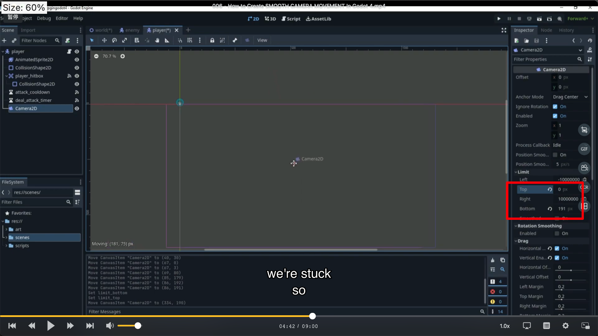

## 230921

## 0026 不相关

## 0133 player 增加 camera2d，之后就能移动镜头了，但效果还不好

## 0205 点选如图 drag 的两个选项，就能有玩家在视频中间时摄像头暂时停止的现象

</img>

## 0325 这段可忽略，讲解为什么不用 position smoothing，因为用了它镜头会有延迟，效果不好。

</img>

## 0413 在 world 新建一个 cam2d，然后拖动它就能得到各个位置的坐标。

</img>

## 0441 在 player 的 cam2d 里，设置 limit，则最终游戏镜头就被限制在范围内了（玩家还是能去其它区域，只是镜头不会跟着走）。

</img>

## 0508 但 cam 太大了。设置 scale 从 4 变为 1，游戏视角变大了，但每个单位变小了。

</img>  
--=  
</img>

## 0528 修改 player cam zoom 到 4，相机所占范围变小。

</img>

## 0640
