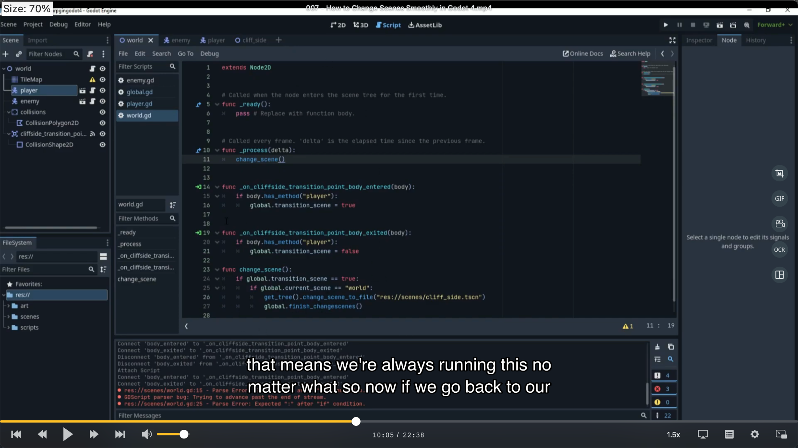
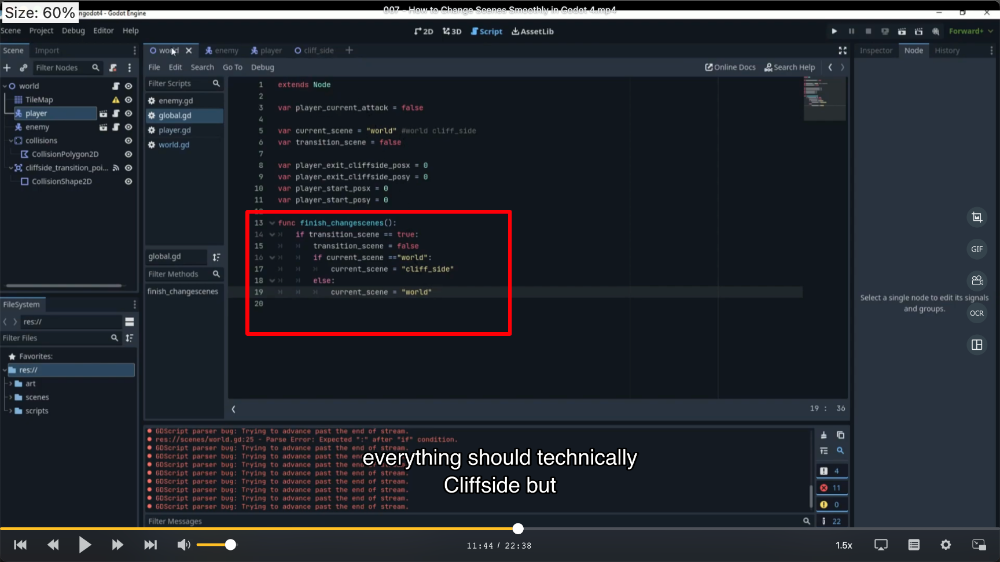

## 230922

## 0030 不重要

## 0213 做些设置让玩家不穿过地图边界，只留一个小空间让玩家可以去另一个 scene。

## 0428 编写 global 脚本，写入转换场景的坐标等变量。

## 0445 创建新场景 cliffside

## 0530 在 world 中创建 area2d，cliffside transition side。作为玩家转换 scene 等区域

## 0622 作者弄错了，忽略这部分

## 1005 创造一个 world 脚本，并把 cliffside transition side 的 body enter/exit 连接进这个脚本，并添加一个 change scene 函数。（中途修改了一个其它脚本的拼写错误）

</img>

## 1210 global 中添加 finish-changescenes 函数，此时实现了切换场景的功能。但去了新场景是空的。

</img>

## zzz 1300 编辑 cliff side 场景，自己操作遇到 bug，复制主场景 tilemap 到副场景，修改副场景 tilemap 后主场景 tilemap 出错（需要使用唯一化/make unique 才不会出错）。
