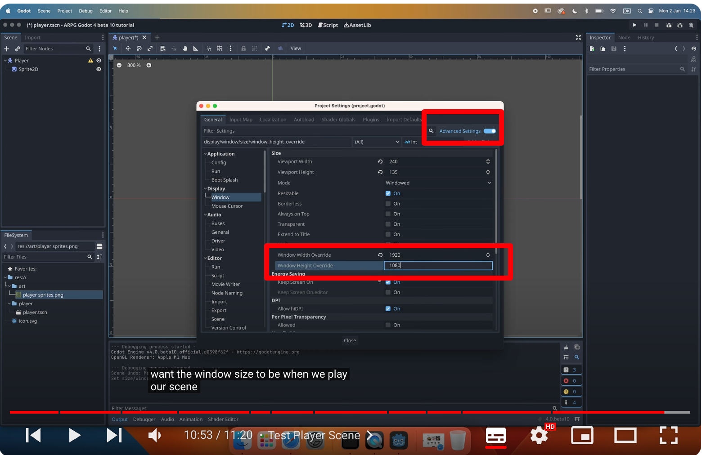

## 230922

## 0140 创建项目，视频选择了 com 渲染，自己选择了 forward 渲染

## 0355 不重要，界面介绍

## 0420 黄色感叹号代表节点需要其它东西才能正常工作

## 0818 都是已经熟悉的添加玩家精灵图等内容，需要注意的是默认精灵图不清晰，可以修改 sprite 2d 的 texture filter 为 nearest。但最好是修改它的父节点，这样父节点的所有子节点都会自动继承高清画质，

## 0900 分割精灵图，跟上个教程有点区别

## 0955 运行发现玩家太小，所以将 window，viewport 修改小很多，这样运行时整个屏幕都小了，手动拉大屏幕玩家大小却保持不变，且屏幕长宽比不固定。

</img>  
--=  
</img>

## 1035 stretch mode 改为 canvas item 后，手动拉大，长宽比固定且玩家也会等比例放大缩小。

</img>  
--=  
</img>

## end 再这样设置下，则运行开始时就是如图设置的大小，不用再拉伸窗口变大了。

</img>  
--=  
</img>
