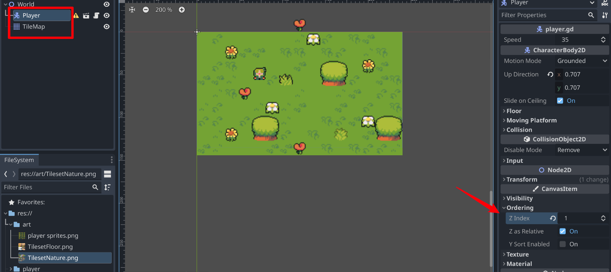

## 230924

## 0032 修改上节课的一个小 bug

## end 设置 tilemap，大部分都会了，但注意 0301s 可以随机设置 tile。0530 教了另一种合并多个格子的方法。0628z 教了调整合并的大格子不能贴合 grid 的方法。

## add，注意 player 放在 tilemap 上时，可能人物会被覆盖，因为越下面的越后渲染，此时修改 player 的 cavnasitem ordering 为比 tilemap 更大的值，就不被覆盖了。

</img>
