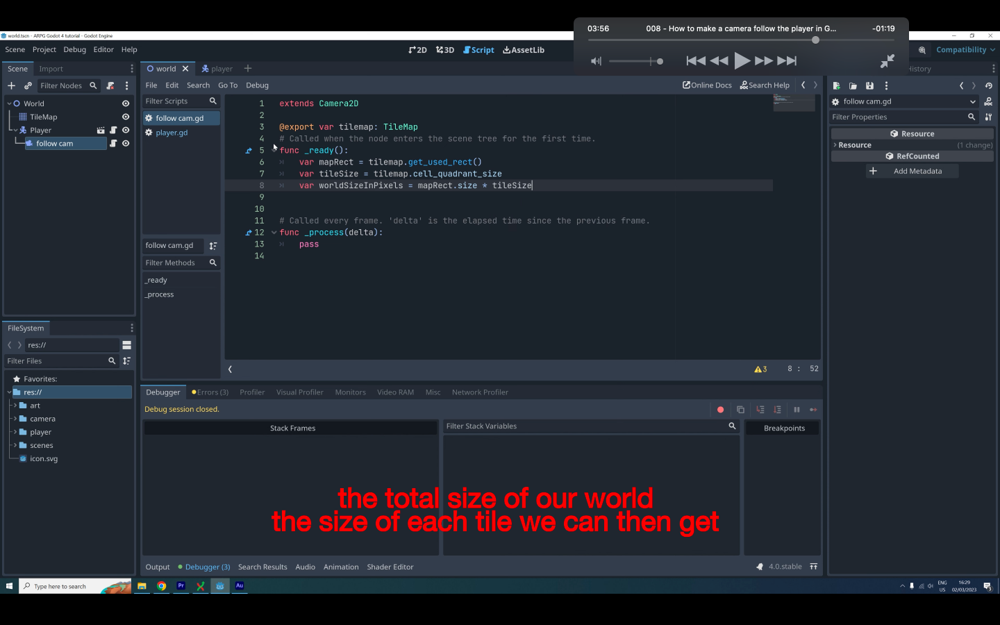

## 230924

## 0030 扩建地图，此时镜头固定

## 0103 给 player 增加一个 cam2d，此时镜头会始终以玩家为中心移动

## 0145 给 cam2d 设置边界，则移动视线就有边界了。zzz，注意 tilemap-transform-scale 可能会被无意间改动，造成 bug。

## 0420 前一种方法虽然能设置边界，但如果增加了地图，则边界又需要重设。所以这里介绍了写个脚本来自动设置边界。zzz，自己操作时按这代码底部会超出一个 tile。所以 limit_bottom 后需要-16，暂不知道原因。

</img>

## end，几个 smooth 介绍，自己没跟进
