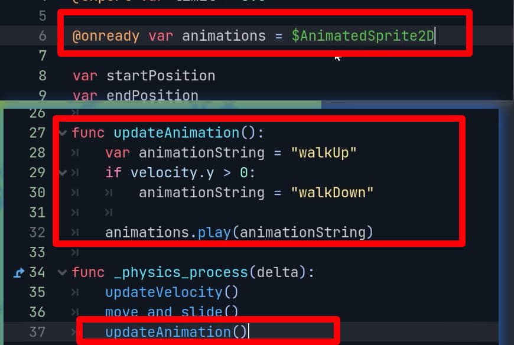

## 230925

## 0059 新建场景，且 slime.png 存入项目

## 0400 类似 devworm 的教程，做史莱姆的动画，但注意 0323 做完后把史莱姆向上提一点超过 position mark，因为之后的 ysort 会需要这样。

## 0420 把 slime 拉为 tilemap 的子节点，好让它之后成为 ysort 的一部分

## 0430 介绍 gridsnap，snap 有咬的意思，所以意思是让子节点咬住 grid。让子节点的中心必须在 grid 的四个端点上。

## 0826 slime 移动的脚本，经过了多次修改。

</img>

## 0914 增加动画部分。

</img>

## end，增加 marker2d，这样可以在 2d 图中自定义 slime 的起始点了。
