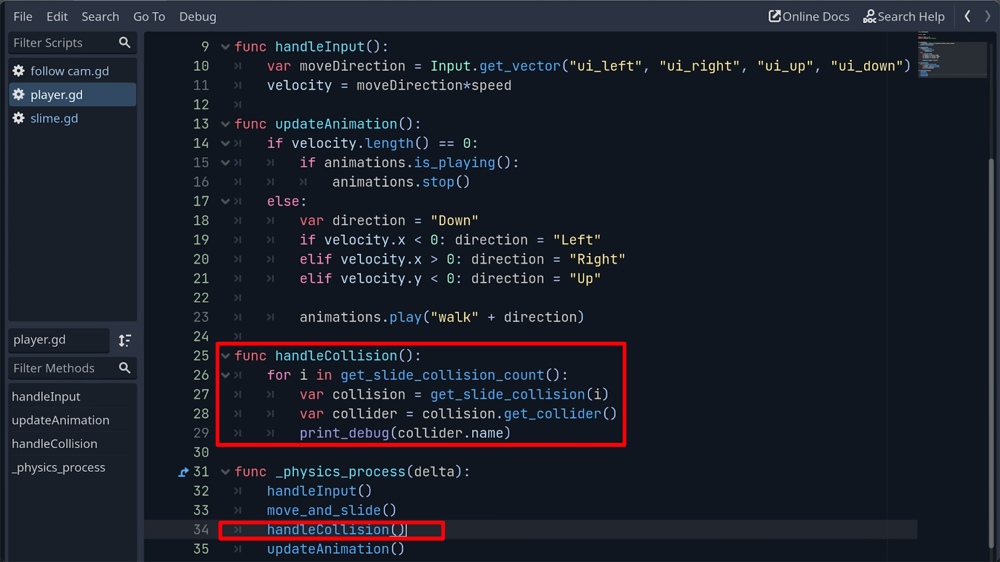

## 230925

## 0026，intro，会介绍两种做碰撞效果的方式，第一是两个 body node，第二是两个 area2d node。第二种方式需要对史莱姆的动画方式做修改

## 0137，给 slime 增加 collision。与玩家碰撞效果产生

## 0308 打印出碰撞信息来

</img>

## 0342 有些时候虽然碰撞了但仍能互相跨过，因为 collsionshape 只覆盖了角色的下部分，改为覆盖全身了则不能在树前走了。所以这种类型的碰撞可能不适合此游戏。

## 0403 不重要

## 0500 把玩家都 layer mask 层都设置为 1，怪物都设置为 2，让它们都做 tilemap 的子节点，且 tilemap 设置为 1，2 都有 （这样玩家和怪物不会互相碰撞，但都会碰撞环境）

## 0618 给玩家和怪物都增加一个 area2d，每个 area2d 都带个 colli-shape。其中玩家的 area2d 的 layer 设置为 1，mask 设置为 1，2

## 0720 只是讲解，还没操作。由于动画要变形，collision 不能一直很好覆盖怪物，所以就让 hitbox 也 animated 起来。这样要要删掉原来的一些元素，新建一些元素。

## 0837 执行删除一些旧元素，新增新方式的动画效果。

## 1050 做 collisionshape 适配 walkdown。

## 1135 适配另外三个方向

## 1240 写好代码，可以正常完成动画了

## 1350 做玩家的 hurtbox 和怪物的 hitbox 的碰撞，目前只 print 相关信息就是
