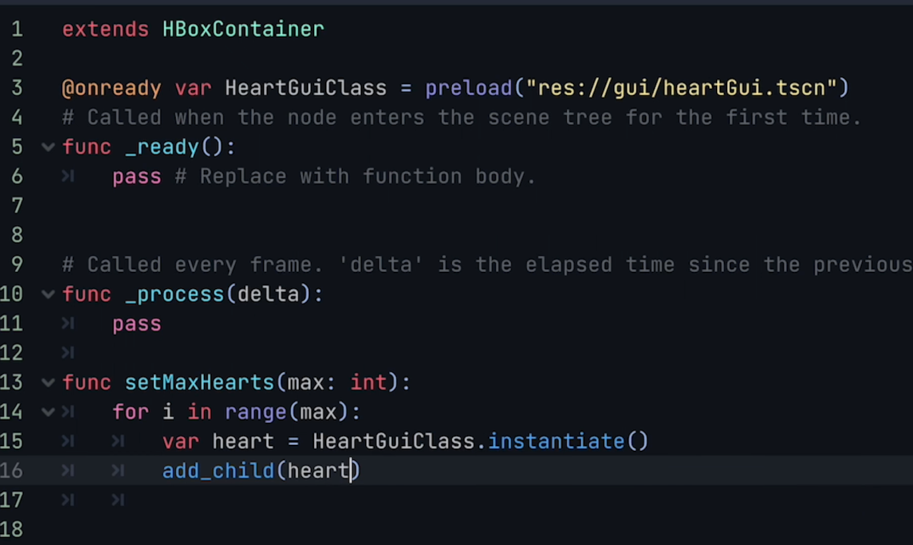
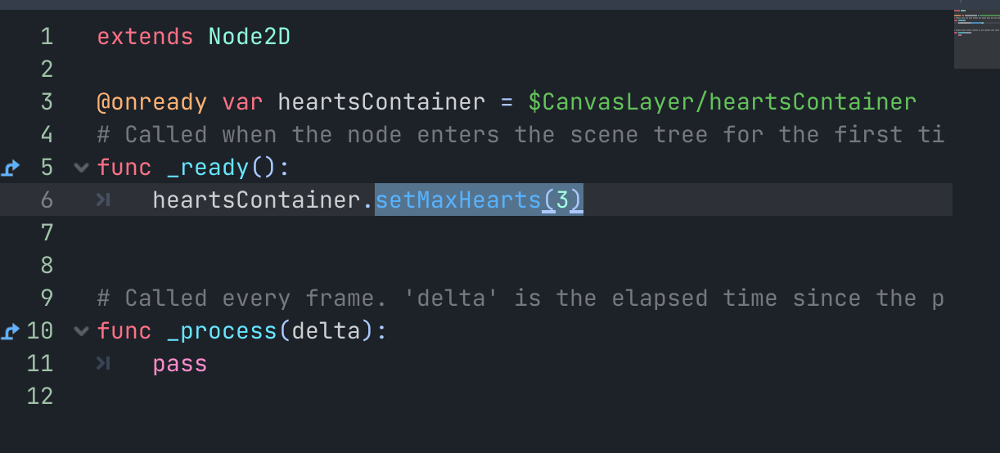
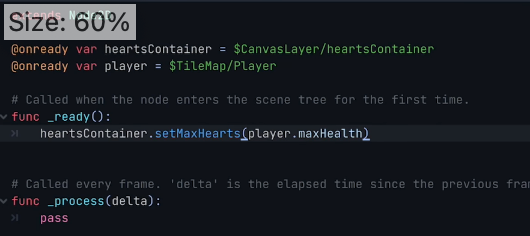
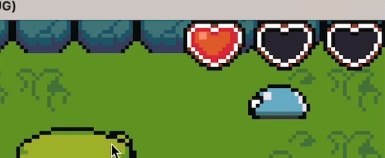

## 230926

## 0135 给 heartsContainer 创建脚本，并删除其之前的 3 个子节点，因为要用脚本实时的实现它们

</img>

## 0157 给 world 添加脚本，让它在 ready 时加载 heartsContainer，这样就能通过 setMaxHearts(n)，将血量设置为 n 个。

</img>

## 0247，当血量为 1 时，位置显示效果不好，进行些设置，让它靠角落显示

## 0324，再修改脚本，使血量自动从 player 中获取，而不是手动设置。

</img>

## 实现当玩家被攻击时，显示血量变化的效果。以下过程较复杂没仔细理解，只是照抄，需要时再理解

### 0529 处理多处代码，实现如图效果，血量为 1，但有 3 个心形，只是其中两个是空的

</img>

### 0616 经过修改，让实心的靠在右边

</img>

### 0732 当怪物攻击玩家时，更新血量变化。注意 0639 多了一行视频没说的代码 class_name Player
