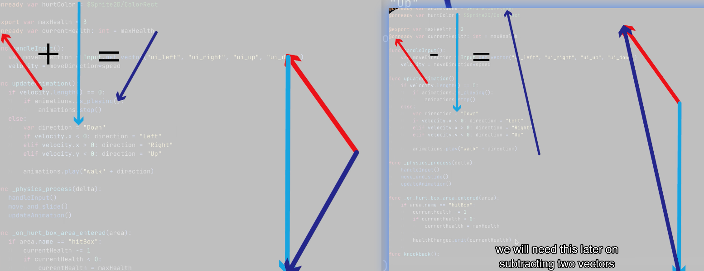

## 230926

## 0028 intro

## 0112 新建一个 knockback func，另外还有向量 vector 的讲解。向量可以想象为一个有长度和方向的箭头，ab 两个向量相加结果是用 a 头连 b 尾，之后再用 a 尾连 b 头，得到结果向量 c。a 向量减 b 向量是 ab 尾巴相连，然后以 a 头为头，b 头为尾，生成结果 c 向量。

</img>

## 先试试让玩家以它移动过来的方向相反的方向反弹。

### 0245 尝试代码，但没有效果。因为 move and slice 默认接受最后一帧做参数。所以幅度很小，看不出效果。

</img>

### 0315 增加 knockbackpower 参数，则能看到明显反弹效果。

</img>

## 0340，但此时如果玩家不动，史莱姆撞到玩家，玩家也不会被弹走，所以需要它们两个的速度向量来做反弹效果。

## 0409，讲解向量，没看懂，不过不用看懂，记住下行的代码就是。

## 0455，修改代码，达到了想要的反弹效果。

</img>

## 0503，结果比较 harsh，可以这样做个 smooth 的修改。

</img>

## 0530 注意可以随时修改反弹威力等参数
