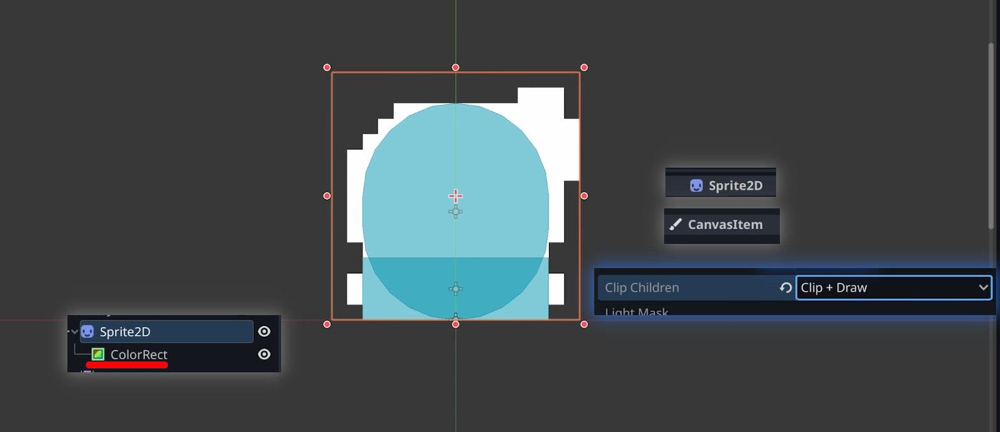
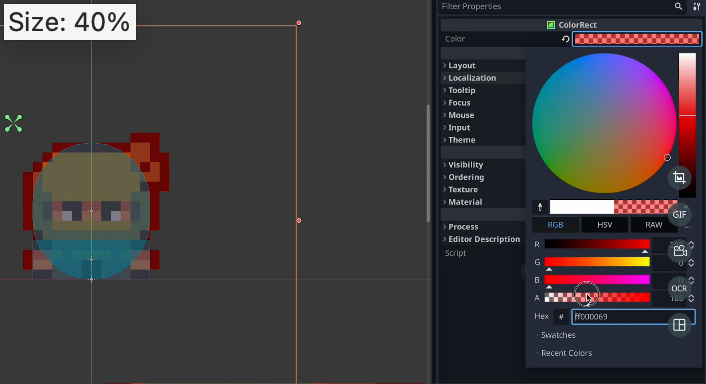

## 230926

## 0028 让玩家在完全白和正常之间 blink with a reddish tone。

## 0052 如图

</img>

## 0113 更改颜色

</img>

## 0247 make an animation using this color rect。产生闪烁效果，注意按视频中的 insert key 无效果，是直接在 0.2 处新增一个 key。

## 0340 修改脚本，让上一步做的闪烁效果在玩家被攻击时生效，但生效后闪烁一直不停止。注意，此时视频脚本少了@onready var hurtColor = $Sprite2D/ColorRect 但没有说明。

## 0430 做一个 timer 来让闪烁达到时间后停止。

## end，timer await 等的相关资料
