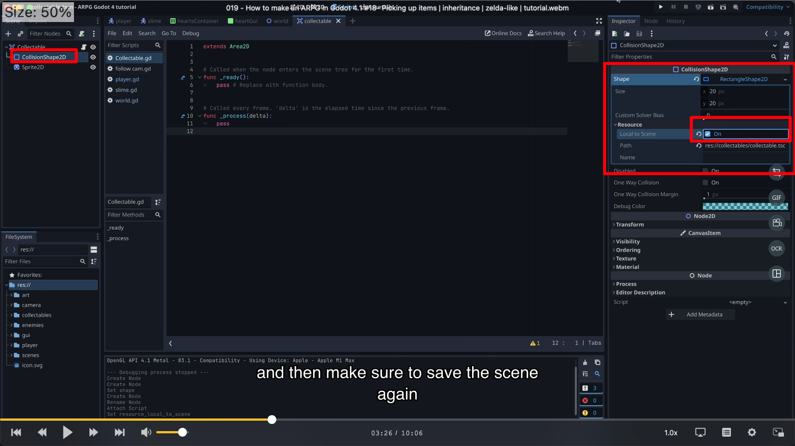

## 230927

## 0030 intro

## 0156 修改了上节课的一些写法。

## 0306 新建一个叫做 collectable 的 area2d，创建子节点 col2d 和 sprite。并创建它的脚本。之后并不会实例化这个场景，而是在创建可拾取的东西时，继承这个场景

## 0326 大概是为了让每个继承这个场景的 item 可以自己调整 colli shape，做如图操作。

</img>

## 0435 创造第一个可拾取场景 lifepot

## 0607 将 lifepot 放到游戏地图中，但此时还无任何互动效果。

## 0653 写脚本，让玩家经过 lifepot 时，lifepot 消失

## 0755 创造剑的场景并放进地图中

## 0950 给拿取剑的场景加动画

## end，youtube 视频介绍里给了继承和使用 scene 作为 tiles 的相关文章，需要时可以看看
