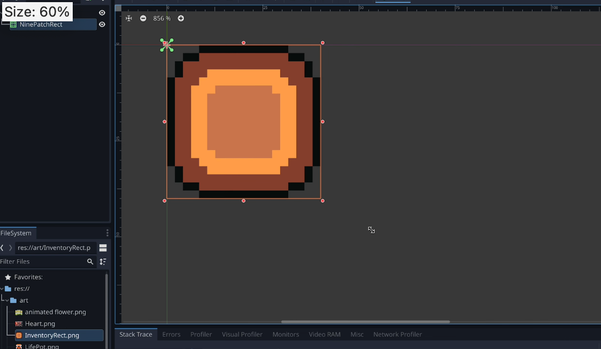

## 230927

## 0135 创建一个 control/inventoryGui，和其子节点 ninepatchrec，并导入图。

</img>

## 0224 调整效果，保存，再放入世界场景中的 canvas-layer 中。

## 0413 制作 slot 场景。

## 0555 把 slot 装到 inventory 中，但此时打开游戏 inv 一直在屏幕上

## 0834，处理后，按 i 可以控制 inv 显示和隐藏

## 1017 此时打开 inv 时，游戏仍在进行，怪物仍能攻击玩家，所以这里让打开 inv 时自动暂停游戏。

## end 相关资料提供
