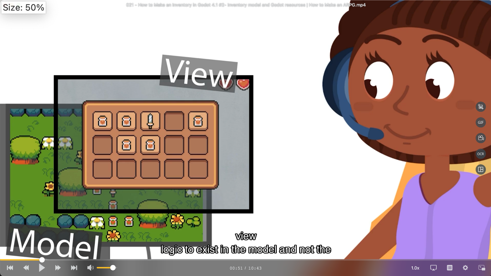
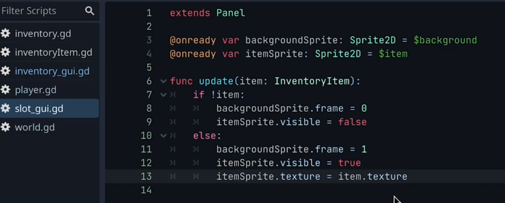
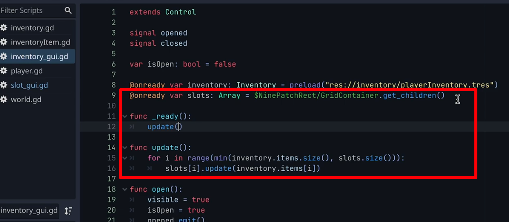
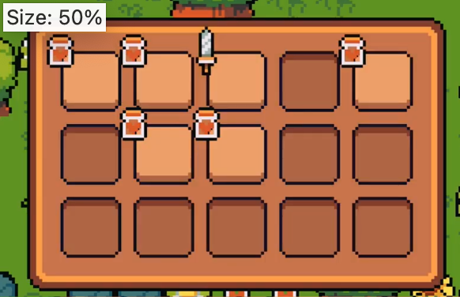

## 230927

## 0130 创建 gui items 只是给玩家 a view to the game world/model。而游戏数据和逻辑最好放在 model 而不是 view 里。可以简单理解为 model 可以在没有 gui 的时候存在。所以上集讲的是创建 inv view，而这集讲的则是 inv model。

</img>

## 0156 创建 inv model，创建它不需要创建新场景，因为 inv model 不是一个节点而是一个 resource（视频提供了 link to godot resource）。

## 以下内容没看太懂

### 0430 新建 inventory 和 inveteoryItem 两个脚本，它们都继承自 Resource 而不是 Node。并在 inveteoryItem 里添加 inveteoryItem resource 的 lifepot 和 sword。

### 0500 在 inveteoryItem 里添加 inventory resource 的项目，并保存为 playerInventory.tres

### 0522 add the new inventory to the player

### 0600 将 inv 中的物品在 inv gui 中展示。但这里先加一些 chest things 到 playerinventory（只是将 0430 里添加的东西多添加点）。

### 0640 inventory-gui.gd 中增加@onready var inventory: Inventory = preload("res://inventory/playerInventory.tres")

### 0802 slot 节点目前只有一个背景 area2d，给它增加一个 area2d 来用于显示物品。并再给它添加一个如图脚本。

</img>

### 0917 如图在 inventory-gui-gd 中更新所有 slots，得到如图效果。虽然有了 items，但不在正确位置

</img>  
--=
</img>

### 1022 做些修改，物品位置就显示正确了
