## 230927

## 0130 创建 gui items 只是给玩家 a view to the game world/model。而游戏数据和逻辑最好放在 model 而不是 view 里。可以简单理解为 model 可以在没有 gui 的时候存在。所以上集讲的是创建 inv view，而这集讲的则是 inv model。

</img>

## 重难点

### 0212 为了创建一个新类型的 resource，创建如图的脚本，继承自 Resource。

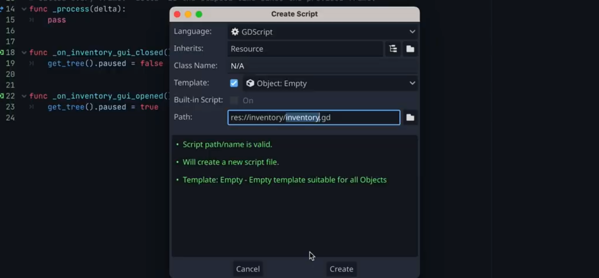</img>

### 0225 给此脚本一个 class-name，这让之后可以更方便的创建实例

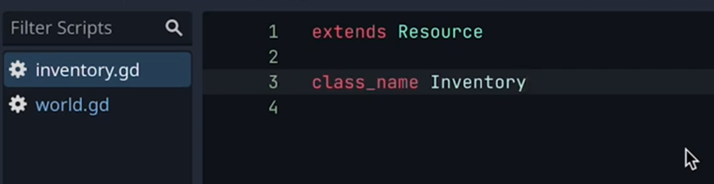</img>

### 创建一个数组用于存储 inventory 里的物品，如图 string 只是一个例子，本次不使用 string

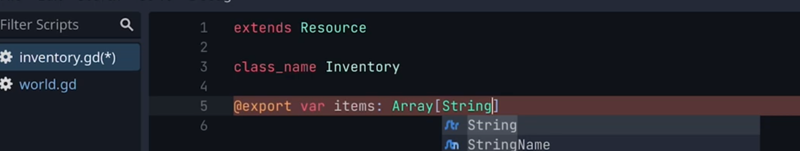</img>

### 0330 创建一个较叫 inventoryItem.gd 的新 resource？

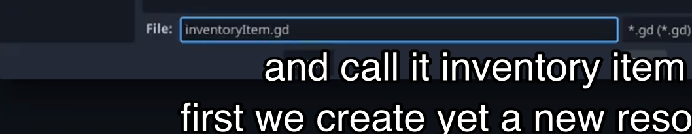</img>
--=  
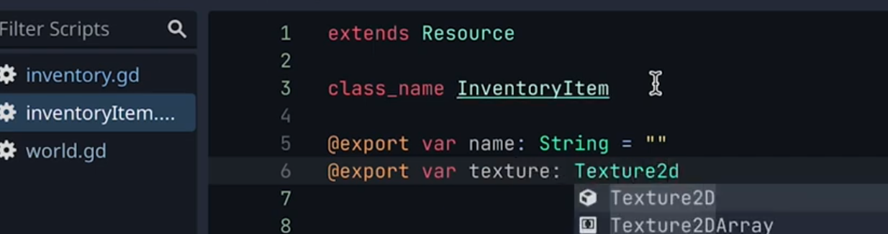</img>

### 0342 回到 inventory.gd，让其 items array 包含的类型为 InventoryItem。

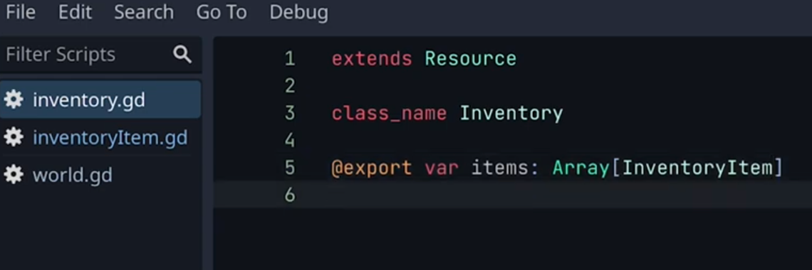</img>

### 0424 创造第一个 inventoryItem lifepot，之后还创造了一个 sword，未截图。(注意视频此时虽然是在 inventoryItem.gd 的脚本下创建，但在其它脚本下也能创建，所以创造 resource 可能跟所在脚本无关，只要在 inspector 里点加号再选择 inventoryItem 就能创造类型为 inventoryItem 的 resource)

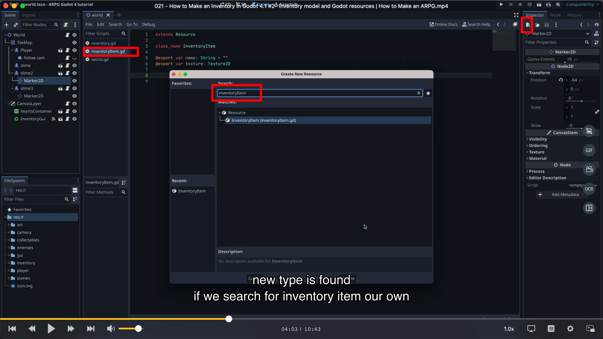</img>  
--=  
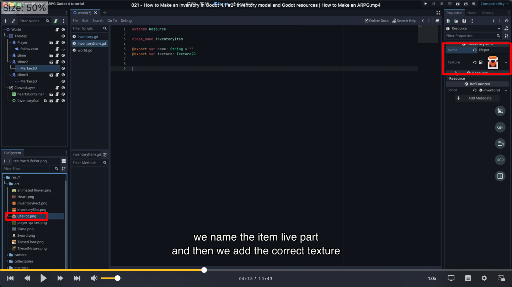</img>
--=  
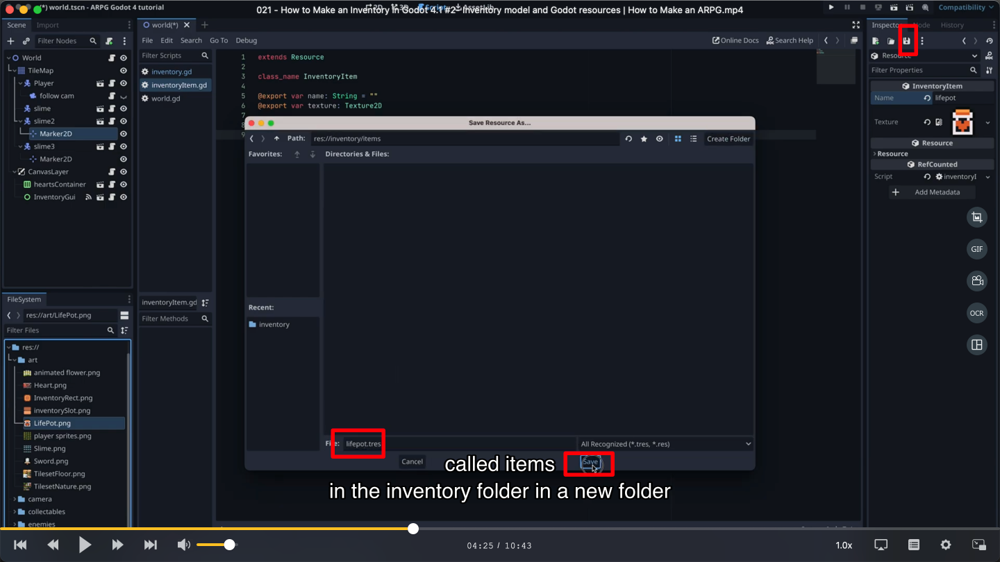</img>

### 0457 创造一个 inventory 类型的 resource，叫做 playerInventory，作为玩家的库存。playerInventory 的类型为 tres，而它包含的 items 也是 tres，所以这里其实有了一个嵌套，即 资源/resource/tres 里面包含的数组的每个元素也是 资源/resource/tres。

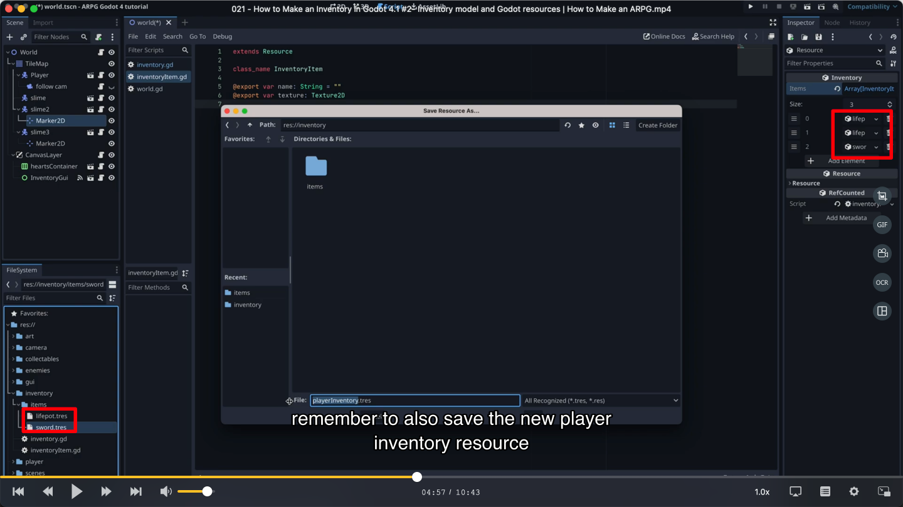</img>

### 0521 通过代码给 player 增加个 inventory 类型的变量，再通过拖拽把 playerInventory 设置为这个新增的变量，player 就最终拥有了这个 playerInventory 资源。

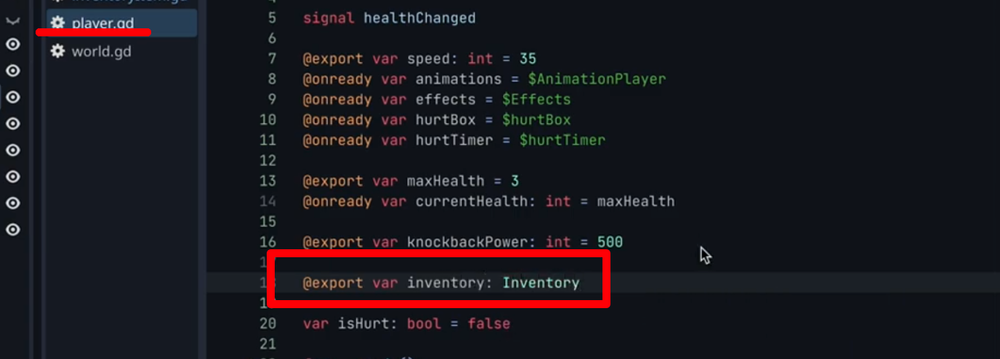</img>
--=  
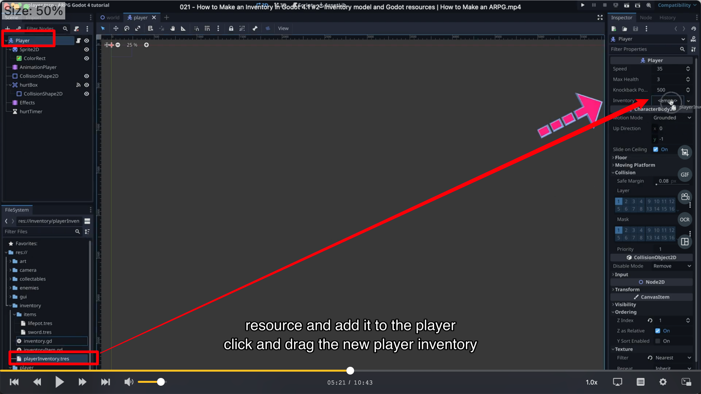</img>

### 0531 让刚刚给玩家添加的 playerInventory 资源在以前创建的 inventory gui 中显示出来。

#### 添加 playerInventory 的 items 到 10 个

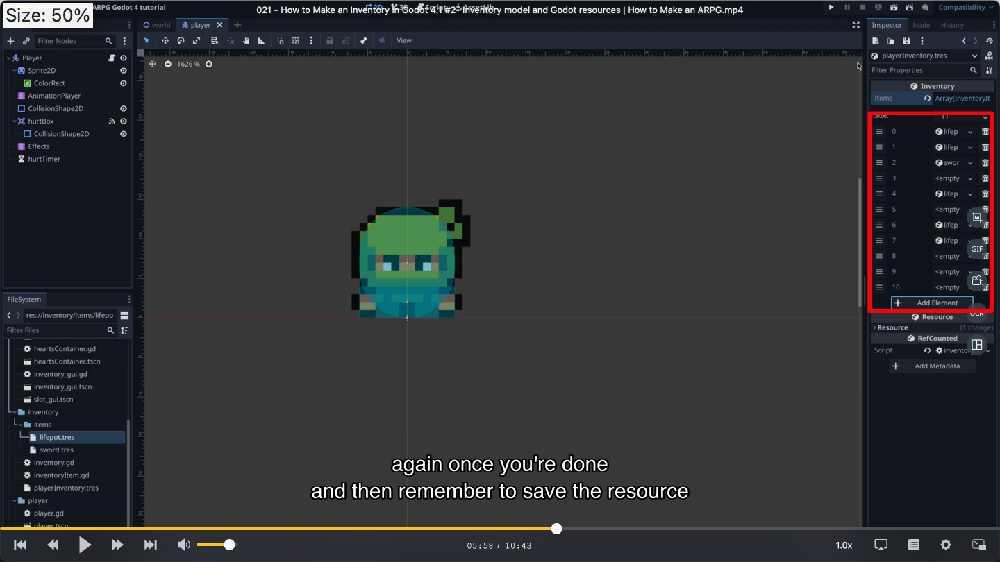</img>

#### 0636 在 inventorygui 中 preload playerInventory-tres。注意这里用了 preload，而 0521 步则没有，可能是只需要在一个地方 preload，其它地方就能直接引用。

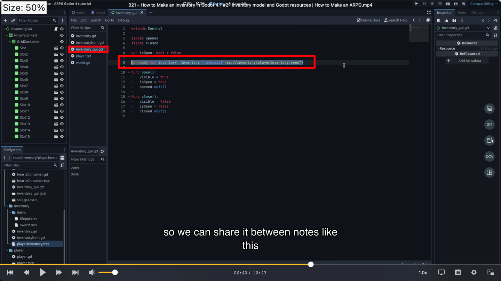</img>

#### 0800 给 slot 增加一个 sp2d 名为 item，用于之后显示物品图片。并给 slot 绑定脚本。给它分配一个背景图和一个物品图。并设置一个 update 函数，当没有 item 时，背景图的 frame 设置为 0，不设物品图。当有 item 时，背景图的 frame 设置为 1，显示背景图。

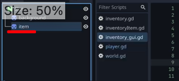</img>
--=  
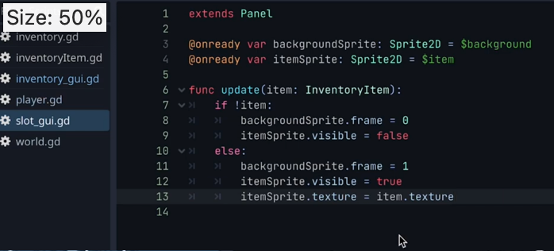</img>

#### 0858 在 inventory-gui 脚本中，引入 slots，并也创建一个 update 函数，通过循环来调用所有 slot 的函数。

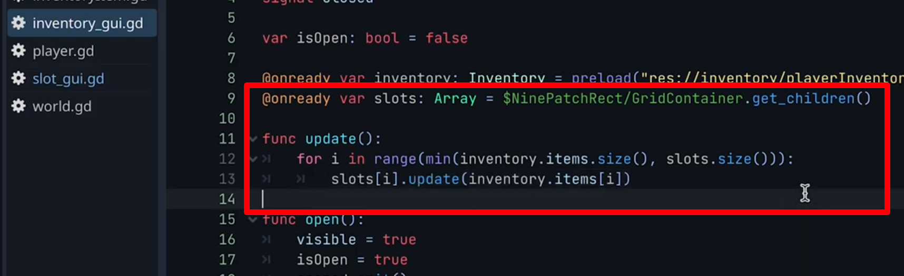</img>

#### 0913 新建 ready 函数，用于调用 update 函数。

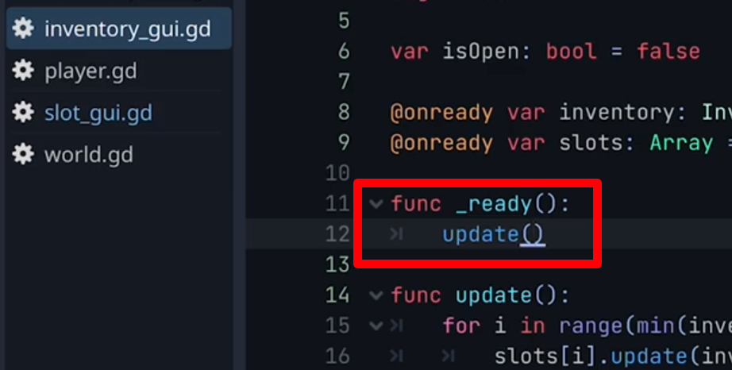</img>

## 1022 做些修改，物品位置就显示正确了
