## 230928

## 0100 这节课讲怎么将玩家捡到的东西放入 playerInventory，并在 gui 中正确显示出来。注意有很多实现方式，哪种最合适要具体情况具体分析。且根据情况修改之前的代码也是非常正常的。这里只讲其中一种方式。

## inventory-gd 中新增 insert 方法。

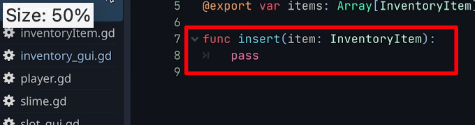</img>

## 0132 collectable-gd 中增加一个存储 inventoryItem 的 itemRes 变量。因为 collectable-gd 有了 itemRes ，所有继承它的场景也都会有 itemRes ，见 19-0306

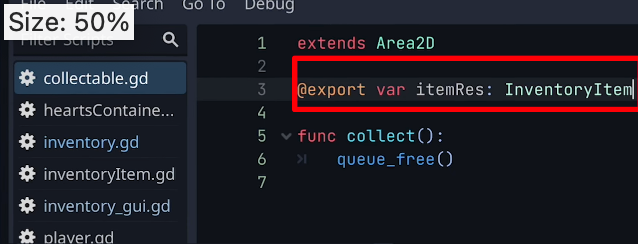</img>

## 0149 在每个继承了 collectable 的 scene 中，将对应的 tres 拽入 itemRes 里。

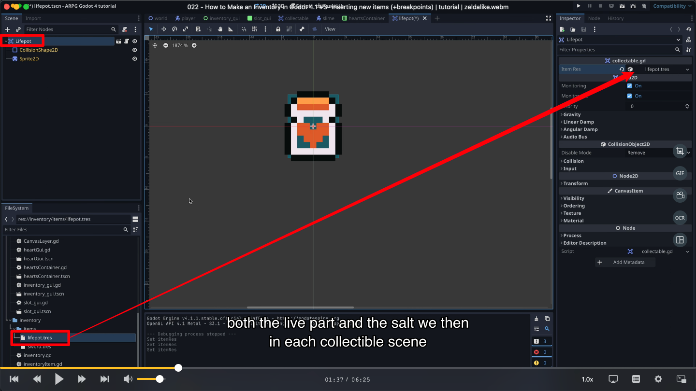</img>

## 0220 在 collectable-gd 中增加 func collect 的代码。因为 sword 有自己的代码，所以单独为它更新。注意 super 的意思大概是调用父级同名函数的意思，因为同名，就省略了.funcname 的写法。

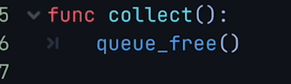</img>  
--=  
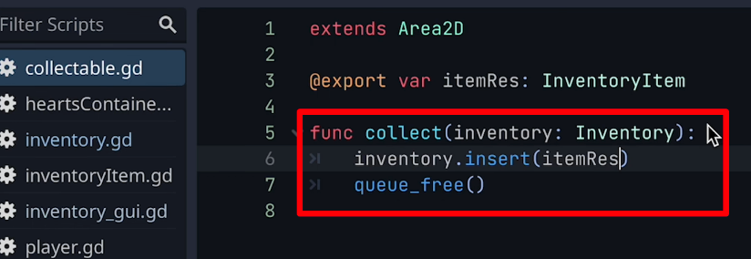</img>
--=  
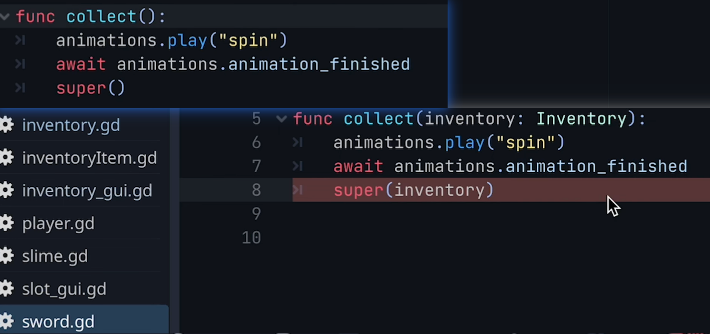</img>

## 0233 player-gd 中的一个函数内加入一个参数

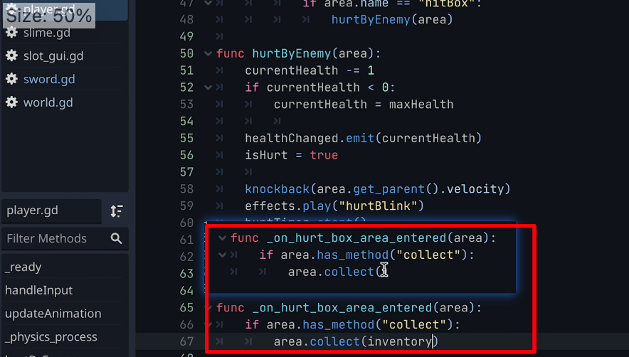</img>

## 0253 1 如图加个断点，运行游戏，捡到东西，自动退出游戏 。2 获得 id。3 发现 id 对应的正是捡到的东西

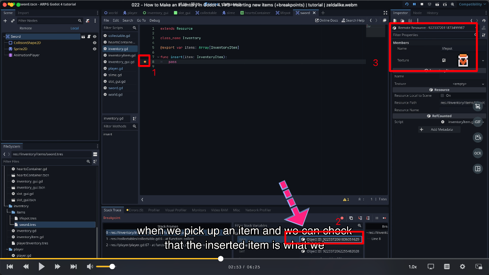</img>

## 0345 在 insert 函数中做在 items 中 增加 item 的方法，循环发现某个位置没 item 时，就在该位置增加 item

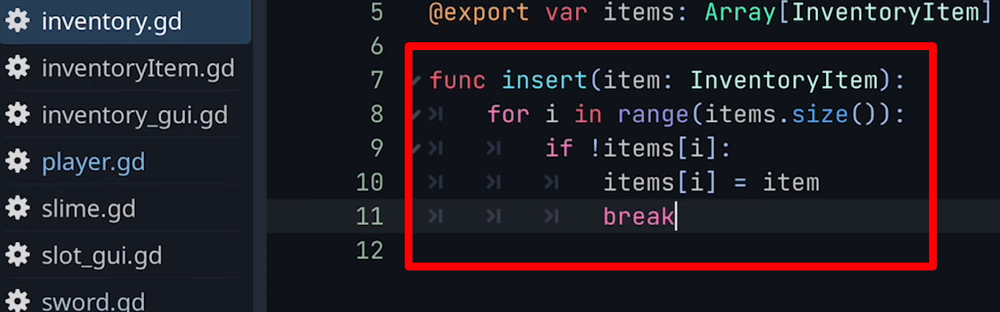</img>

## 0424 修改 player-inventory 的 inventory size，再打个断点

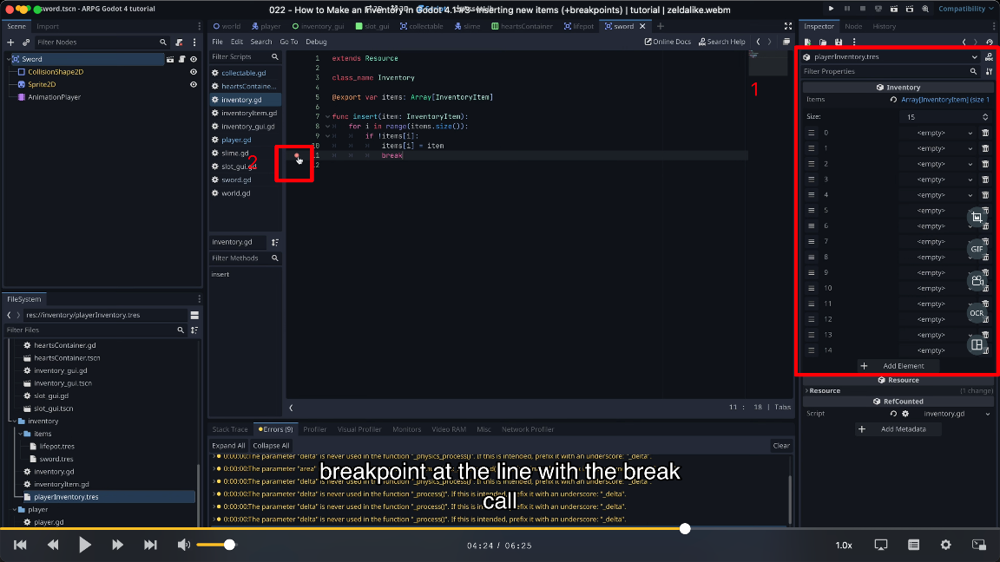</img>

## 0439 测试三次，发现 items 增加了 3 个，证明没问题。注意需要点一下才显示如图。

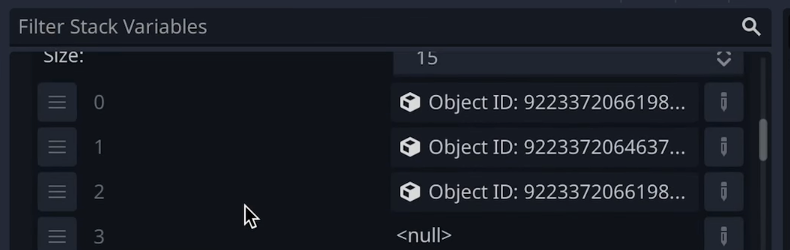</img>

## 0522 现在需要更新 inv gui 了。1，做如图操作，发出信号。2，在 inv gui 中接收信号，并操作。3，测试成功

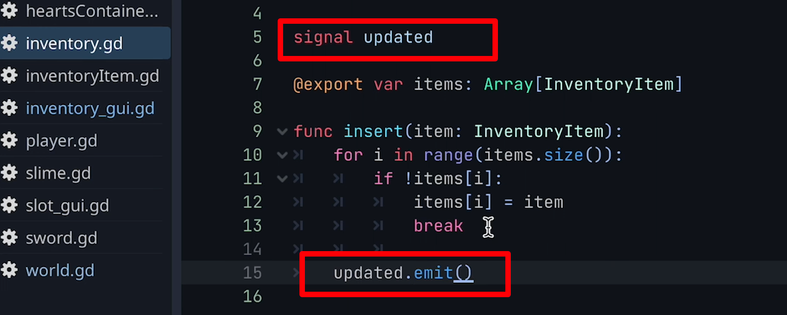</img>  
--=  
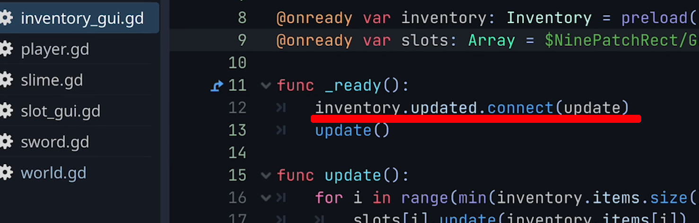</img>
--=  
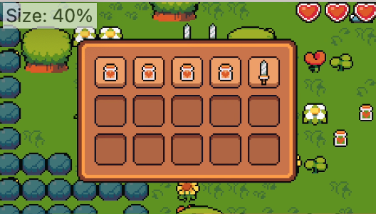</img>

## 0555 测试预先给一些东西的情况，仍然成功

## 总结以上步骤，大概是 player 碰撞到有 collect 函数的东西后就启动该东西的 collect 方法，并传入 inventory 做参数。碰撞到的东西调用自己的 collect 函数，collect 函数调用 invetory 的 insert 函数。insert 函数往 items 里加入 item，并发出信号。inv gui 在收到信号后更新并把更新后的结果显示在屏幕上。
