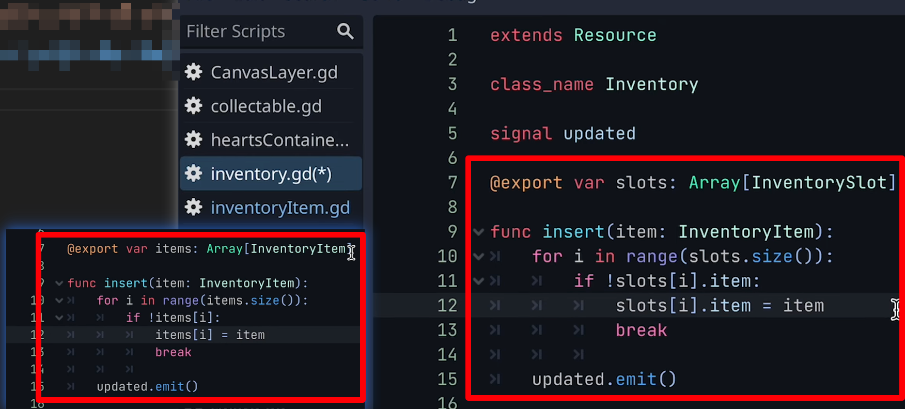

## 230930

## 0030 intro，注意此时已经清空了上节课最后加的 items

## 0118 the first thing we need is a place to store how many of each item is in the player's inventory。所以这里创建一个 new resource（其实是脚本，只是继承自 resource 而不是 node，但视频叫它 resource 也没错，广义的 resource 也包括脚本：https://docs.godotengine.org/en/stable/tutorials/scripting/resources.html 而狭义的 resource 可能就只指 tres 文件）

</img>

## 0203 解释了为什么不用另一种看上去更容易的形式

## 0240 修改 inv-gd 的代码

</img>

## 0253 修改 playerinv-tres 为 15 个 slots。

</img>

## 0329 修改 slot-gui，inv-gui。之后测试，运行顺利

</img>  
--=  
</img>

## 0457 再修改 inv-gui 的 insert func。主要是加判断，如果有相同的物品，就不占用新槽位，而是在原槽位的基础上加 1。打断点测试成功。

</img>

## 0539 再给 insert 换种写法，视频没有具体解释。需要暂时取消掉 && slot.amount < slot.item.max 部分，不然会报错。

</img>

## 0725 现在开始更新 gui。给 panel 增加 label，然后进行各种调整，看视频，最终达到图 2 效果。(此处自己跟做有 bug，已解决 bug，updated.emit()多了一个缩进)

</img>  
--=  
</img>

## 0926 给了两个问题，自己想办法解决
