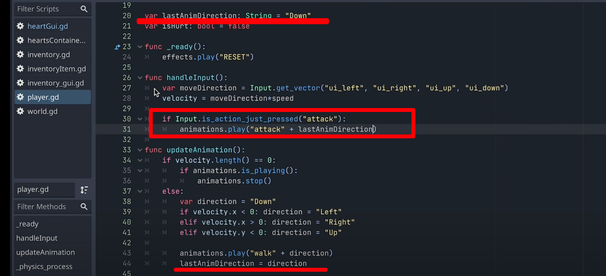
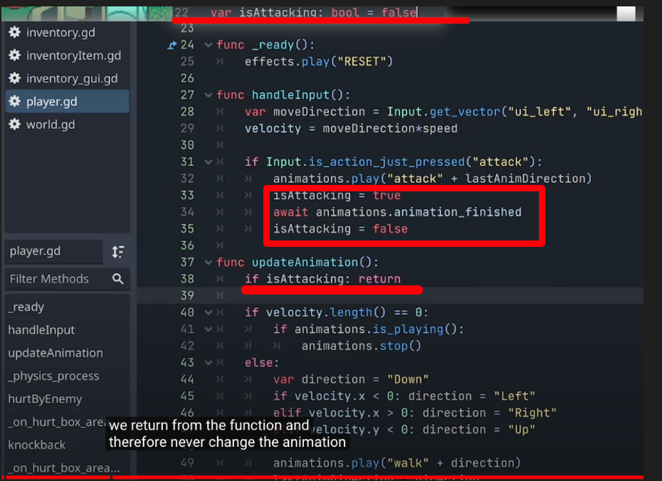
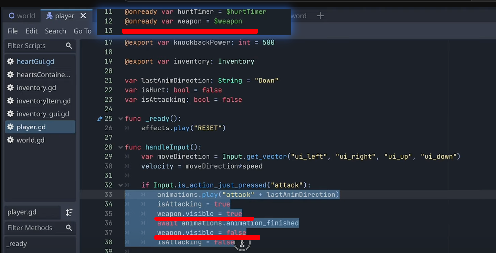
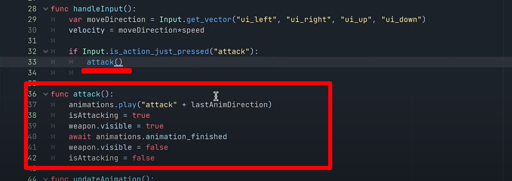

## 231003

## 0015 intro，创造第一个攻击动画

## 0200 创建一个剑的场景，注意 0135 的 position origin/重心 设置

## 0254 将剑加给玩家。

## 0747 做攻击动画。

## 使用攻击动画

### 0812 空格绑定 attack 键

### 0925 play-gd 修改如下代码，但实测无动画效果

</img>

### 1100 解决方法一，创建一个 state machine/状态机。

</img>

### 1146 不相关

### 1303 隐藏武器，图一就行，但图二将一些代码集成到了 attack 方法。注意最好还要在 func \_ready()中加入 weapon.visible = false，这样刚打开游戏时也没有武器显示

</img>  
--=  
</img>
