## 231005

## 0155 1，虽然 slime 已经有了一个 hitbox，但还是给它增加另一个 area2d/hurtbox，以使它更容易被攻击。2，再设置其 area enter func，但目前只打断点做测试。但打开游戏后就立马退出，查看记录发现是跟自己的 hitbox 碰撞了。

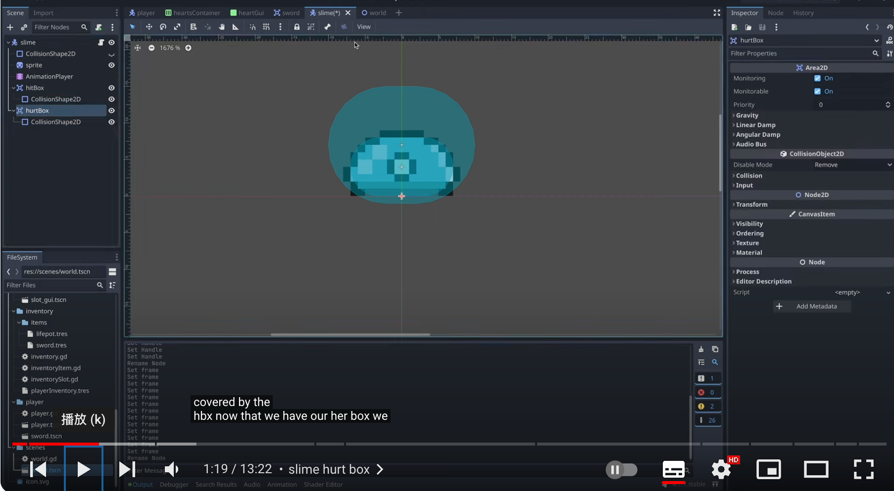</img>
--=  
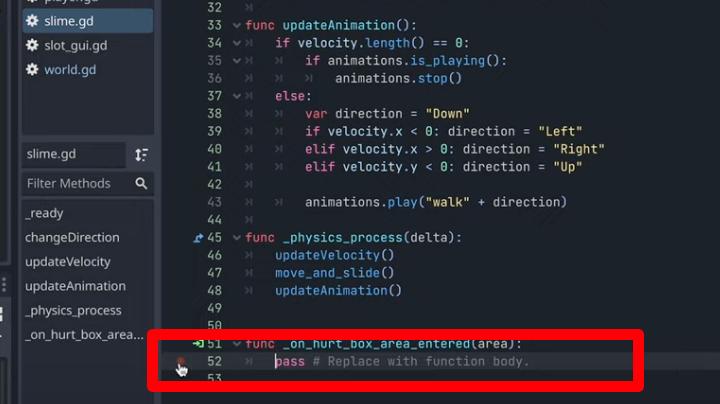</img>

## 0233 修改排除 hitbox 后，仍然立马退出(但自己跟着做并没有立马退出)。为解决这个问题，这次不检查这个 func 的 cases，而是使用 colli 的 layers 和 mask，来让任务更简单。

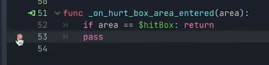</img>

## 0310 新增 sword 的碰撞 layer3，hitBoxes。现在可以把所有 hitbox 放在这层，然后 hurtbox 可以扫描这一层，且忽略其它的。

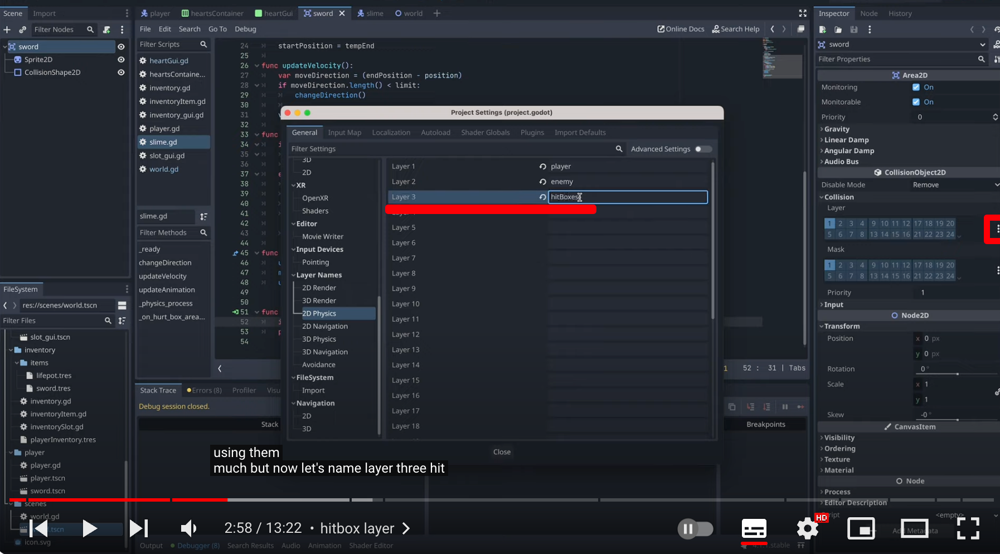</img>

## 0325 将 sword 的 layer 设置为 3/hitBoxes，mask 全取消。

## 0350 将 slime 的 hurtbox 的 layer 全取消，mask 设置为 3。

## 0400 每次 hurtbox 触发一次碰撞都打印出信息

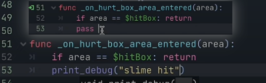</img>

## 0440 也可以将 slime 的 hitbox 切换为只有 layer3。player 的 hurtbox 切换为只有 mask1，3（因为用了 player 的 hurtbox 来捡东西，所以要保留 mask1）。

## 0500 把 debug 信息改为 queue_free()，则 slime 被攻击时就会消失

</img>

## 0800 做 slime 的死亡动画

### 0540 给 slime 新增 sprite-deathEffect，并添加图 smoke.png(NinjaAdventure/FX/Smoke/Smoke/SpriteSheet.png)

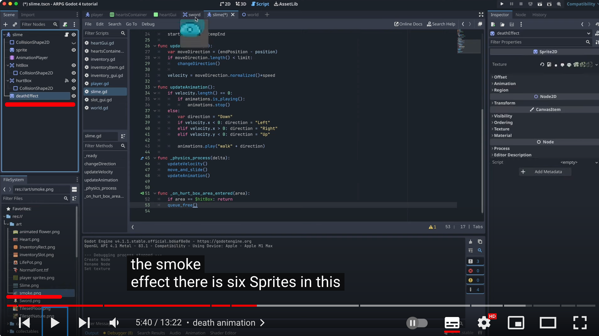</img>

### 0600 在 deathEffect 的 animation 里，将 hframes 设置为 6，意思应该是将原图在水平方向均分为 6 份，这样刚好显示一个图。然后在 AnimationPlayer 中设置 death 动画。

### 0630 此时 slime 的主图仍然在，所以将其 base sprite 在第一帧设置为不可见，后面几帧应该也是自动不可见。deathEffect 的 visible 在第一帧也设置为可见（不知道为什么要特意设置这个，因为默认应该就是可见的）

### 0730 脚本修改后运行，但此时 slime 显示不正常

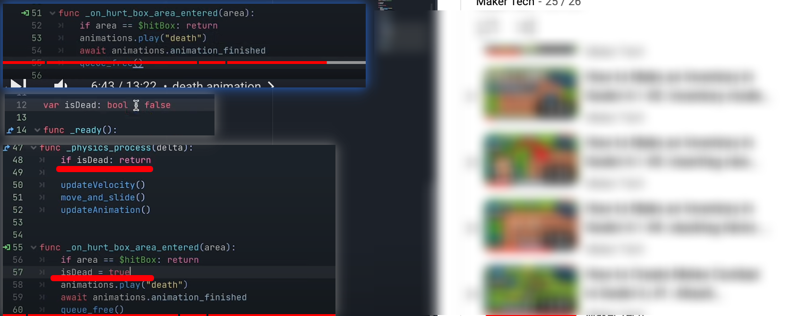</img>
--=  
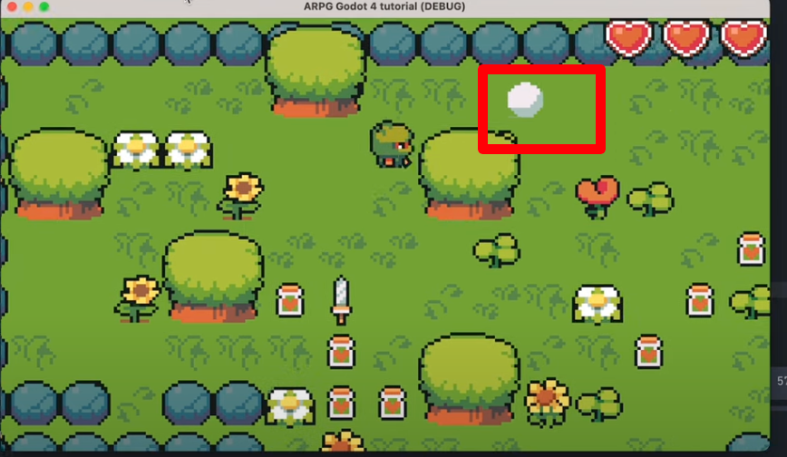</img>

### 0800 做一些修改后，slime 显示正常了。

### 0843 但有个 bug 是即使没有攻击，slime 碰到玩家可能也会消失，因为虽然让玩家身上的剑不可见了，但它实际上还在，能碰撞到 slime

### 0916 给 sword 创建如图脚本。 1019 给 player/weapon 添加一个脚本。1035 修改 player 脚本。最后还要加上图 4 视频未加的代码才能真正解决上述 bug。

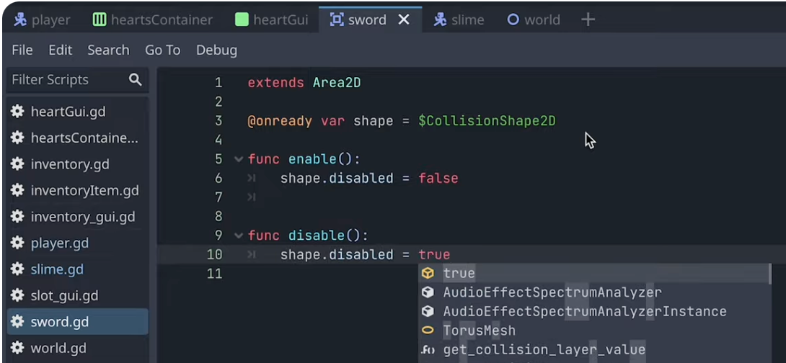</img>  
--=  
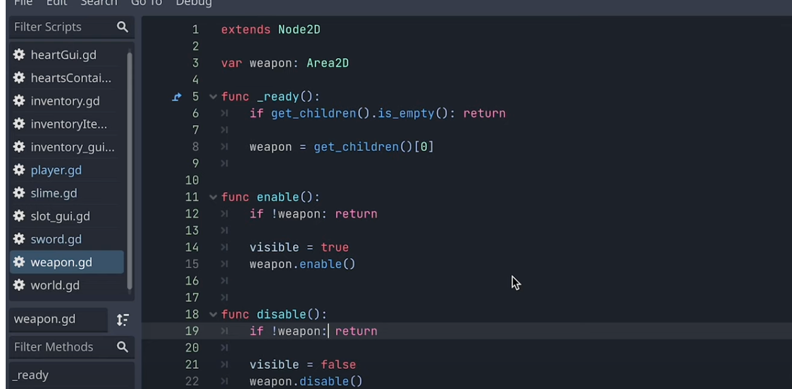</img>  
--=  
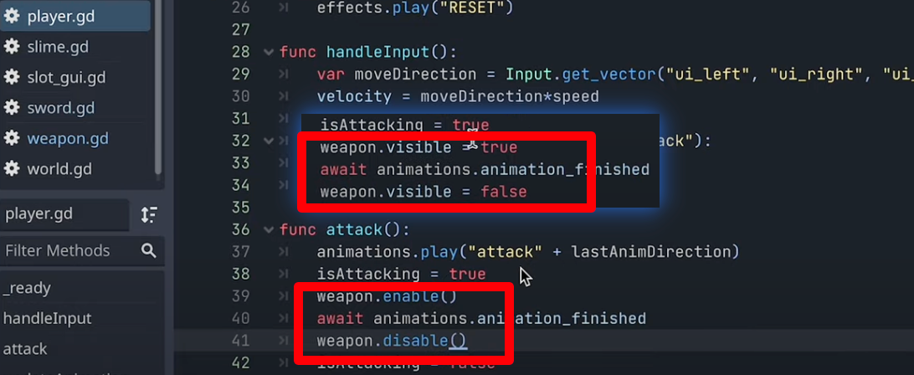</img>  
--=  
</img>

### 1200 即使砍掉了 slime，如果靠近生成的 smoke 太近，玩家仍然掉血。如图处理后，解决问题。（中间有错误步骤，暂不了解）

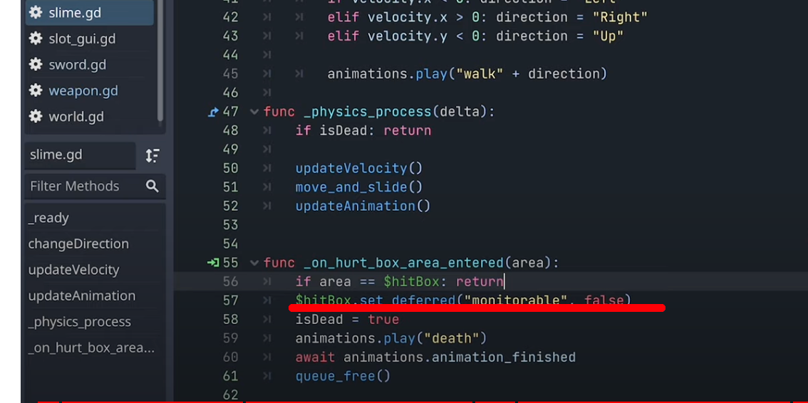</img>

### add，自己运行时，最终仍有有时玩家冲向 slime，玩家不被弹走而 slime 消失的 bug 暂未解决。
