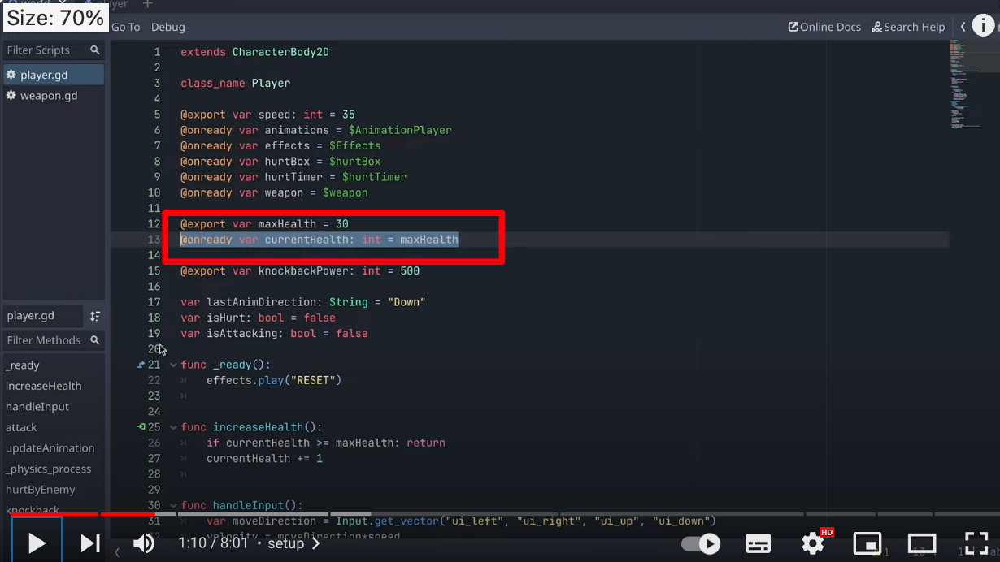

## 231018

### 0110 play-gd 加入这两个变量，之前已经写过，只是 3 改为 30

</img>

### 0239 创建 progress bar

### 0430 给 progress bar 写 gd。看视频效果，可能还改了 currentHealth -= 1 为 currentHealth -= 10

### 0550 TextureProgressBar，需要两个 texture 图片。一个 texture for progress itself，另一个 for background

### 0624 给 TextureProgressBar 写 gd，借用 progress bar 的 gd 修改下 extends 就行，但注意要取消 progress bar 的绑定，且把 player 拉给 TextureProgressBar

### 0705 设置下，就可以随意调整 TextureProgressBar 的形状大小了。

### end，如果把 TextureProgressBar 放到玩家节点下，就可以让它像其它游戏一样一直显示在玩家头上。
