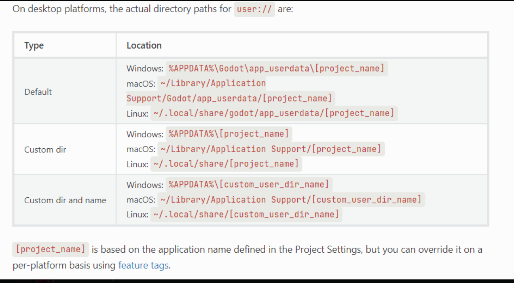

## 231025

## 注意此教程是存储 json 字典，之前也有类似存储教程：https://kidscancode.org/godot_recipes/4.x/basics/file_io/index.html ，只是不是存储 json 字典，而该教程也指出尽量不要用 json 字典来存储。

## 不同系统 user 路径

</img>

## 直接看代码。

```
extends Node2D

func _ready():
	save_game()
	load_game()

func save():
	var save_dict = {
		"score" : 1740000,
		"username": "peilin",
		"position": Vector3(0,0,0)
	}
	return save_dict

func save_game():
	var save_game = FileAccess.open("user://savegame2.save", FileAccess.WRITE)
	var json_string = JSON.stringify(save())
	save_game.store_line(json_string)

func load_game():
	if not FileAccess.file_exists("user://savegame2.save"):
		return

	var save_game = FileAccess.open("user://savegame2.save", FileAccess.READ)

	while save_game.get_position() < save_game.get_length():
		var json_string = save_game.get_line()
		var json = JSON.new()
		var parse_result = json.parse(json_string)
		var node_data = json.get_data()

		print(node_data)

```
