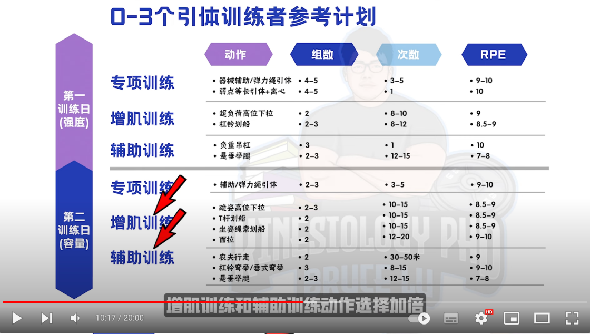
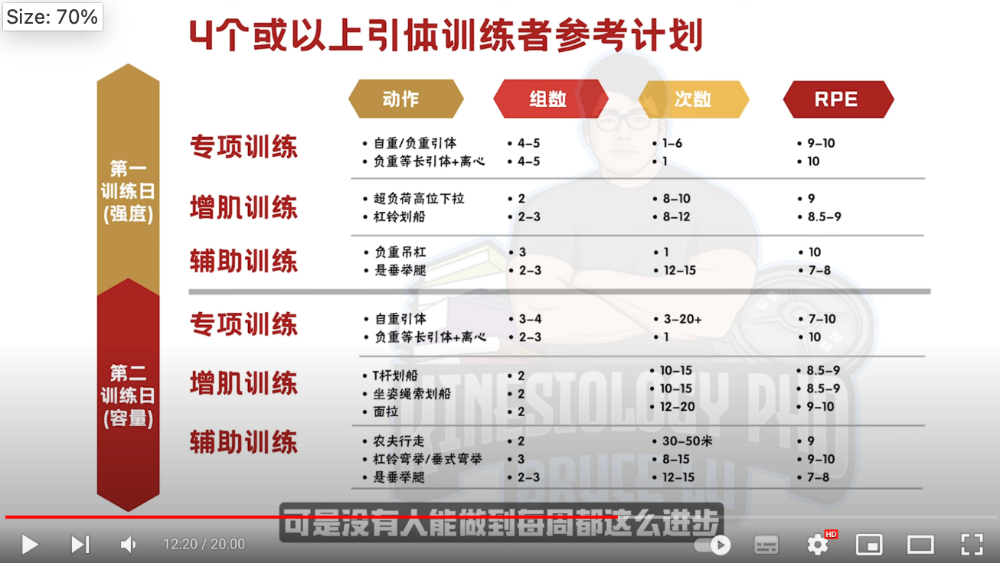

https://www.youtube.com/watch?v=cuk_C9p3R5A

# 专项训练

## 0342 等长收缩加离心引体

选择薄弱位置做等长收缩，如在底端通常是背阔肌弱，如在顶端，通常是二头和拱绕机太弱。

## 0533 反向划船不好

# 增肌训练

## 跪姿下拉相比坐姿更接近引体

## 借力高位下拉，因为有髋部借力，所以离心时刺激高，且能连续受到刺激（即使负重离心引体都要调整腰带等）

## 以上两个垂直拉已经够用。水平拉最好的动作为杠铃划船，t 杆划船，坐姿划船。面拉（有助于肩部健康）

# 辅助训练

## 0658 主要三点，上臂力量，核心力量，握力

## 上臂，二头，宫扰，不用花哨，杠铃弯举，哑铃锤式弯举即可

## 防止引体过程前后摇摆，要练核心。最好悬垂举腿

## 0800 握力，负重吊杠。农夫行走，可以做成半有氧，还有减脂作用，一箭双雕是很好的动作。

# 计划

## 建议一周两练，除去恢复因素，还有训练欲望影响，破 pr 最增加欲望，不同角度破小 pr 进阶。

</img>  
初级
</img>  
进阶

## 1300 以上计划每 3 周进行一次减载周，完全不做引体，对肌肉关节神经休息

# 错误

## 1340 向后狗叫，要伸直大腿并全程紧绷。原因看视频

## 1429 太宽，最好选仅仅比肩宽一圈的握距

## 1450 直上直下拉，正确发力是加入肩胛下压（既能保护肩部，又能使用更多肌肉），标准下巴过杠不仅垂直方向过杠，水平也得过杠，所以拉时身体要有倾斜。

## 1545 一来就拉，引体向上对神经激活要求很高，最好神经激活方式是拮抗肌训练，所以引体前可以练些卧推，实力推等。

# 饮食计划
