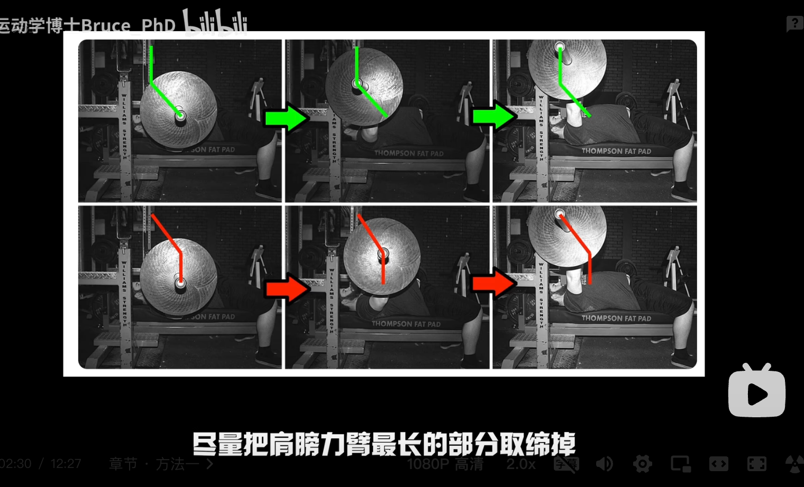

## 240127

https://www.bilibili.com/video/BV1aT4y1h7sF

## 0144 某本关于卧推很好的书

## 0336 j 型推起

杠铃越往下放时，离肩关节的距离也就越远（水平方向），力臂就越长。三角肌前束受到的扭矩（扭矩在物理学中就是特殊的力矩，等于力和力臂的乘积，国际单位是牛米 N·m）就越大。三角肌前束的力量就是卧推木桶效应中最弱的一环。

</img>  
所以应如图绿色这样，从底部就斜向上往头部推，之后再垂直往上。而不是相反的像红色这样。

这种方法会不可避免的出现开肘，但向心的时候可以开肘（肩胛骨要下沉），因为大部分开肘受伤都是在离心时产生。

## 0515 腿驱动

腿驱动应往后而不是往上，如太滑可以加一层瑜伽垫。  
离心的时候就开始顶，而不是往上时同步驱动。  
最好整个脚掌触地，才能更好发动臀部肌肉。

## 0750 卡在最底端该练啥

离胸部 1 厘米就停止，完全靠肌肉力量完成。还可以停顿 1 秒左右。  
架上卧推，剔除牵张反射  
加强三角肌前束，如练哑铃推举等。

## 0810 卡在高点该练啥

练三头  
卧推专向三头 JM press，窄推和三头臂屈伸的杂交

## 0930 外部注意力

内部注意力指焦点在身体，外部注意力指焦点在非身体部分。  
外部注意力效果好，所以离心时提醒自己把杠铃搬弯，向心时提醒自己把杠铃扔到天花板

## 1050 快速下降

慢速下降，快速下降各有优缺点  
快速下降不会在离心出消耗太多能量还能借到更多牵张反射  
牵张反射会在停顿后的 2-3 秒才消失，所以总体更推荐快速下降并在胸部下陷处停顿 2，3 秒的再推起的快速下降方式。

## 1200 增加体重
