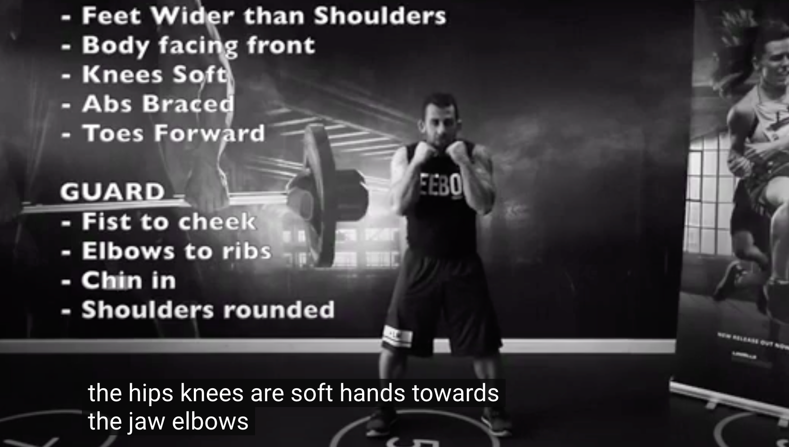
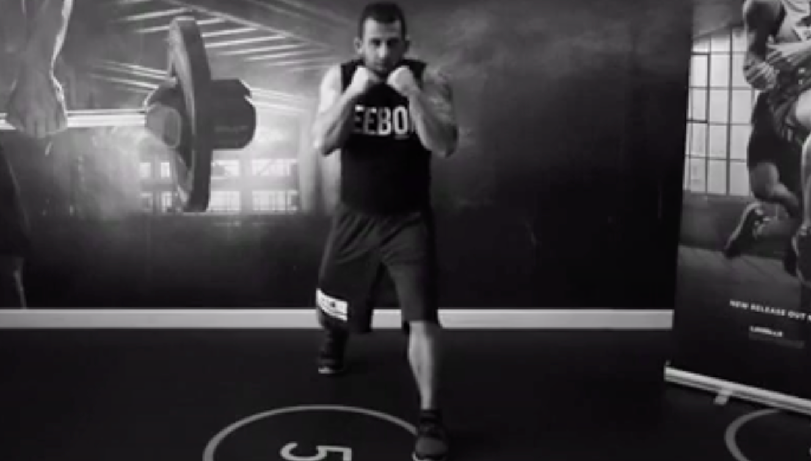
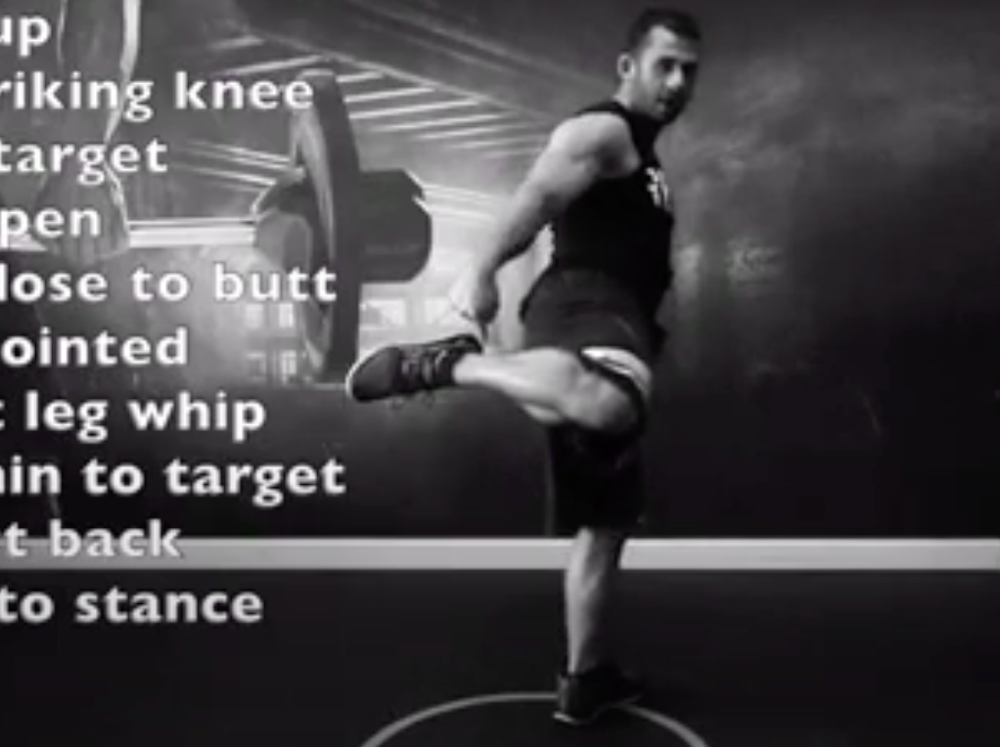
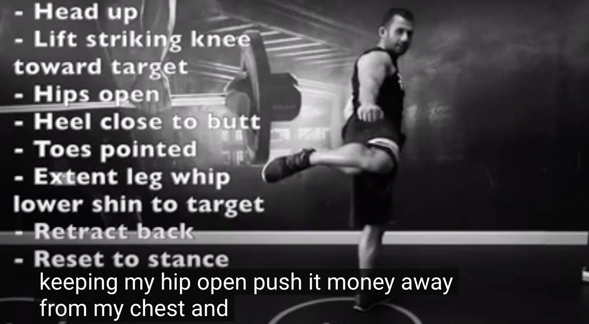
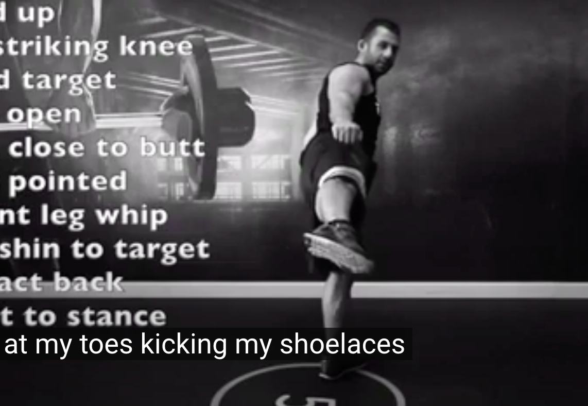
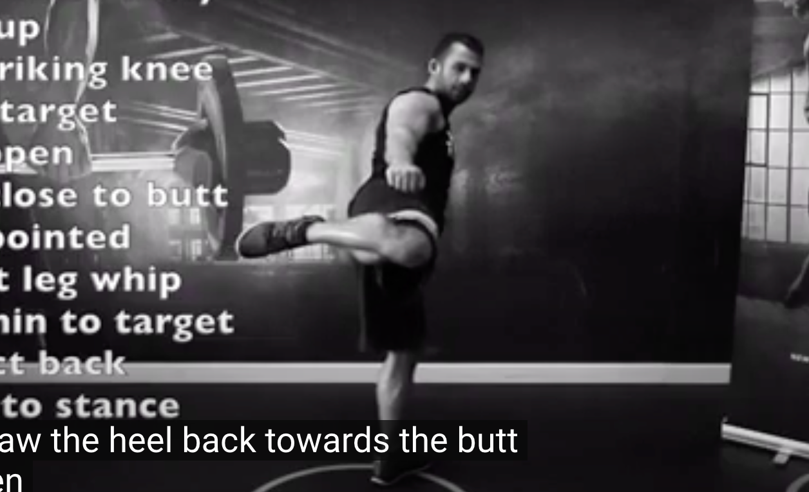
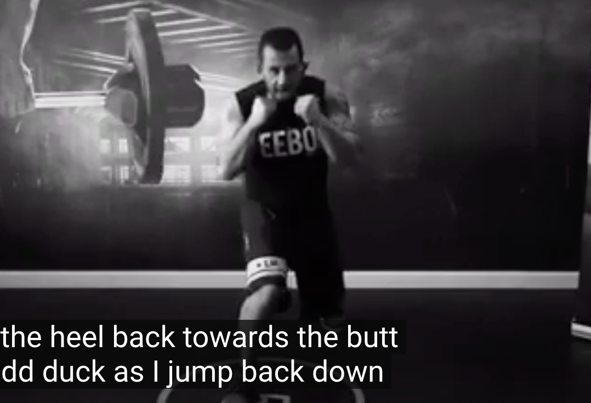

## 240117

https://www.youtube.com/watch?v=uwBDOvOYrfI

## 0026 回旋踢的站姿可以是 front stand 或 combat stand，以下是 front stand 要点

</img>

## 0042 combat stand

</img>

腿一前一后  
后腿的后跟离开地面  
拳头挨着下巴  
手肘挨着肋骨  
膝盖放松

## rhk 通常用 combat stand

</img>  
后腿朝后旋转 3/4？同时后手靠近肋骨。前手指向进攻方向（越 45 度指向地面）。  
抬起前腿，且让前腿后跟贴近屁股。

</img>  
前腿膝盖指向目标，keep hip open（大概是伸髋的意思）  
让膝盖远离胸部

</img>  
朝着目标水平的踢小腿。  
point at my toes kicking my shoelaces （没太懂）

</img>  
将脚后跟收回屁股处。

</img>  
跳回战斗姿势
