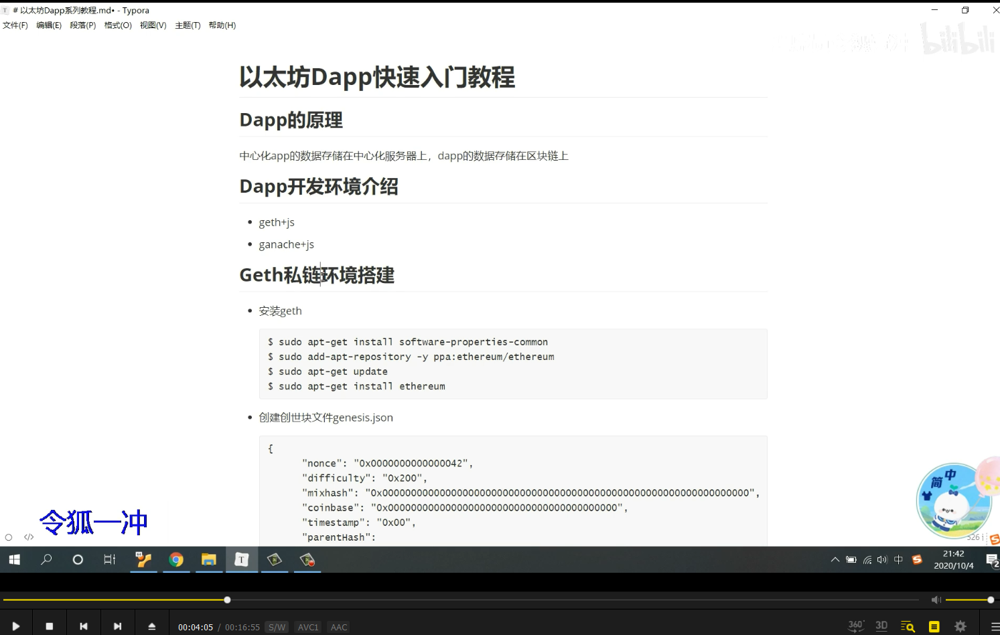
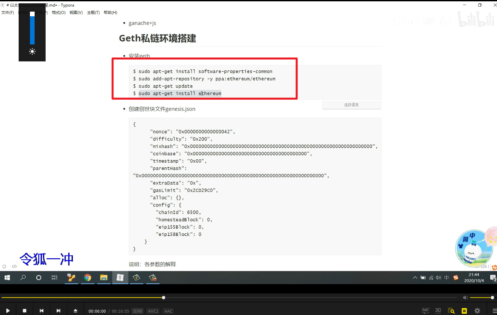
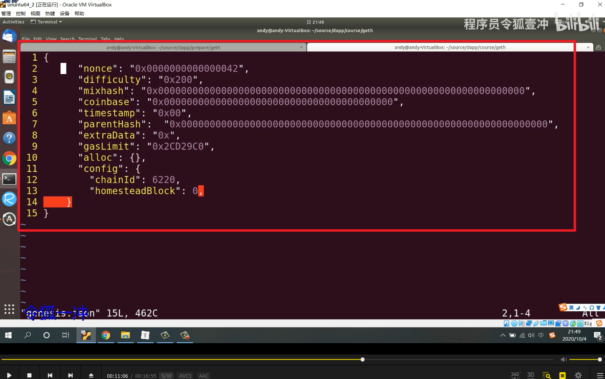
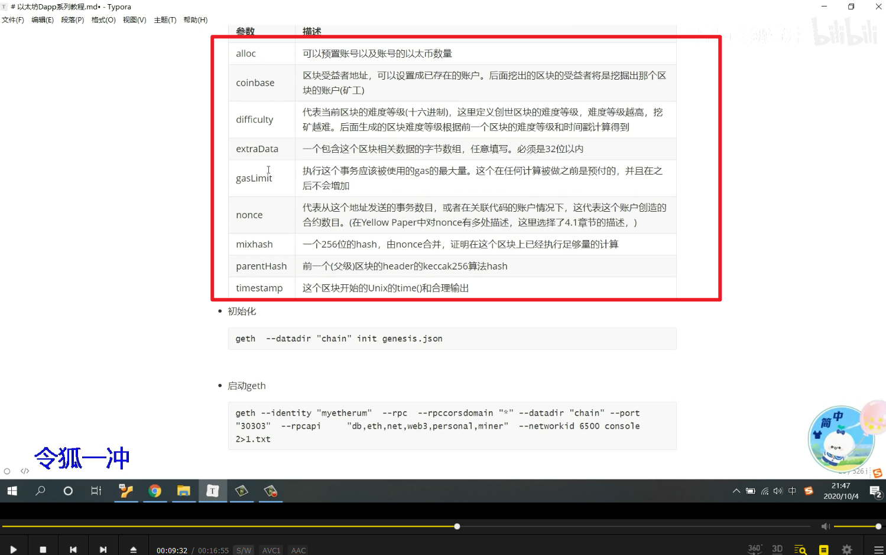
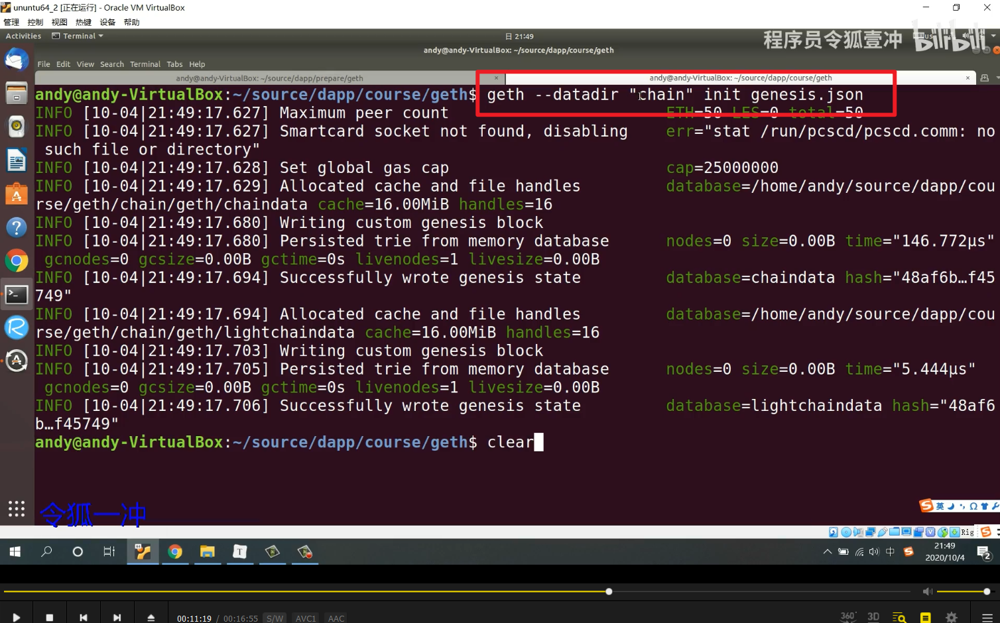
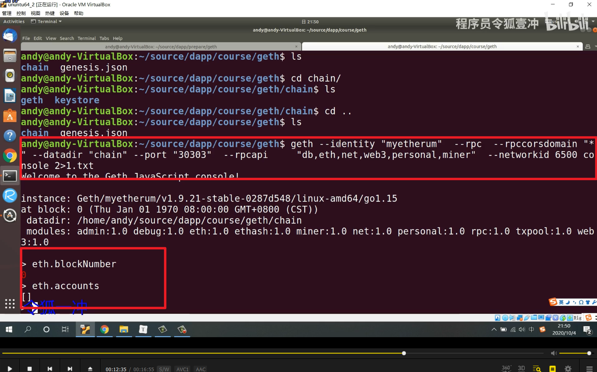

      
geth是以太坊客户端，或者叫全节点

      
ubuntu下载geth，也可以github搜go-ethereum下载win10版本。

  
配置文件genesis.json
```
{
  "nonce": "0x0000000000000042",
  "difficulty": "0x200",
  "mixHash": "0x0000000000000000000000000000000000000000000000000000000000000000",
  "coinbase": "0x0000000000000000000000000000000000000000",
  "timestamp": "0x00",
  "parentHash": "0x0000000000000000000000000000000000000000000000000000000000000000",
  "extraData": "0x",
  "gasLimit": "0x2CD29C0",
  "alloc": {},
  "config": {
    "chainId": 6220,
    "homesteadBlock": 0
  }
}
```

      
配置参数介绍

      
初始化      
```
geth --datadir "chain" init genesis.json
```


启动链      
```
geth --identity "myetherum" --rpc --rpccorsdomain "*" --datadir "chain" --port "30303" --rpcapi "db,eth,net,web3,personal,miner" --networkid 6500 console 2>1.txt
```

此教程暂无文档，暂停学习。