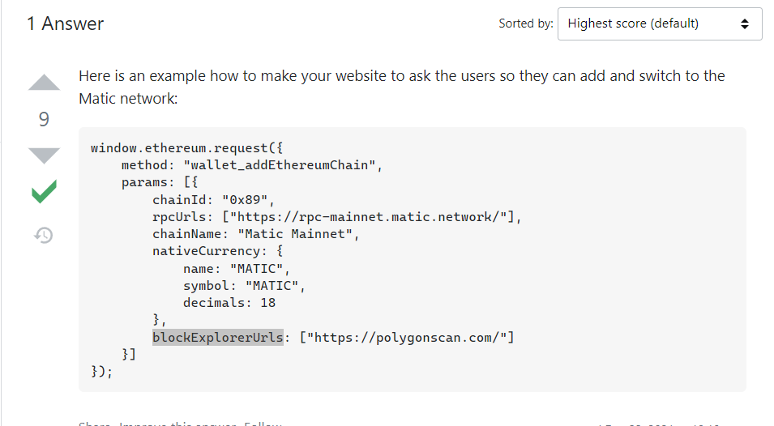
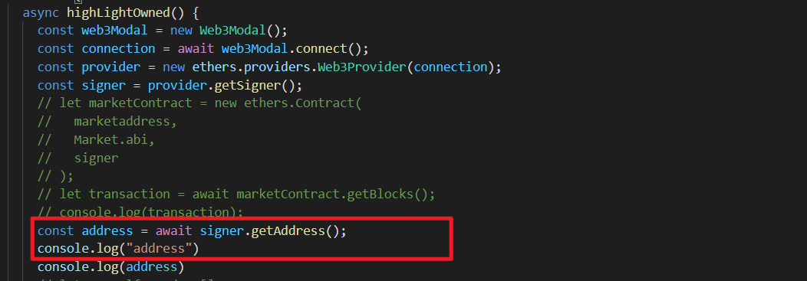
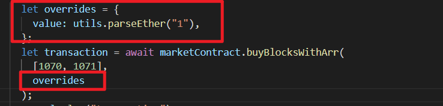
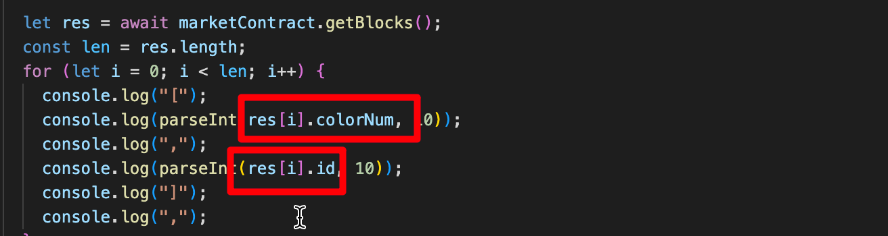

## 转到指定的 metamask 网络

https://ethereum.stackexchange.com/questions/117156/how-to-ask-the-metamask-user-to-switch-its-network  
  
不用核实是否在指定网络，因为如果已经在指定网络，则不会再出现对话框。

## 获取当前账户地址

  
const address = await signer.getAddress();

## 调用需要转账的 function 的方法。

  
加入一个 overrides，注意是{}包围的，且数字是字符串形式。

## 不通过前端和小狐狸，直接用 ethers 与合约交互

```
async function functionName() {
  const { ethers, utils } = require("ethers");

  const provider = new ethers.providers.JsonRpcProvider();
  //以下几个为hardhat初始设定账号，第一个为默认部署合约的账号。
  const wallet1 = await new ethers.Wallet(
    "0xac0974bec39a17e36ba4a6b4d238ff944bacb478cbed5efcae784d7bf4f2ff80",
    provider
  );
  const wallet2 = await new ethers.Wallet(
    "0x59c6995e998f97a5a0044966f0945389dc9e86dae88c7a8412f4603b6b78690d",
    provider
  );
  const wallet3 = await new ethers.Wallet(
    "0x5de4111afa1a4b94908f83103eb1f1706367c2e68ca870fc3fb9a804cdab365a",
    provider
  );
  const wallet4 = await new ethers.Wallet(
    "0x7c852118294e51e653712a81e05800f419141751be58f605c371e15141b007a6",
    provider
  );
  const wallet5 = await new ethers.Wallet(
    "0x47e179ec197488593b187f80a00eb0da91f1b9d0b13f8733639f19c30a34926a",
    provider
  );
  const wallet6 = await new ethers.Wallet(
    "0x8b3a350cf5c34c9194ca85829a2df0ec3153be0318b5e2d3348e872092edffba",
    provider
  );
  const marketaddress = "0x5FbDB2315678afecb367f032d93F642f64180aa3";
  //为避免import，require等冲突，此脚本需放在非项目目录里，但要将项目目录里的artifacts文件夹拷贝到此脚本目录下
  const Market = require("./artifacts/contracts/Market.sol/Market.json");
  const signer = provider.getSigner();
  let marketContract = new ethers.Contract(marketaddress, Market.abi, signer);
  //3是需要转出的eth数量，注意用字符串形式
  let overrides = {
    value: utils.parseEther("3"),
  };
  let transaction = await marketContract
  //如不connect(wallet2)，则使用默认账户交互
    .connect(wallet2)
    .functionName([1, 2, 3], 11, overrides);
  console.log(transaction);
}
functionName();

```

## ethers 获得的结构体数组，直接整个获取得到的整个数据不符合 js 格式。但可以通过数组下标.属性名的方式获得具体数据。



## 获取某地址余额的脚本

`
async function getBal() {
const { ethers } = require("ethers");

const provider = new ethers.providers.JsonRpcProvider();
const balance = await provider.getBalance(
"0x5FbDB2315678afecb367f032d93F642f64180aa3"
);
console.log(parseInt(balance, 10));
}
getBal();

`
