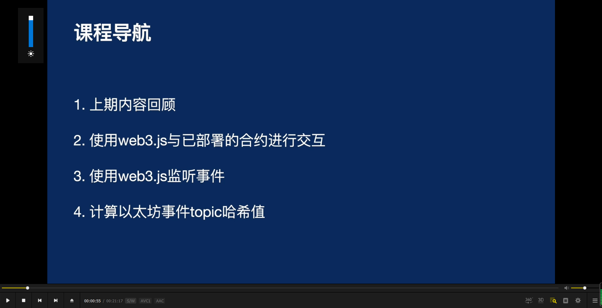
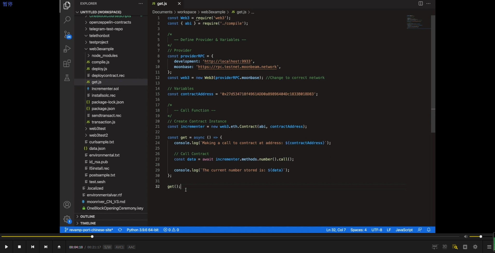
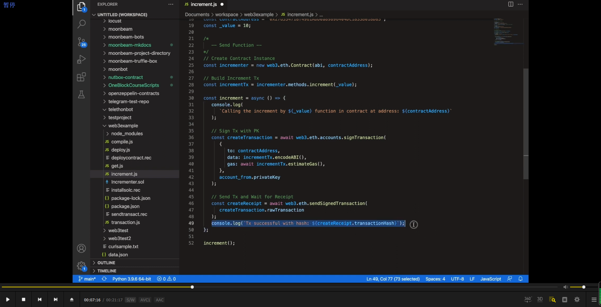
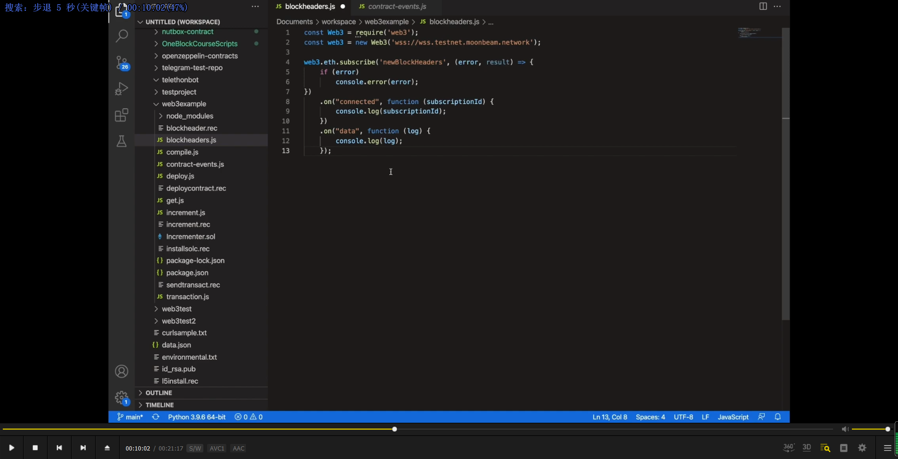
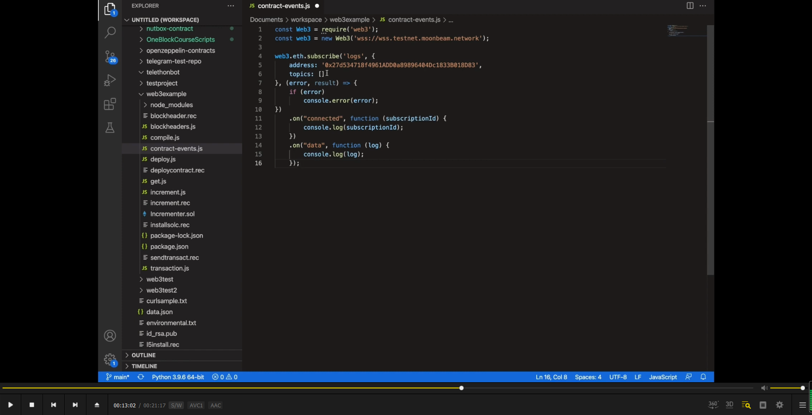
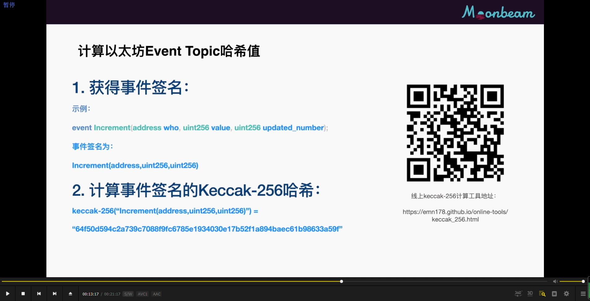
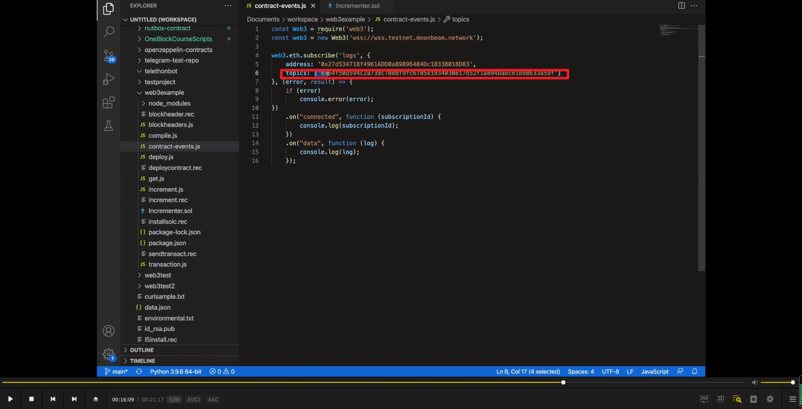
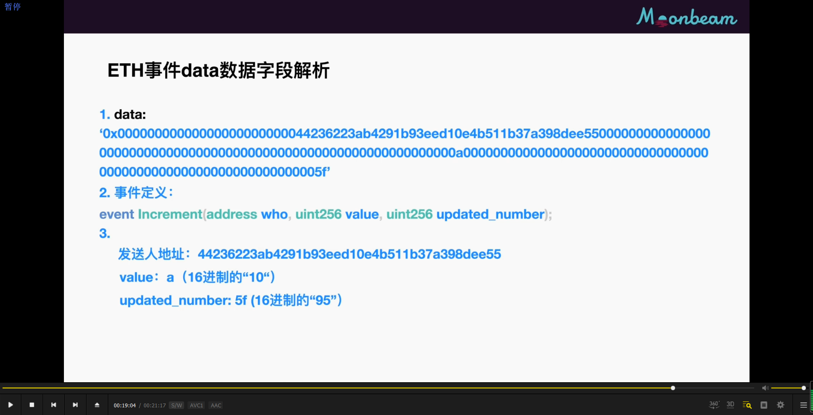
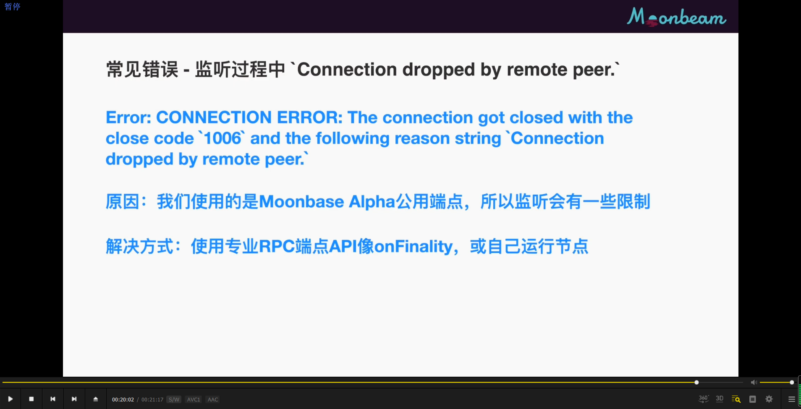

使用 web3 读取智能合约上的数据。

使用 web3 写入智能合约上的数据。

使用web3监听事件        

监听智能合约事件

      
计算以太坊event hash值的方法。

      
只监听某一个事件的方法。        

      
eth事件data数据字段解析，事件里面的参数是隐藏在data数据字段里面，以16进制来存在的。

      
常见错误，connection dropped by remote peer。
