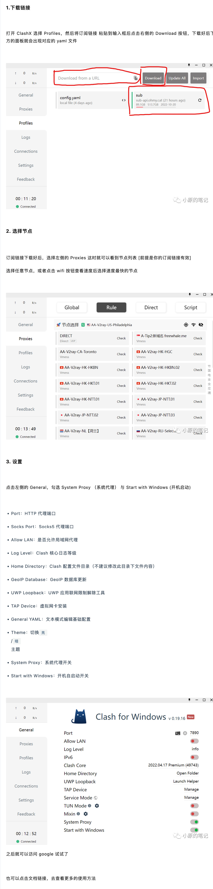

### justmysocks，搬瓦工机场

https://justmysocks.xyz/justmysocks-v2ray/  
注意可以使用订阅，且可指定域名从而自动更新。

### iTerm2 翻墙 代理

～/.zshrc 中设置如下：
alias setproxy="export ALL_PROXY=socks5://127.0.0.1:1080"
alias unsetproxy="unset ALL_PROXY"
add，经测试，用 alias 方法有时无效，所以直接使用命令。

之后需要翻墙时先连接好 v2ray 再输入 setproxy。此方法仅针对当前窗口，重启 iTerm2 后代理自动失效。默认端口可能是 1080 或 1086。
curl https://twitter.com 测试，有返回值代表成功。  
add, curl https://twitter.com 有时候无结果，用 curl https://www.youtube.com 测试。

https://www.jianshu.com/p/0470d0dc3e64

add220929
https://github.com/Fndroid/clash_for_windows_pkg/releases  
或 https://github.com/rusty-peilin/clash4window 下载
然后  
  
最后 general port 里还要输入个随机 port，就行了  
订阅链接可选  
https://miru.cloud//auth/register  
https://portal.shadowsocks.nz/  
第一个试了，第二个没试过  
这样的好处是像 lets vpn 那样可选很多线路，且终端也能翻墙
add  
重启后 port 可能会变成其它值导致无法翻墙，手动设置为上次的 port 值即可