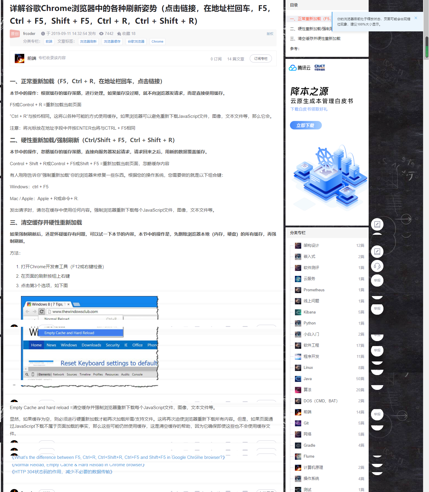

### 设置搜索书签和历史记录

```
设置，管理搜索引擎，添加

搜索引擎名称：Chrome书签
关键字：b
网址：chrome://bookmarks/q=％s

Name: Chrome History (or whatever you want)
Keyword: h
URL: chrome://history/#q=%s&p=0

历史记录需按空格后才显示
```

### 详解谷歌 Chrome 浏览器中的各种刷新姿势（点击链接，在地址栏回车，F5，Ctrl + F5，Shift + F5，Ctrl + R，Ctrl + Shift + R）

https://blog.csdn.net/u012107143/article/details/100735550  


### chrome 截图整个页面，包括显示屏没显示的页面

https://baijiahao.baidu.com/s?id=1718999146383122471&wfr=spider&for=pc
f12，cmd shift p（ctl shift p），full（Capture full size screenshot）。

### 快速切换不同的 chrome 用户，cmd shift m
